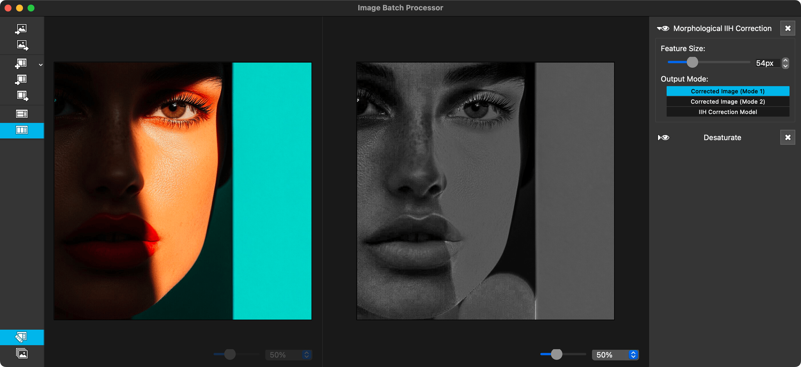

# Image Batch Processor



The Image Batch Processor (or IBP for short) is a cross-platform, open source, simple tool writen in C++/Qt whose purpose is to transform one or more images in an automatic way based in a [list of effects](https://github.com/twardoch/ibp/tree/master/doc).

## [∞](#download) Download

☛ [Download unsinged macOS Intel build](https://github.com/twardoch/ibp/raw/refs/heads/master/dist/ImageBatchProcessor-1.0.0.dmg) (2025-01-29)

## [∞](#who) Who?

2014-2020, the app was [created by Deif Lou](https://github.com/deiflou/ibp), an independent illustrator ([tumblr blog](http://deiflou.tumblr.com)).

2025, the app was [updated](https://github.com/twardoch/ibp) slightly by [Adam Twardoch](https://github.com/twardoch)

## [∞](#what) What?

IBP began being focused in traditional animation and the processing of several frames (e.g. cleaning cels).

IBP applies a list of effects to a list of images (useful if you want to transform/filter/modify a folder with hundreds of images/frames). The goal here is to provide the application with a set of filters that will help to achieve animation specific effects (non-uniform illumination correction, keying and so on).
  
## [∞](#why) Why?

The main reason why I am making this application is to help me in some specific tasks and minimize the amount of time required to do some repetitive work.

## [∞](#bulding-on-macos) Bulding on macOS: 

- Run `./macos_prep.sh` to install prerequisites 
- Run `./macos_install.sh` to build the app into `./build/`
- Run `./macos_package.sh` to build a simple DMG into `./dist/`

## [∞](#autogenerated-details) Autogenerated details

### [∞](#project-structure) Project Structure

The project is organized into several key directories and files, each serving a specific purpose:

- **Root Directory:** Contains project-level configuration, build scripts, and documentation.
- **`src/`:** Contains the source code for the main application and its components.
- **`cmake/`:** Contains CMake modules used for finding external dependencies.
- **`doc/`:** Contains documentation, including images used in the README.
- **`resources/`:** Contains application resources such as icons.
- **`plugins/`:** Contains source code for various image filter plugins.

### [∞](#root-directory-files) Root Directory Files

#### [∞](#gitignore) `.gitignore`

This file specifies intentionally untracked files that Git should ignore. It includes common build artifacts, temporary files, and editor-specific files to keep the repository clean.

#### [∞](#cmakeliststxt) `CMakeLists.txt`

This is the top-level CMake configuration file. It sets the minimum required CMake version, includes the GNUInstallDirs module, defines the project name and version, and includes the `src` subdirectory for further processing.

#### [∞](#license) `LICENSE`

This file contains the MIT License under which the project is released. It details the permissions, conditions, and limitations of using, modifying, and distributing the software.

#### [∞](#readmemd) `README.md`

This file provides a general overview of the project, its purpose, development status, and snapshots of its user interface. It also includes a brief introduction to the main developer, Deif Lou.

### [∞](#cmake-modules-cmakemodules) CMake Modules (`cmake/modules/`)

#### [∞](#findfreeimagecmake) `FindFreeImage.cmake`

This CMake module is used to locate the FreeImage library. It defines:

- `FreeImage_FOUND`: Whether FreeImage was found.
- `FreeImage_INCLUDE_DIRS`: Include directories for FreeImage.
- `FreeImage_LIBRARIES`: Libraries needed to link against FreeImage.

It searches for `FreeImage.h` in common installation directories and sets the appropriate variables.

### [∞](#documentation-images-docimages) Documentation Images (`doc/images/`)

This folder contains images used in the `README.md` to demonstrate the functionality of various filters, such as color correction, illumination correction, and HSL keying. The images are provided in both thumbnail and full-size formats.

### [∞](#source-code-src) Source Code (`src/`)

#### [∞](#srccmakeliststxt) `src/CMakeLists.txt`

This file configures the build for the `src` directory. It sets the C++ standard to C++11, defines the output directory for the build, and includes subdirectories for `ibp` and `plugins`.

#### [∞](#srcibp) `src/ibp/`

This directory contains the source code for the main application components, organized into subdirectories for different parts of the application.

##### [∞](#srcibpimagebatchprocessor) `src/ibp/imagebatchprocessor/`

- **`CMakeLists.txt`**: Configures the build for the `ibp` executable, including linking against necessary libraries and setting target properties such as `AUTOMOC`, `AUTORCC`, and `AUTOUIC`.
- **`imagebatchprocessor.qrc`**:  A Qt resource file that lists icons used by the application's user interface.
- **`main.cpp`**: The entry point of the application. Initializes Qt resources, sets application name and style, handles configuration paths, and creates the main window.
- **`mainwindow.h`**: The header file for the main application window. Defines the `MainWindow` class, including member variables, slots, and methods related to the UI, image processing, and plugin loading.
- **`mainwindow.main.cpp`**: Implements the main functionality of the `MainWindow` class, including loading and unloading the main components, reloading image filter list presets, and handling resize, move, and show events.
- **`mainwindow.toolbar.batch.cpp`**: Implements the toolbar for batch processing.
- **`mainwindow.toolbar.edit.cpp`**: Implements the toolbar for the edit view, including functionalities for loading/saving images, adding/removing filters, and managing filter lists.
- **`mainwindow.ui`**: The Qt Designer UI file defining the layout and widgets of the main window.
- **`mainwindow.view.batch.cpp`**: Implements the batch processing view.
- **`mainwindow.view.edit.cpp`**: Implements the edit view, including image preview, zoom controls, and the image filter list.

##### [∞](#srcibpimgproc) `src/ibp/imgproc/`

- **`CMakeLists.txt`**: Configures the build for the `ibp.imgproc` shared library, including finding necessary packages like OpenCV and FreeImage.
- **`colorconversion.cpp/h`**: Implements color conversion functions using the Little CMS color management system (lcms2).
- **`freeimage.cpp/h`**: Provides functions for loading and saving images using the FreeImage library, including filter string generation for open/save dialogs.
- **`imagefilter.h`**: Defines the base class `ImageFilter` for all image filters.
- **`imagefilterlist.cpp/h`**: Implements the `ImageFilterList` class, which manages a list of image filters, handles their processing, and supports loading and saving filter lists from/to files.
- **`lut.h`**: Defines lookup tables used in various image processing operations.
- **`lut01.cpp`, `lut02.cpp`, `lut03.cpp`**: Implementations of specific lookup table calculations.
- **`util.cpp/h`**: Provides utility functions for image processing.
- **`pixelblending.cpp/h`**: Implements various pixel blending algorithms.
- **`intensitymapping.cpp/h`**: Implements intensity mapping functions, including generating levels LUTs.
- **`thresholding.cpp/h`**: Implements thresholding algorithms, including adaptive thresholding using integral images.
- **`imagehistogram.cpp/h`**: Implements the `ImageHistogram` class for computing and managing image histograms.

##### [∞](#srcibpmisc) `src/ibp/misc/`

- **`CMakeLists.txt`**: Configures the build for the `ibp.misc` shared library.
- **`configurationmanager.cpp/h`**: Implements the `ConfigurationManager` class for managing application settings.
- **`nativeeventfilter.cpp/h`**: Implements a native event filter for handling platform-specific events.
- **`interpolator1D.h`**: Defines the base class for 1D interpolators.
- **`basesplineinterpolator1D.h`**: Defines the base class for spline-based interpolators.
- **`cubicsplineinterpolator1D.cpp/h`**: Implements a cubic spline interpolator.
- **`linearsplineinterpolator1D.cpp/h`**: Implements a linear spline interpolator.
- **`nearestneighborsplineinterpolator1D.cpp/h`**: Implements a nearest neighbor spline interpolator.
- **`probabilitymassfunction.cpp/h`**: Implements the `ProbabilityMassFunction` class for managing probability mass functions.
- **`util.h`**: Provides utility functions for the `misc` module.

##### [∞](#srcibpplugins) `src/ibp/plugins/`

- **`CMakeLists.txt`**: Configures the build for plugins, including an option to build plugins.
- **`imagefilterpluginloader.cpp/h`**: Implements the `ImageFilterPluginLoader` class, which is responsible for loading image filter plugins, managing their information, and instantiating filter objects.

##### [∞](#srcibpwidgets) `src/ibp/widgets/`

- **`CMakeLists.txt`**: Configures the build for the `ibp.widgets` shared library.
- **`resinit.cpp`**: Initializes the Qt resource system for the widgets.
- **`widgets.qrc`**: A Qt resource file that lists resources used by the widgets.
- **`style.cpp`**: Sets the application style, including the dark palette.
- **`colorbutton.cpp/h`**: Implements a custom color button widget.
- **`colorslider.cpp/h`**: Implements a custom color slider widget.
- **`histogramviewer.cpp/h`**: Implements a widget for viewing image histograms.
- **`imageviewer.cpp/h`**: Implements an image viewer widget with zoom and pan capabilities.
- **`toolbuttonex.cpp/h`**: Implements an extended tool button widget.
- **`genericdialog.cpp/h/ui`**: Implements a generic dialog widget.
- **`colorpicker.cpp/h/ui`**: Implements a color picker widget.
- **`colorbox.cpp/h`**: Implements a color box widget.
- **`imagebutton.cpp/h`**: Implements an image button widget.
- **`colorcompositionmodecombobox.cpp/h`**: Implements a combo box for selecting color composition modes.
- **`widgetlist.cpp/h`**: Implements a widget list for managing a list of widgets.
- **`affinetransformationlist.cpp/h/ui`**: Implements a list for managing affine transformations.
- **`rotationgauge.cpp/h`**: Implements a rotation gauge widget.
- **`inputlevelsslider.cpp/h`**: Implements a slider for input levels.
- **`inputlevelswidget.cpp/h/ui`**: Implements a widget for managing input levels.
- **`outputlevelsslider.cpp/h`**: Implements a slider for output levels.
- **`outputlevelswidget.cpp/h/ui`**: Implements a widget for managing output levels.
- **`anchorpositionbox.cpp/h`**: Implements a widget for selecting anchor positions.
- **`curves.cpp/h`**: Implements a curves widget for visualizing and manipulating interpolation curves.
- **`filedialog.cpp/h`**: Provides functions for opening and saving files using platform-specific dialogs.
- **`levelscurvespaintdelegate.cpp/h`**: Implements a custom paint delegate for levels curves.
- **`lumakeyingcurvespaintdelegate.cpp/h`**: Implements a custom paint delegate for luma keying curves.
- **`hslkeyingcurvespaintdelegate.cpp/h`**: Implements a custom paint delegate for HSL keying curves.
- **`hslcolorreplacementcurvespaintdelegate.cpp/h`**: Implements a custom paint delegate for HSL color replacement curves.

### [∞](#plugins-srcplugins) Plugins (`src/plugins/`)

The `plugins` directory contains subdirectories for each image filter plugin. Each plugin is built as a separate shared library.

#### [∞](#plugin-structure) Plugin Structure

Each plugin follows a similar structure:

- **`CMakeLists.txt`**: Configures the build for the plugin.
- **`filter.h`**: Defines the `Filter` class, inheriting from `ImageFilter`.
- **`filter.cpp`**: Implements the `Filter` class, including the `process` method for applying the filter to an image.
- **`filterwidget.h`**: Defines the `FilterWidget` class, which provides the user interface for the filter.
- **`filterwidget.cpp`**: Implements the `FilterWidget` class.
- **`filterwidget.ui`**: The Qt Designer UI file for the filter widget.
- **`main.cpp`**: Contains the plugin entry point and functions for retrieving plugin information and creating filter instances.


Okay, I can help you with that. Here's a detailed description of each plugin found in the `src/plugins/` directory of the Image Batch Processor (IBP) project, formatted in Markdown:

### [∞](#ibp-image-filter-plugins) IBP Image Filter Plugins

This document describes the individual image filter plugins available in the Image Batch Processor. Each plugin is a dynamically loaded library that extends IBP's functionality by providing a specific image transformation.

#### [∞](#adaptive-manifold-filter) Adaptive Manifold Filter

**ID:** `ibp.imagefilter.adaptivemanifoldfilter`
**Version:** 0.1.0
**Description:** This filter smooths the image while preserving hard edges. It utilizes the Adaptive Manifolds algorithm, an edge-preserving smoothing filter that adapts to the underlying image structure.
**Tags:** Smooth, Noise
**Dependencies:** OpenCV (`opencv_ximgproc`)
**Parameters:**
-   **Radius:** Controls the spatial extent of the smoothing.
-   **Edge Preservation:** Controls the degree to which edges are preserved during smoothing. Higher values preserve edges more effectively.

**Implementation Details:**

The plugin uses the `cv::ximgproc::amFilter()` function from the OpenCV library to perform adaptive manifold filtering. This filter computes a weighted average of neighboring pixels, where the weights are determined by the similarity of pixel intensities and their spatial proximity. The `sigmaS` parameter controls spatial weighting, and `sigmaR` controls range weighting (intensity similarity).

#### [∞](#add-noise) Add Noise

**ID:** `ibp.imagefilter.addnoise`
**Version:** 0.1.0
**Description:** Adds random noise to the image. The noise can be either uniformly or normally distributed. It can also be monochromatic or colored.
**Tags:** Noise
**Parameters:**
-   **Amount:** Controls the intensity of the added noise.
-   **Distribution:** Selects between uniform and Gaussian (normal) distribution for noise generation.
-   **Color Mode:** Toggles between monochromatic and color noise.

**Implementation Details:**

The plugin generates random noise values using `qrand()` and scales them according to the selected distribution (uniform or Gaussian) and the specified amount. In color mode, it adds different random values to each color channel. In monochromatic mode, it adds the same random value to all color channels.

#### [∞](#auto-levels) Auto Levels

**ID:** `ibp.imagefilter.autolevels`
**Version:** 0.1.0
**Description:** Automatically adjusts the image's levels to enhance contrast and brightness.
**Tags:** Levels
**Parameters:**
-   **Enhance Channels Separately:** If checked, it adjusts each color channel independently. Otherwise, it adjusts the luma channel.
-   **Adjust Midtones:** If checked, it allows adjustment of the midtones.
-   **Target Color Shadows:** The desired color for the shadows.
-   **Target Color Midtones:** The desired color for the midtones.
-   **Target Color Highlights:** The desired color for the highlights.
-   **Clipping Shadows:** Percentage of pixels to clip in the shadows.
-   **Clipping Highlights:** Percentage of pixels to clip in the highlights.

**Implementation Details:**

The filter calculates histograms for the selected channels (RGB or Luma) and determines the black and white points based on the specified clipping percentages. It then computes linear interpolation parameters for each channel to map input pixel values to output pixel values, adjusting the overall brightness and contrast.

#### [∞](#auto-threshold) Auto Threshold

**ID:** `ibp.imagefilter.autothreshold`
**Version:** 0.1.0
**Description:** Converts the image to a binary (black and white) image using an automatically determined threshold value.
**Tags:** Levels
**Parameters:**
-   **Threshold Mode:** Either global thresholding using Otsu's method or local adaptive thresholding.
-   **Color Mode:** Toggles between working on the luma channel or each color channel separately.
-   **Affected Channels:** Allows selecting which channels (Luma/Red/Green/Blue/Alpha) are affected by the thresholding.

**Implementation Details:**

The plugin uses either Otsu's global thresholding algorithm (`cv::threshold`) or a local adaptive thresholding method (`adaptiveThresholdIntegral`) to determine the threshold value for each channel. It then applies the threshold to convert the image into a binary representation.

#### [∞](#auto-trim) Auto Trim

**ID:** `ibp.imagefilter.autotrim`
**Version:** 0.1.0
**Description:** Automatically trims the image by removing transparent borders.
**Tags:** Geometry
**Parameters:**
-   **Reference:** Specifies the channel to use for determining transparency (Alpha or Luma).
-   **Threshold:** The threshold value to determine transparent pixels.
-   **Margins:** Additional margin to add around the trimmed area.

**Implementation Details:**

The plugin analyzes each pixel in the image based on the selected reference channel (alpha or luma) and the given threshold. It determines the bounding rectangle of the non-transparent region and crops the image accordingly, adding optional margins.

#### [∞](#basic-rotation) Basic Rotation

**ID:** `ibp.imagefilter.basicrotation`
**Version:** 0.1.0
**Description:** Rotates the image by 90-degree increments.
**Tags:** Geometry
**Parameters:**
-   **Angle:** The angle of rotation in 90-degree increments (90, 180, 270).

**Implementation Details:**

The plugin performs a basic image rotation by swapping pixel coordinates or reversing the order of pixels, depending on the selected angle.

#### [∞](#bilateral-filter) Bilateral Filter

**ID:** `ibp.imagefilter.bilateralfilter`
**Version:** 0.1.0
**Description:** Smooths the image while preserving edges using a bilateral filter.
**Tags:** Smooth, Noise
**Parameters:**
-   **Radius:** The spatial extent of the filter (sigma in the spatial domain).
-   **Edge Preservation:** Controls the degree to which edges are preserved (sigma in the range domain).

**Implementation Details:**

The plugin utilizes the `cv::bilateralFilter()` function from the OpenCV library to perform bilateral filtering. This filter applies a weighted average to neighboring pixels, where the weights depend on both spatial distance and intensity difference.

#### [∞](#box-blur) Box Blur

**ID:** `ibp.imagefilter.boxblur`
**Version:** 0.1.0
**Description:** Applies a simple box blur to the image.
**Tags:** Smooth, Noise
**Parameters:**
-   **Radius:** The radius of the box blur kernel.

**Implementation Details:**

The plugin uses the `cv::blur()` function from the OpenCV library to apply a normalized box filter to the image. This filter averages the pixel values within a square kernel of the specified size.

#### [∞](#brightness-and-contrast) Brightness and Contrast

**ID:** `ibp.imagefilter.brightnesscontrast`
**Version:** 0.1.0
**Description:** Adjusts the brightness and contrast of the image.
**Tags:** Levels
**Parameters:**
-   **Working Channel:** Selects which channel to work on (RGB, Red, Green, Blue, Alpha).
-   **Brightness:** Adjusts the brightness level.
-   **Contrast:** Adjusts the contrast level.
-   **Use Soft Mode:** Enables a non-linear adjustment for a softer look.

**Implementation Details:**

The plugin computes lookup tables (LUTs) based on the brightness and contrast parameters. These LUTs are then used to remap the pixel values of the selected channels. The soft mode utilizes a sigmoid function for a more natural adjustment.

#### [∞](#color-balance) Color Balance

**ID:** `ibp.imagefilter.colorbalance`
**Version:** 0.1.0
**Description:** Adjusts the color balance of the image by modifying the levels of the red, green, and blue channels independently for shadows, midtones, and highlights.
**Tags:** Color
**Parameters:**
-   **Shadows Red, Green, Blue:** Adjusts the red, green, and blue components of the shadows.
-   **Midtones Red, Green, Blue:** Adjusts the red, green, and blue components of the midtones.
-   **Highlights Red, Green, Blue:** Adjusts the red, green, and blue components of the highlights.
-   **Preserve Luminosity:** Attempts to preserve the overall image luminosity during adjustments.

**Implementation Details:**

The plugin calculates separate adjustment parameters for shadows, midtones, and highlights based on user input. It then generates lookup tables (LUTs) for each color channel using these parameters and applies them to the image.

#### [∞](#color-boosting) Color Boosting

**ID:** `ibp.imagefilter.colorboosting`
**Version:** 0.1.0
**Description:** Enhances the color saturation of the image using an advanced algorithm.
**Tags:** Color
**Dependencies:** OpenCV (`opencv_photo`)
**Parameters:** None

**Implementation Details:**
The plugin utilizes the `cv::decolor()` function from the OpenCV library, which denoises the image while attempting to retain color information.

#### [∞](#color-layer) Color Layer

**ID:** `ibp.imagefilter.colorlayer`
**Version:** 0.1.0
**Description:** Overlays a solid color on the image, allowing for various blending modes and opacity adjustments.
**Tags:** Composition
**Parameters:**
-   **Color:** The color of the overlay layer.
-   **Position:** Specifies whether the color layer is placed in front of, behind, or inside the image.
-   **Color Composition Mode:** The blending mode to use for combining the color layer with the image.
-   **Opacity:** The opacity of the color layer.
-   **Geometric Transformations:** Allows applying affine transformations (translation, scaling, rotation, shearing) to the color layer.

**Implementation Details:**

The plugin creates a solid color image and applies the specified blending mode and opacity to combine it with the input image. It also supports geometric transformations of the color layer.

#### [∞](#contrast-preserving-grayscale) Contrast Preserving Grayscale

**ID:** `ibp.imagefilter.contrastpreservinggrayscale`
**Version:** 0.1.0
**Description:** Converts the image to grayscale while attempting to preserve the original contrast.
**Tags:** Color
**Dependencies:** OpenCV (`opencv_photo`)
**Parameters:** None

**Implementation Details:**
The plugin uses the `cv::decolor()` function from the OpenCV library, which effectively denoises the image while removing color information.

#### [∞](#curves) Curves

**ID:** `ibp.imagefilter.curves`
**Version:** 0.1.0
**Description:** Allows adjusting the image's tone curve using spline interpolation.
**Tags:** Levels
**Dependencies:** Eigen3
**Parameters:**
-   **Working Channel:** Selects the channel to adjust (Luma, Red, Green, Blue, Alpha).
-   **Interpolation Mode:** Specifies the type of spline interpolation (Flat, Linear, Smooth).
-   **Knots:** Allows adding, removing, and repositioning control points on the curve.
-   **Inverted:** Inverts the curve.

**Implementation Details:**

The plugin utilizes spline interpolation (nearest neighbor, linear, or cubic) to define a mapping curve for each channel. The user can add, remove, and move control points (knots) to manipulate the curve. The curve is then applied to remap pixel intensity values.

#### [∞](#dct-denoising) DCT Denoising

**ID:** `ibp.imagefilter.dctdenoising`
**Version:** 0.1.0
**Description:** Reduces noise in the image using Discrete Cosine Transform (DCT) thresholding.
**Tags:** Smooth, Noise
**Dependencies:** OpenCV (`opencv_xphoto`)
**Parameters:**
-   **Strength:** Controls the intensity of the denoising effect.

**Implementation Details:**
The plugin uses the `cv::xphoto::dctDenoising()` function from the OpenCV library to apply a non-local means denoising algorithm in the DCT domain.

#### [∞](#desaturate) Desaturate

**ID:** `ibp.imagefilter.desaturate`
**Version:** 0.1.0
**Description:** Removes color saturation from the image, effectively converting it to grayscale.
**Tags:** Color
**Parameters:** None

**Implementation Details:**

The plugin converts the image to HSL color space, sets the saturation channel to 0, and then converts it back to RGB.

#### [∞](#domain-transform-filter) Domain Transform Filter

**ID:** `ibp.imagefilter.domaintransformfilter`
**Version:** 0.1.0
**Description:** Applies the Domain Transform filter for edge-aware smoothing.
**Tags:** Smooth, Noise
**Dependencies:** OpenCV (`opencv_ximgproc`)
**Parameters:**
-   **Radius:** Controls the spatial extent of the smoothing.
-   **Edge Preservation:** Controls the degree to which edges are preserved.

**Implementation Details:**

The plugin uses the `cv::ximgproc::dtFilter()` function from the OpenCV library to perform domain transform filtering, which is a fast edge-preserving smoothing technique.

#### [∞](#equalize) Equalize

**ID:** `ibp.imagefilter.equalize`
**Version:** 0.1.0
**Description:** Applies histogram equalization to enhance the image's contrast.
**Tags:** Levels
**Parameters:** None

**Implementation Details:**

The plugin computes the image histogram, calculates the cumulative distribution function, and uses it to map pixel intensities to a more uniform distribution, effectively enhancing contrast.

#### [∞](#flip) Flip

**ID:** `ibp.imagefilter.flip`
**Version:** 0.1.0
**Description:** Flips the image horizontally, vertically, or both.
**Tags:** Geometry
**Parameters:**
-   **Direction:** Specifies the flip direction (Horizontal, Vertical, Both).

**Implementation Details:**

The plugin performs a simple pixel swapping operation to flip the image along the specified axis/axes.

#### [∞](#guided-filter) Guided Filter

**ID:** `ibp.imagefilter.guidedfilter`
**Version:** 0.1.0
**Description:** Applies the Guided Filter for edge-preserving smoothing.
**Tags:** Smooth, Noise
**Dependencies:** OpenCV (`opencv_ximgproc`)
**Parameters:**
-   **Radius:** Controls the spatial extent of the smoothing.
-   **Edge Preservation:** Controls the degree to which edges are preserved.

**Implementation Details:**

The plugin utilizes the `cv::ximgproc::guidedFilter()` function from the OpenCV library, which performs edge-aware smoothing using a guidance image (in this case, the input image itself).

#### [∞](#hsl-color-replacement) HSL Color Replacement

**ID:** `ibp.imagefilter.hslcolorreplacement`
**Version:** 0.1.0
**Description:** Replaces colors in the image based on their HSL values, allowing for hue, saturation, and lightness adjustments using curves.
**Tags:** Color
**Parameters:**
-   **Hue/Saturation/Lightness Curves:** Allow defining the mapping from input to output values for each HSL channel using spline interpolation.
-   **Interpolation Mode:** Specifies the type of spline interpolation (Flat, Linear, Smooth).
-   **Inverted:** Inverts the curves.
-   **Output Mode:** Selects between outputting the keyed image or the generated matte.
-   **Preblur Radius:** Applies a gaussian blur to the input image before processing.
-   **Colorize:** Replaces colors with a single hue and saturation.
-   **Relative Hue/Saturation/Lightness:** Adjusts the hue, saturation, and lightness relative to the original values.
-   **Absolute Hue/Saturation:** Sets the hue and saturation to absolute values.

**Implementation Details:**

The plugin converts the image to HSL color space, applies the specified curves to adjust hue, saturation, and lightness, and then converts it back to RGB. It supports various output modes and pre-blurring for smoother results.

#### [∞](#hsl-keyer) HSL Keyer

**ID:** `ibp.imagefilter.hslkeyer`
**Version:** 0.1.0
**Description:** Generates a matte (alpha channel) based on the HSL values of the input image.
**Tags:** Keying
**Parameters:**
-   **Hue/Saturation/Lightness Curves:** Allow defining the opacity (matte) based on the hue, saturation, and lightness values.
-   **Interpolation Mode:** Specifies the type of spline interpolation (Flat, Linear, Smooth).
-   **Inverted:** Inverts the curves.
-   **Output Mode:** Selects between outputting the keyed image or the generated matte.
-   **Preblur Radius:** Applies a gaussian blur to the input image before processing.

**Implementation Details:**

Similar to the HSL Color Replacement filter, but instead of modifying color channels, it generates an alpha channel (matte) based on the defined curves. The matte can be used for masking or compositing.

#### [∞](#identity) Identity

**ID:** `ibp.imagefilter.identity`
**Version:** 0.1.0
**Description:** A placeholder filter that does not modify the image.
**Tags:**
**Parameters:** None

**Implementation Details:**

This filter simply returns the input image without any modifications. It can be used as a placeholder or for testing purposes.

#### [∞](#inpainting-iih-correction) Inpainting IIH Correction

**ID:** `ibp.imagefilter.inpaintingiihc`
**Version:** 0.1.0
**Description:** Attempts to correct illumination inhomogeneity using an inpainting-based approach.
**Tags:** Illumination
**Dependencies:** OpenCV (`opencv_ximgproc`, `opencv_photo`)
**Parameters:**
-   **Noise Reduction:** Controls the amount of noise reduction applied before processing.
-   **Mask Expansion:** Controls the expansion of the mask used for inpainting.
-   **Output Mode:** Selects between different output modes (Corrected Image Mode 1, Corrected Image Mode 2, IIH Correction Model).

**Implementation Details:**

This filter uses a combination of techniques to correct illumination inhomogeneity:

1. **Noise Reduction:** Applies a bilateral filter to reduce noise in the input image.
2. **Adaptive Thresholding:** Creates a mask based on adaptive thresholding of the luma channel.
3. **Mask Expansion:** Erodes the mask to exclude areas with unwanted noise.
4. **Inpainting:** Employs the Navier-Stokes inpainting algorithm (`cv::inpaint`) to fill in the masked areas of the luma channel, effectively estimating the background illumination.
5. **IIH Correction:** Uses the inpainted image as a correction model to adjust the original image.

#### [∞](#itk-n4-iih-correction) ITK N4 IIH Correction

**ID:** `ibp.imagefilter.itkn4iihc`
**Version:** 0.1.0
**Description:** Corrects illumination inhomogeneity using the N4 bias field correction algorithm from the ITK library.
**Tags:** Illumination
**Dependencies:** ITK
**Parameters:**
-   **Grid Size:** Controls the number of control points in the B-spline grid used for bias field estimation.
-   **Output Mode:** Selects between different output modes (Corrected Image Mode 1, Corrected Image Mode 2, IIH Correction Model).

**Implementation Details:**

This filter uses the ITK library's N4BiasFieldCorrectionImageFilter to estimate and correct the illumination inhomogeneity. It involves the following steps:

1. **Image Preparation:** The input image is converted to grayscale and resampled to a smaller size if necessary.
2. **N4 Bias Field Correction:** The ITK N4 algorithm is applied to estimate the bias field.
3. **B-Spline Interpolation:** A B-spline interpolator is used to create a smooth bias field from the estimated control points.
4. **Least Squares Fitting:** A least squares fitting is performed to find a linear relationship between the original image and the estimated bias field.
5. **IIH Correction:** The linear relationship is used to correct the illumination inhomogeneity in the original image.
6. **Output:** The corrected image, the mask, or the IIH correction model can be outputted.

#### [∞](#levels) Levels

**ID:** `ibp.imagefilter.levels`
**Version:** 0.1.0
**Description:** Adjusts the black point, white point, and gamma of the image.
**Tags:** Levels
**Parameters:**
-   **Working Channel:** Selects the channel to adjust (Luma, Red, Green, Blue, Alpha).
-   **Input Black Point:** Sets the black point for the input levels.
-   **Input Gamma:** Adjusts the gamma correction (midtones).
-   **Input White Point:** Sets the white point for the input levels.
-   **Output Black Point:** Sets the black point for the output levels.
-   **Output White Point:** Sets the white point for the output levels.

**Implementation Details:**

The filter generates lookup tables (LUTs) based on the input and output levels and the gamma correction value. These LUTs are then used to remap the pixel values of the selected channel.

#### [∞](#low-pass-iih-correction) Low Pass IIH Correction

**ID:** `ibp.imagefilter.lowpassiihc`
**Version:** 0.1.0
**Description:** Corrects illumination inhomogeneity using a low-pass filtering approach.
**Tags:** Illumination
**Parameters:**
-   **Feature Size:** Controls the size of the low-pass filter kernel.
-   **Output Mode:** Selects between different output modes (Corrected Image Mode 1, Corrected Image Mode 2, IIH Correction Model).

**Implementation Details:**

This filter applies a low-pass filter (using a box blur in this implementation) to estimate the background illumination. The estimated background is then used to correct the original image.

#### [∞](#luma-keyer) Luma Keyer

**ID:** `ibp.imagefilter.lumakeyer`
**Version:** 0.1.0
**Description:** Generates a matte (alpha channel) based on the luma values of the input image.
**Tags:** Keying
**Parameters:**
-   **Luma Curve:** Allows defining the mapping from luma values to opacity values using spline interpolation.
-   **Interpolation Mode:** Specifies the type of spline interpolation (Flat, Linear, Smooth).
-   **Inverted:** Inverts the curve.
-   **Output Mode:** Selects between outputting the keyed image or the generated matte.
-   **Preblur Radius:** Applies a gaussian blur to the input image before processing.

**Implementation Details:**

Similar to the HSL Keyer, but it operates solely on the luma channel to generate the matte.

#### [∞](#median) Median

**ID:** `ibp.imagefilter.median`
**Version:** 0.1.0
**Description:** Applies a median filter to smooth the image and reduce noise.
**Tags:** Smooth, Noise
**Parameters:**
-   **Radius:** Controls the radius of the median filter kernel.

**Implementation Details:**

The plugin uses the `cv::medianBlur()` function from the OpenCV library to apply a median filter, which replaces each pixel with the median value of its neighboring pixels within the specified radius.

#### [∞](#morphological-iih-correction) Morphological IIH Correction

**ID:** `ibp.imagefilter.morphologicaliihc`
**Version:** 0.1.0
**Description:** Corrects illumination inhomogeneity using morphological operations.
**Tags:** Illumination
**Parameters:**
-   **Feature Size:** Controls the size of the structuring element used in morphological operations.
-   **Output Mode:** Selects between different output modes (Corrected Image Mode 1, Corrected Image Mode 2, IIH Correction Model).

**Implementation Details:**

This filter uses morphological closing (dilation followed by erosion) to estimate the background illumination. The size of the structuring element determines the scale of the features that are considered part of the background.

#### [∞](#morphology) Morphology

**ID:** `ibp.imagefilter.morphology`
**Version:** 0.1.0
**Description:** Applies basic morphological operations to the image.
**Tags:** Morphology
**Parameters:**
-   **Modify RGB:** Toggles whether to apply the operation to the RGB channels.
-   **Modify Alpha:** Toggles whether to apply the operation to the alpha channel.
-   **Morphology Operation:** Selects the type of morphological operation (Dilation, Erosion, Closing, Opening).
-   **Kernel Shape:** Selects the shape of the structuring element (Ellipse, Rectangle, Diamond, Octagon, Plus, Cross, Ring).
-   **Horizontal Radius:** Controls the horizontal radius of the structuring element.
-   **Vertical Radius:** Controls the vertical radius of the structuring element.
-   **Lock Radius:** Locks the horizontal and vertical radii together.

**Implementation Details:**

The plugin uses OpenCV's `cv::morphologyEx()` function along with custom functions to generate structuring elements of various shapes. It allows applying basic morphological operations like dilation, erosion, closing, and opening to either the RGB channels or the alpha channel independently.

#### [∞](#nlm-denoising) NLM Denoising

**ID:** `ibp.imagefilter.nlmdenoising`
**Version:** 0.1.0
**Description:** Reduces noise in the image using the Non-Local Means denoising algorithm.
**Tags:** Smooth, Noise
**Dependencies:** OpenCV (`opencv_photo`)
**Parameters:**
-   **Strength:** Controls the intensity of the denoising effect.

**Implementation Details:**
The plugin uses the `cv::fastNlMeansDenoisingColored()` function from the OpenCV library to apply a non-local means denoising algorithm, which effectively reduces noise while preserving image details.

#### [∞](#perspective-iih-correction) Perspective IIH Correction

**ID:** `ibp.imagefilter.prospectiveiihc`
**Version:** 0.1.0
**Description:** Corrects illumination inhomogeneity by applying a perspective transformation to a blurred version of the image.
**Tags:** Illumination
**Parameters:**
-   **Image:** The image to be used for creating a perspective transformation.
-   **Output Mode:** Selects between different output modes (Corrected Image Mode 1, Corrected Image Mode 2, IIH Correction Model).

**Implementation Details:**

This filter uses a user-provided image to estimate a perspective transformation that models the illumination inhomogeneity. The estimated transformation is then applied to a blurred version of the input image to correct for the non-uniform illumination.

#### [∞](#resample) Resample

**ID:** `ibp.imagefilter.resample`
**Version:** 0.1.0
**Description:** Resizes the image to a new size without resampling.
**Tags:** Geometry
**Parameters:**
-   **Width:** The new width of the image.
-   **Height:** The new height of the image.
-   **Width Mode:** Specifies how the width is interpreted (Percent, Pixels, Keep Aspect Ratio).
-   **Height Mode:** Specifies how the height is interpreted (Percent, Pixels, Keep Aspect Ratio).
-   **Resize Mode:** Selects between absolute resizing and relative resizing.
-   **Anchor Position:** Specifies the anchor point for resizing.
-   **Background Color:** The color to use for the background when resizing.

**Implementation Details:**
This filter simply changes the dimensions of the image without resampling the pixel data. The new image can be filled with a background color, and the anchor position determines how the original image is placed within the new dimensions.

#### [∞](#texture-layer) Texture Layer

**ID:** `ibp.imagefilter.texturelayer`
**Version:** 0.1.0
**Description:** Adds a texture layer to the image.
**Tags:** Composition
**Parameters:**
-   **Image:** The image to be used as the texture.
-   **Position:** Specifies whether the texture layer is placed in front of, behind, or inside the image.
-   **Color Composition Mode:** The blending mode to use for combining the texture layer with the image.
-   **Opacity:** The opacity of the texture layer.
-   **Geometric Transformations:** Allows applying affine transformations (translation, scaling, rotation, shearing) to the texture layer.

**Implementation Details:**

The plugin creates an image from the texture and applies the specified blending mode and opacity to combine it with the input image. It also supports geometric transformations of the texture layer.

#### [∞](#threshold) Threshold

**ID:** `ibp.imagefilter.threshold`
**Version:** 0.1.0
**Description:** Applies a threshold to the image channels.
**Tags:** Levels
**Parameters:**
-   **Color Mode:** Toggles between working on the luma channel or each color channel separately.
-   **Affected Channels:** Allows selecting which channels (Luma/Red/Green/Blue/Alpha) are affected by the thresholding.
-   **Threshold:** The threshold value for each channel.

**Implementation Details:**

The plugin applies a simple thresholding operation to each selected channel. Pixel values above the threshold are set to 255, and values below or equal to the threshold are set to 0.


### [∞](#building-on-macos) Building on macOS

#### [∞](#prerequisites) Prerequisites

```bash
##!/bin/bash

## [∞](#script-to-install-prerequisites-and-build-the-image-batch-processor-ibp-project-on-macos) Script to install prerequisites and build the Image Batch Processor (IBP) project on macOS.

## [∞](#exit-immediately-if-a-command-exits-with-a-non-zero-status) Exit immediately if a command exits with a non-zero status.
set -e

## [∞](#----install-homebrew-if-not-already-installed----) --- Install Homebrew (if not already installed) ---
if ! command -v brew &> /dev/null
then
    echo "Homebrew not found. Installing..."
    /bin/bash -c "$(curl -fsSL https://raw.githubusercontent.com/Homebrew/install/HEAD/install.sh)"
else
    echo "Homebrew already installed."
fi

## [∞](#----install-required-packages----) --- Install Required Packages ---
echo "Installing required packages using Homebrew..."
brew update
brew install cmake qt@5 lcms2 freeimage opencv eigen

## [∞](#link-qt5-if-necessary-its-keg-only) Link qt@5 if necessary (it's keg-only)
if ! ls /usr/local/opt/qt@5 > /dev/null; then
  echo "Linking qt@5..."
  brew link --force qt@5
fi

## [∞](#----set-environment-variables-for-cmake----) --- Set Environment Variables for CMake ---
export LDFLAGS="-L/usr/local/opt/qt@5/lib"
export CPPFLAGS="-I/usr/local/opt/qt@5/include"
export PKG_CONFIG_PATH="/usr/local/opt/qt@5/lib/pkgconfig"

## [∞](#----set-cmake-options----) --- Set CMake Options ---
CMAKE_OPTIONS=(
    -DCMAKE_CXX_STANDARD=17
    -DCMAKE_CXX_STANDARD_REQUIRED=ON
    -DCMAKE_CXX_EXTENSIONS=OFF
    -DCMAKE_CXX_FLAGS="-std=c++17 -DQT_USE_QSTRINGBUILDER -DQT_DEPRECATED_WARNINGS -DQT_DISABLE_DEPRECATED_BEFORE=0x060000 -DQ_COMPILER_STDCXX=201703L"
    -DCMAKE_EXE_LINKER_FLAGS="-L/usr/local/opt/lcms2/lib -L/usr/local/Cellar/freeimage/3.18.0/lib"
    -DCMAKE_INCLUDE_PATH="/usr/local/include;/usr/local/Cellar/freeimage/3.18.0/include"
    -DCMAKE_LIBRARY_PATH="/usr/local/lib;/usr/local/Cellar/freeimage/3.18.0/lib"
    -DCMAKE_PREFIX_PATH="/usr/local/opt/qt@5;/usr/local/opt/lcms2;/usr/local/Cellar/freeimage/3.18.0"
    -DCMAKE_SHARED_LINKER_FLAGS="-L/usr/local/Cellar/freeimage/3.18.0/lib -L/usr/local/opt/lcms2/lib -llcms2"
    -DIBP_BUILD_PLUGINS=ON
)

## [∞](#----build-the-project----) --- Build the Project ---
echo "Configuring project with CMake..."
cmake . "${CMAKE_OPTIONS[@]}"

echo "Building project with Make..."
make -j$(sysctl -n hw.ncpu)

echo "Build completed successfully!"

## [∞](#----cleanup-optional----) --- Cleanup (Optional) ---
## [∞](#brew-cleanup) brew cleanup

echo "Installation and build process finished."
```

#### [∞](#pre-building) Pre-building

```bash
LDFLAGS="-L/usr/local/opt/qt@5/lib" CPPFLAGS="-I/usr/local/opt/qt@5/include" PKG_CONFIG_PATH="/usr/local/opt/qt@5/lib/pkgconfig" cmake . \
    -DCMAKE_CXX_STANDARD=17 \
    -DCMAKE_CXX_STANDARD_REQUIRED=ON \
    -DCMAKE_CXX_EXTENSIONS=OFF \
    -DCMAKE_CXX_FLAGS="-std=c++17 -DQT_USE_QSTRINGBUILDER -DQT_DEPRECATED_WARNINGS -DQT_DISABLE_DEPRECATED_BEFORE=0x060000 -DQ_COMPILER_STDCXX=201703L" \
    -DCMAKE_EXE_LINKER_FLAGS="-L/usr/local/opt/lcms2/lib -L/usr/local/Cellar/freeimage/3.18.0/lib" \
    -DCMAKE_INCLUDE_PATH="/usr/local/include;/usr/local/Cellar/freeimage/3.18.0/include" \
    -DCMAKE_LIBRARY_PATH="/usr/local/lib;/usr/local/Cellar/freeimage/3.18.0/lib" \
    -DCMAKE_PREFIX_PATH="/usr/local/opt/qt@5;/usr/local/opt/lcms2;/usr/local/Cellar/freeimage/3.18.0" \
    -DCMAKE_SHARED_LINKER_FLAGS="-L/usr/local/Cellar/freeimage/3.18.0/lib -L/usr/local/opt/lcms2/lib -llcms2"
```

#### [∞](#building) Building

```bash
make -j$(sysctl -n hw.ncpu)
```

#### [∞](#building-details) Building details

**Prerequisites for Building on macOS**

This project uses several external libraries and tools, which you'll need to install before attempting to build. Based on the `BUILDING.md` and the CMake command, here's a breakdown of the prerequisites and how to install them:

**1. Package Manager: Homebrew**

Homebrew is a popular package manager for macOS that simplifies the installation of software. It's highly recommended for managing development tools and libraries.

- **Installation:**
If you don't have Homebrew installed, open your terminal and run the following command:

```bash
/bin/bash -c "$(curl -fsSL https://raw.githubusercontent.com/Homebrew/install/HEAD/install.sh)"
```

This command downloads and executes the Homebrew installation script. Follow the on-screen instructions to complete the installation. You may need to add it to your `$PATH` if it's not added automatically. Usually, this will be indicated in the output after running the command.

- **Verification:**
After installation, verify it's working correctly by running:

```bash
brew doctor
```

This command checks your Homebrew installation and reports any potential issues.

**2. Build System: CMake**

CMake is a cross-platform build system generator. It doesn't build the project directly but generates build files for other build systems (like Make in this case).

- **Installation with Homebrew:**

```bash
brew install cmake
```

- **Verification:**

```bash
cmake --version
```

**3. Libraries**

- **Qt5:** This project requires Qt 5 for its user interface and core functionalities.
- **Installation:**
```bash
brew install qt@5
brew link --force qt@5
```
-  Homebrew has changed how it handles Qt versions, and `qt@5` is now "keg-only", which means it's not automatically linked into `/usr/local`. You might need to force-link it as shown above, or adjust your `PATH` and other relevant environment variables. The `brew info qt@5` command can provide further guidance.
- **Verification:**
```bash
qmake -v
```
(Ensure that it's picking up the Qt 5 version, not another Qt version if you have others installed)

- **lcms2 (Little CMS Color Management Library):** This library is used for color management.
- **Installation:**
```bash
brew install lcms2
```
- **Verification:**
```bash
pkg-config --modversion lcms2
```

- **FreeImage:** This library is used for image loading and saving.
- **Installation:**
```bash
brew install freeimage
```
- **Verification:**
```bash
pkg-config --modversion freeimage
```

- **OpenCV:** This library is used for image processing.
- **Installation:**
```bash
brew install opencv
```
- **Verification:**
```bash
pkg-config --modversion opencv4
```

- **Eigen3:** This library is used for linear algebra operations, especially in the `misc` directory of your `src`.
- **Installation:**
```bash
brew install eigen
```
- **Verification:**
There isn't a direct `pkg-config` check for Eigen, but you can check if the headers are present, e.g.:
```bash
ls /usr/local/include/eigen3/Eigen
```

- **ITK (Insight Segmentation and Registration Toolkit):** Used in the `imagefilter_itkn4iihc` plugin.
- **Installation:**
```bash
brew install itk
```
- **Verification:**
```bash
pkg-config --modversion itk
```

- **Tina Vision Library:**
- You'll need to install this library manually, as it's not typically available through Homebrew. You need to get it from the [Tina Vision website](http://www.tina-vision.net/) and follow their installation instructions.
- Make sure to install the correct version that's compatible with your other dependencies.
- After installation, make sure that the paths you provide to CMake for `TINA_LIBS_INCLUDE_DIR` and `TINA_LIBS_LIB_DIR` point to the correct locations of the Tina headers and libraries.

**4. Other Dependencies (Potentially):**

- The project's `CMakeLists.txt` files might reveal additional dependencies that are not explicitly mentioned in the `BUILDING.md`. You might encounter errors during the CMake configuration step if any of these are missing.

**5. Development Environment (Optional but Recommended):**
 - **Xcode**: Install Xcode from the Mac App Store. This will provide you with the necessary compilers (Clang), build tools, and SDKs for macOS. After installation, open Xcode at least once to accept the license agreement. You may also need to install the command-line tools with `xcode-select --install`

**Putting it All Together**

Once you have these prerequisites installed, you should be able to follow the instructions in your `BUILDING.md` to build the project. The CMake command you provided sets a lot of environment variables and flags to ensure that CMake finds the correct libraries and uses the desired C++ standard.

**Troubleshooting**

- If you encounter errors during the `cmake` configuration step, carefully examine the error messages. They often indicate missing dependencies or incorrect paths.
- Use `brew doctor` and `brew info <package>` to troubleshoot issues with your Homebrew installation or specific packages.
- Make sure that the environment variables like `LDFLAGS`, `CPPFLAGS`, and `PKG_CONFIG_PATH` are correctly set in your shell before running CMake.
- Verify that you are using a compatible compiler. In your CMake command, you specify `-DCMAKE_CXX_STANDARD=17`, which means you need a compiler that supports C++17. Xcode's Clang compiler should be able to handle this.
- If you have multiple versions of a library installed, the paths you provide to CMake must point to the correct versions.

By following these steps, you should be well-equipped to build the Image Batch Processor project on macOS. Remember to consult the official documentation of Homebrew, CMake, and the individual libraries if you encounter any issues.

