# Image Batch Processor Filters


## Adaptive Manifold Filter

Smooth the image preserving hard edges

| Input | Output |
|--------|--------|
|  |  |
|  | 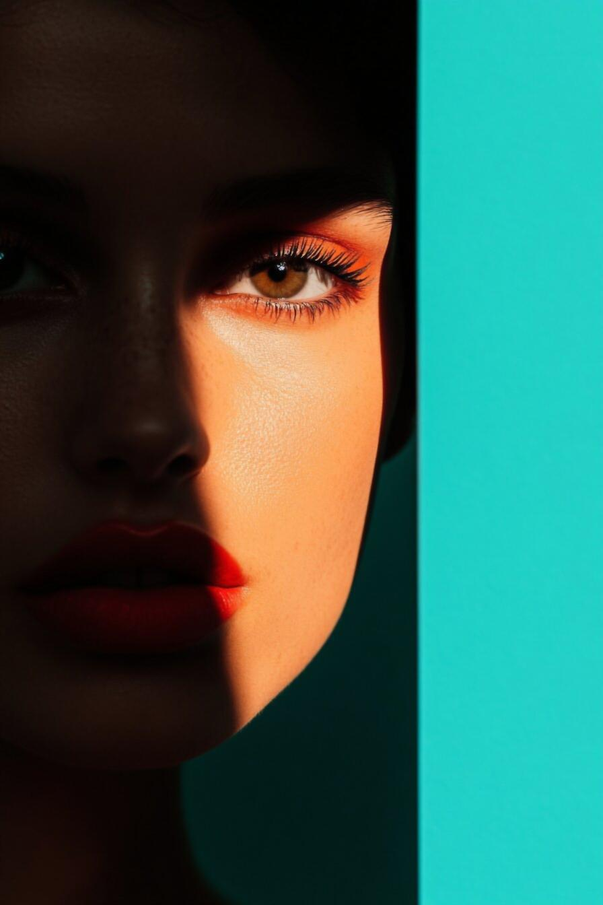 |

### Configuration

```ini
[imageFilter1]
id=ibp.imagefilter.adaptivemanifoldfilter
bypass=false
edgepreservation=50
radius=0.3

[info]
description=Smooth the image preserving hard edges
fileType=ibp.imagefilterlist
nFilters=1
name=Adaptive Manifold Filter

```

## Add Noise

Add uniform or gaussian distributed noise to the image

| Input | Output |
|--------|--------|
|  |  |
|  | 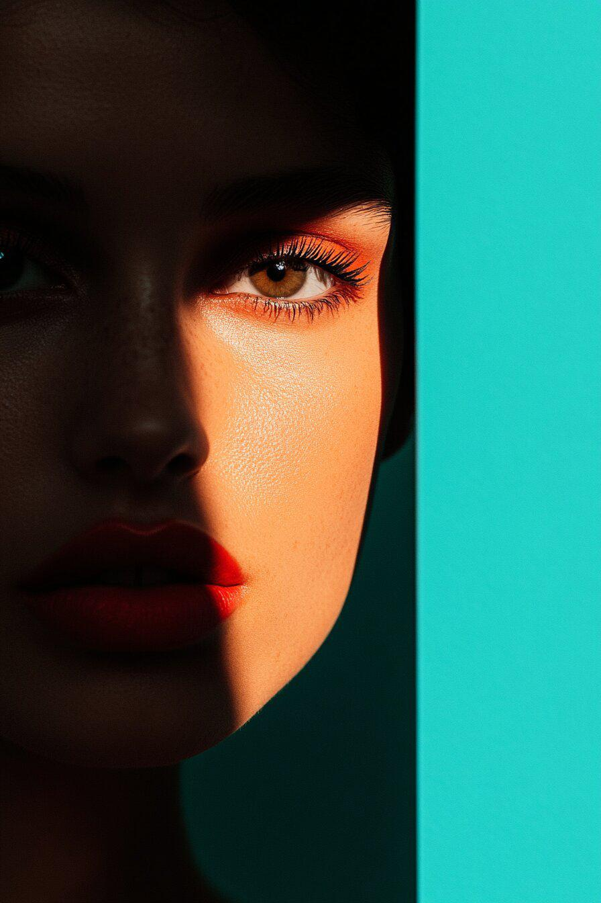 |

### Configuration

```ini
[imageFilter1]
id=ibp.imagefilter.addnoise
bypass=false
distribution=3
colormode=rgb
amount=0.3

[info]
description=Add uniform or gaussian distributed noise to the image
fileType=ibp.imagefilterlist
nFilters=1
name=Add Noise

```

## Auto Levels

Adjust the levels automatically

| Input | Output |
|--------|--------|
|  |  |
|  |  |

### Configuration

```ini
[imageFilter1]
id=ibp.imagefilter.autolevels
bypass=false
enhancechannelsseparately=false
adjustmidtones=false
targetcolorhighlights=#ffffff
targetcolormidtones=#808080
targetcolorshadows=#000000
clippinghighlights=0.1
clippingshadows=0.1

[info]
description=Adjust the levels automatically
fileType=ibp.imagefilterlist
nFilters=1
name=Auto Levels

```

## Auto Threshold

Transforms the channels of the image into binary using an automatic threshold value

| Input | Output |
|--------|--------|
|  | 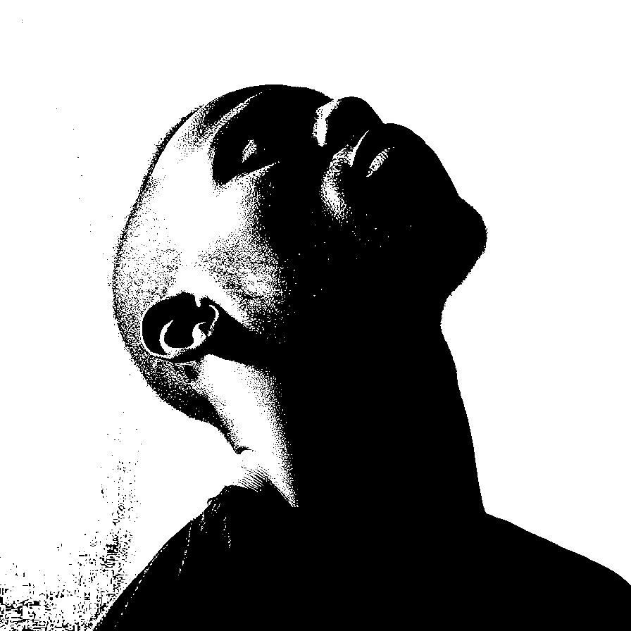 |
|  | 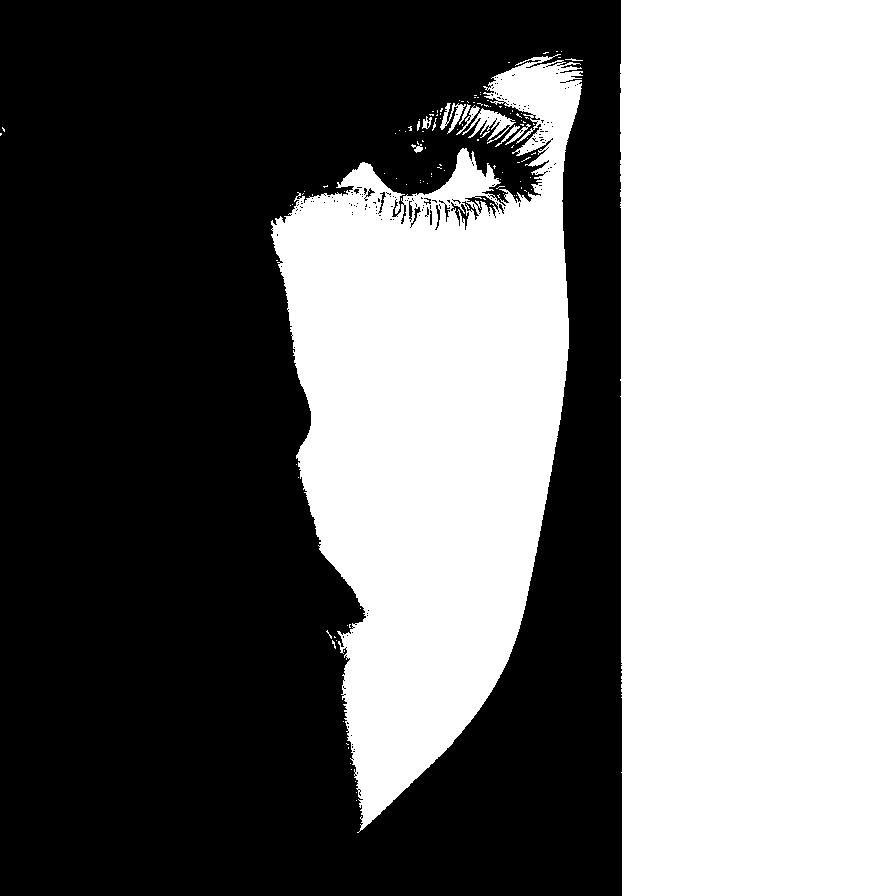 |

### Configuration

```ini
[imageFilter1]
id=ibp.imagefilter.autothreshold
bypass=false
colormode=3
affectedchannel=3
thresholdmode=3

[info]
description=Transforms the channels of the image into binary using an automatic threshold value
fileType=ibp.imagefilterlist
nFilters=1
name=Auto Threshold

```

## Auto Trim

Trims the image based on some luma or alpha threshold value

| Input | Output |
|--------|--------|
|  |  |
|  | 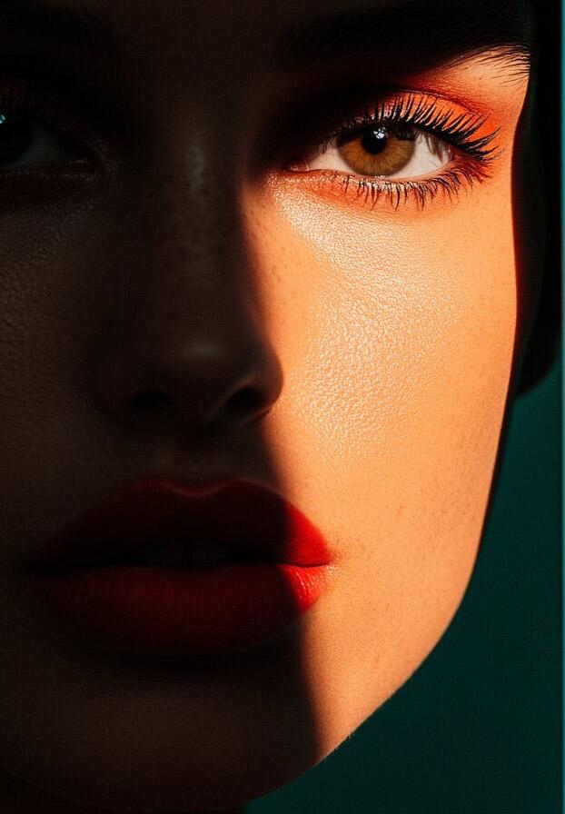 |

### Configuration

```ini
[imageFilter1]
id=ibp.imagefilter.autotrim
bypass=false
threshold=3
margins=0
reference=3

[info]
description=Trims the image based on some luma or alpha threshold value
fileType=ibp.imagefilterlist
nFilters=1
name=Auto Trim

```

## Basic Rotation

Rotate the image by 90° increments

| Input | Output |
|--------|--------|
|  |  |
|  | 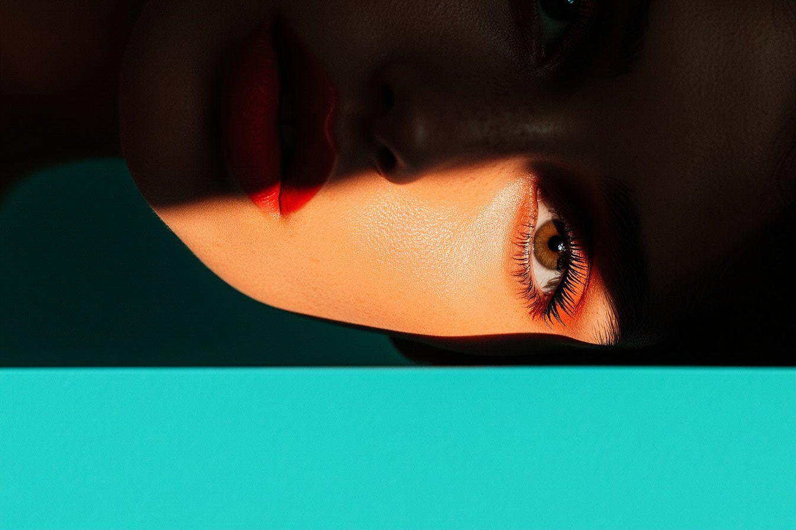 |

### Configuration

```ini
[imageFilter1]
id=ibp.imagefilter.basicrotation
bypass=false
angle=3

[info]
description=Rotate the image by 90° increments
fileType=ibp.imagefilterlist
nFilters=1
name=Basic Rotation

```

## Bilateral Filter

This is a single filter configuration for imagefilter_bilateralfilter.

| Input | Output |
|--------|--------|
|  |  |
|  |  |

### Configuration

```ini
[imageFilter1]
id=ibp.imagefilter.bilateralfilter
bypass=false
edgepreservation=50
radius=0.3

[info]
description=This is a single filter configuration for imagefilter_bilateralfilter.
fileType=ibp.imagefilterlist
nFilters=1
name=Bilateral Filter

```

## Box Blur (Mean Filter)

Smooths the image using a normalized box filter

| Input | Output |
|--------|--------|
|  |  |
|  |  |

### Configuration

```ini
[imageFilter1]
id=ibp.imagefilter.boxblur
bypass=false
radius=3

[info]
description=Smooths the image using a normalized box filter
fileType=ibp.imagefilterlist
nFilters=1
name=Box Blur (Mean Filter)

```

## Brightness and Contrast

Adjust levels of the image in an easy way

| Input | Output |
|--------|--------|
|  |  |
|  | 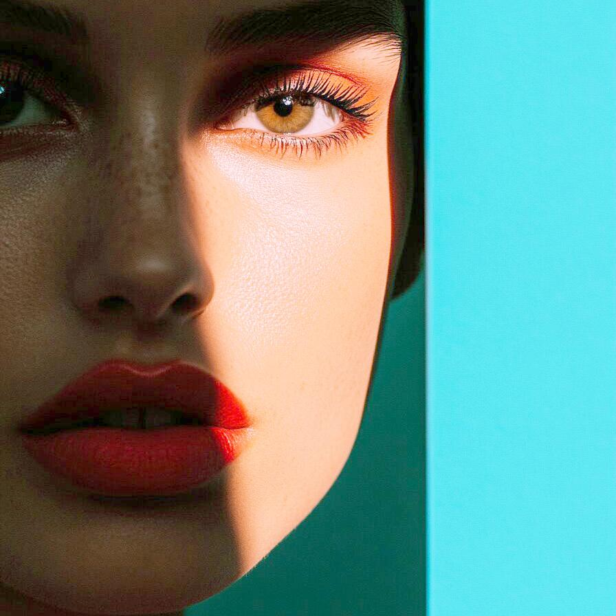 |

### Configuration

```ini
[imageFilter1]
id=ibp.imagefilter.brightnesscontrast
bypass=false
alphabrightnesscontrast=0 0
bluebrightnesscontrast=0 0
greenbrightnesscontrast=0 0
redbrightnesscontrast=0 0
rgbbrightnesscontrast=17 17
usesoftmode=false
workingchannel=rgb
brightness=25
contrast=25

[info]
description=Adjust levels of the image in an easy way
fileType=ibp.imagefilterlist
nFilters=1
name=Brightness and Contrast

```

## Color Balance

This is a single filter configuration for imagefilter_colorbalance.

| Input | Output |
|--------|--------|
|  |  |
|  | 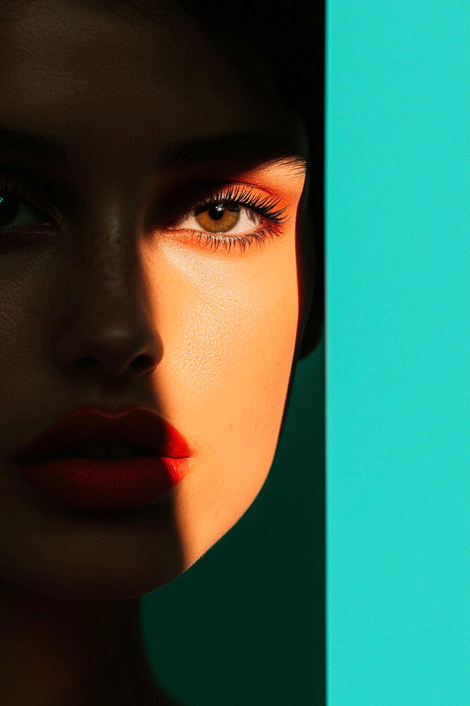 |

### Configuration

```ini
[imageFilter1]
id=ibp.imagefilter.colorbalance
bypass=false
preserveluminosity=false
shadowsred=0
shadowsgreen=0
shadowsblue=0
midtonesred=0
midtonesgreen=17
midtonesblue=0
highlightsred=17
highlightsgreen=0
highlightsblue=0

[info]
description=This is a single filter configuration for imagefilter_colorbalance.
fileType=ibp.imagefilterlist
nFilters=1
name=Color Balance

```

## Color Boosting

Try to improve the color contrast of the image

| Input | Output |
|--------|--------|
|  |  |
|  | 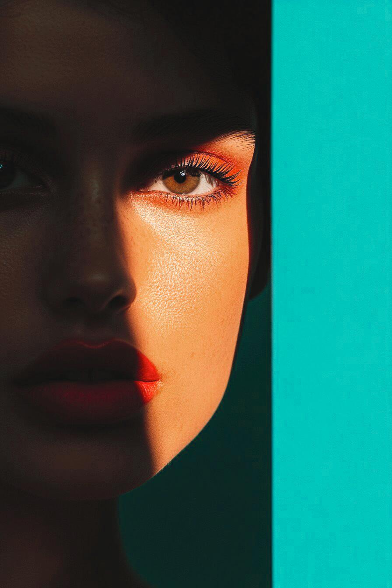 |

### Configuration

```ini
[imageFilter1]
id=ibp.imagefilter.colorboosting
bypass=false

[info]
description=Try to improve the color contrast of the image
fileType=ibp.imagefilterlist
nFilters=1
name=Color Boosting

```

## Color Layer

Adds a color layer to the image

| Input | Output |
|--------|--------|
|  |  |
|  |  |

### Configuration

```ini
[imageFilter1]
id=ibp.imagefilter.colorlayer
bypass=false
position=3
colorcompositionmode=3
opacity=100
color=0

[info]
description=Adds a color layer to the image
fileType=ibp.imagefilterlist
nFilters=1
name=Color Layer

```

## Contrast Preserving Grayscale

Convert the image to grayscale preserving the contrast

| Input | Output |
|--------|--------|
|  |  |
|  | 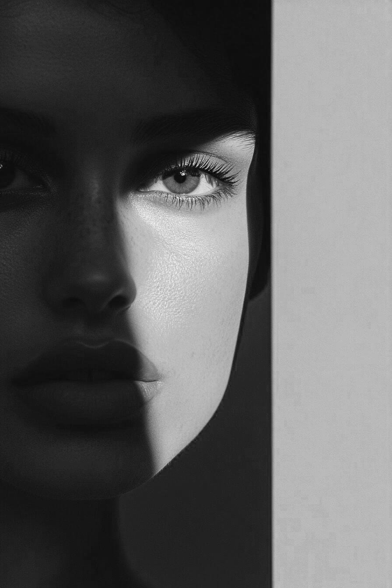 |

### Configuration

```ini
[imageFilter1]
id=ibp.imagefilter.contrastpreservinggrayscale
bypass=false

[info]
description=Convert the image to grayscale preserving the contrast
fileType=ibp.imagefilterlist
nFilters=1
name=Contrast Preserving Grayscale

```

## Curves

Adjust the tonal curves of the image

| Input | Output |
|--------|--------|
|  |  |
|  |  |

### Configuration

```ini
[imageFilter1]
id=ibp.imagefilter.curves
bypass=false
knots=0
interpolationmode=linear
workingchannel=3

[info]
description=Adjust the tonal curves of the image
fileType=ibp.imagefilterlist
nFilters=1
name=Curves

```

## DCT Denoising

This is a single filter configuration for imagefilter_dctdenoising.

| Input | Output |
|--------|--------|
|  |  |
|  |  |

### Configuration

```ini
[imageFilter1]
id=ibp.imagefilter.dctdenoising
bypass=false
strength=0.3

[info]
description=This is a single filter configuration for imagefilter_dctdenoising.
fileType=ibp.imagefilterlist
nFilters=1
name=DCT Denoising

```

## Desaturate

Removes the chroma information of the image

| Input | Output |
|--------|--------|
|  | 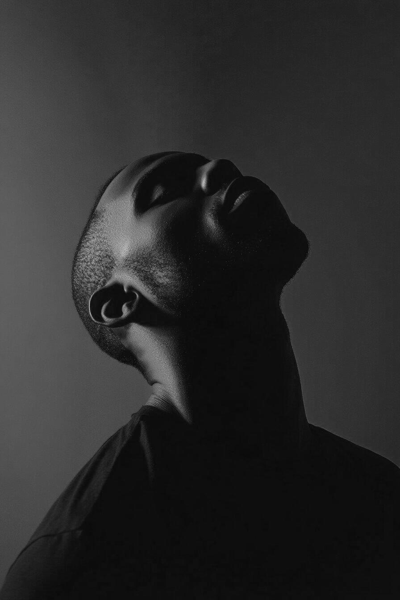 |
|  | 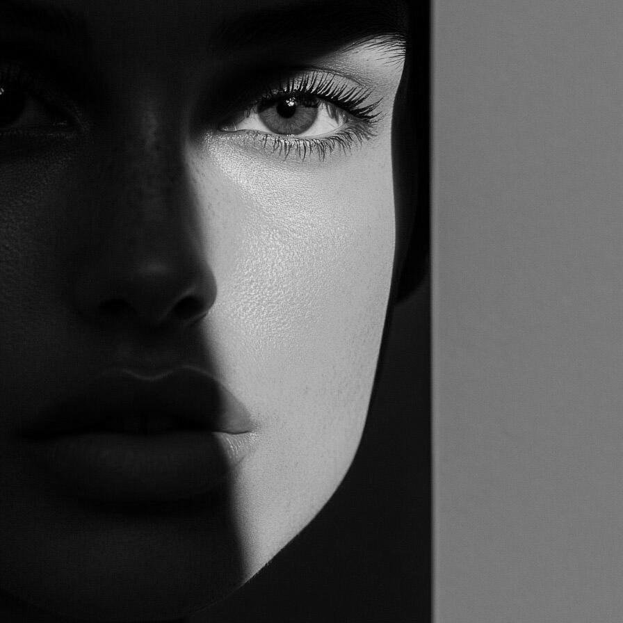 |

### Configuration

```ini
[imageFilter1]
id=ibp.imagefilter.desaturate
bypass=false

[info]
description=Removes the chroma information of the image
fileType=ibp.imagefilterlist
nFilters=1
name=Desaturate

```

## Domain Transform Filter

Smooth the image preserving hard edges

| Input | Output |
|--------|--------|
|  |  |
|  |  |

### Configuration

```ini
[imageFilter1]
id=ibp.imagefilter.domaintransformfilter
bypass=false
edgepreservation=50
radius=0.3

[info]
description=Smooth the image preserving hard edges
fileType=ibp.imagefilterlist
nFilters=1
name=Domain Transform Filter

```

## Equalize

Automatically equalize the image

| Input | Output |
|--------|--------|
|  |  |
|  | 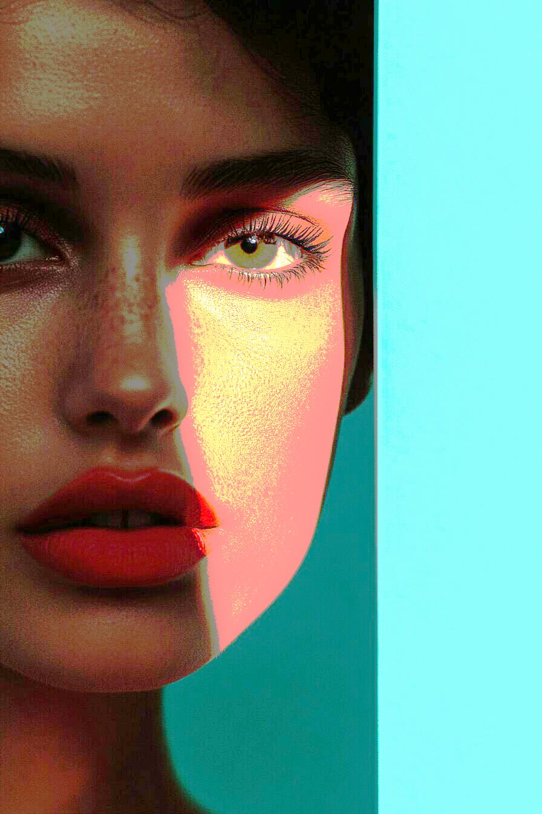 |

### Configuration

```ini
[imageFilter1]
id=ibp.imagefilter.equalize
bypass=false

[info]
description=Automatically equalize the image
fileType=ibp.imagefilterlist
nFilters=1
name=Equalize

```

## Flip

Flip the image around the vertical and/or horizontal axis

| Input | Output |
|--------|--------|
|  |  |
|  | 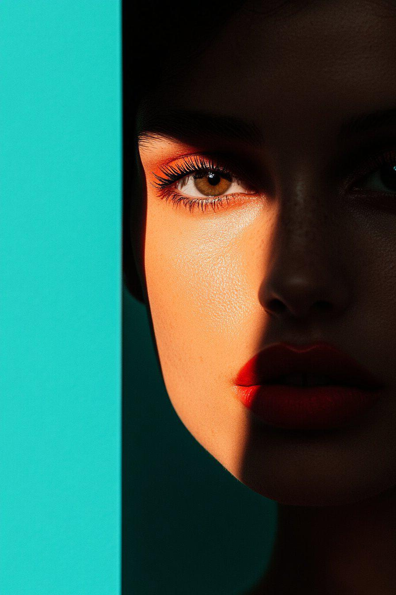 |

### Configuration

```ini
[imageFilter1]
id=ibp.imagefilter.flip
bypass=false
direction=3

[info]
description=Flip the image around the vertical and/or horizontal axis
fileType=ibp.imagefilterlist
nFilters=1
name=Flip

```

## Gaussian Blur

Blurs the image using a smooth gaussian distribution

| Input | Output |
|--------|--------|
|  |  |
|  |  |

### Configuration

```ini
[imageFilter1]
id=ibp.imagefilter.gaussianblur
bypass=false
blurrgb=true
bluralpha=true
radius=0.3

[info]
description=Blurs the image using a smooth gaussian distribution
fileType=ibp.imagefilterlist
nFilters=1
name=Gaussian Blur

```

## Grayscale

Convert the image to grayscale

| Input | Output |
|--------|--------|
|  | 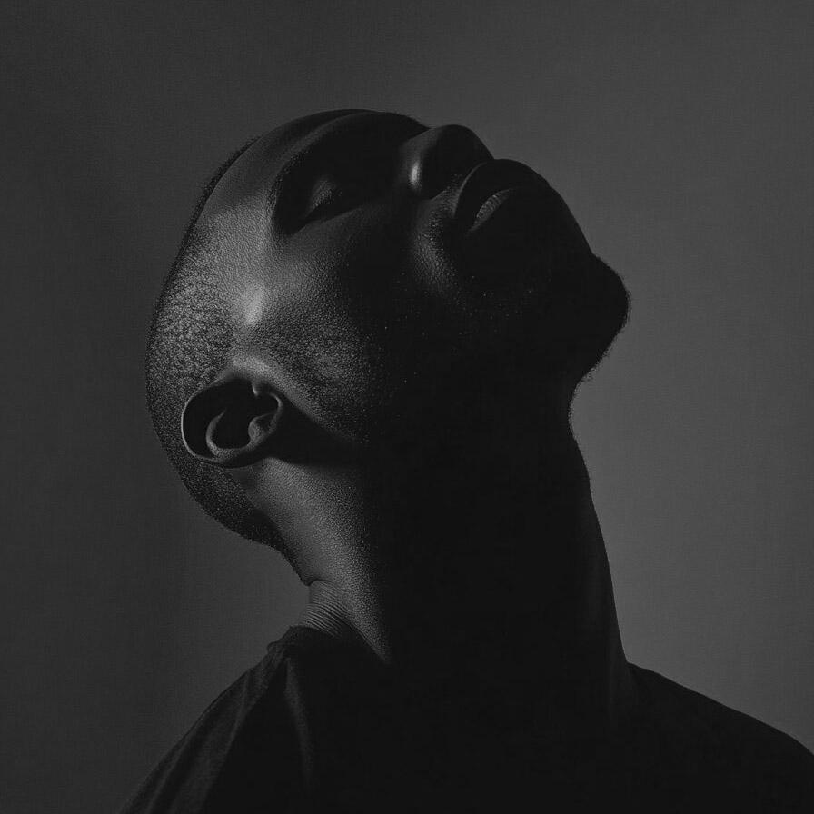 |
|  | 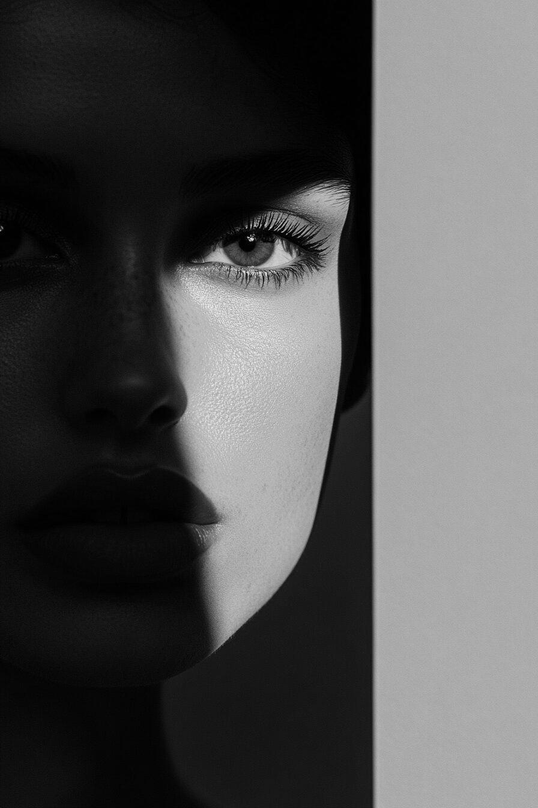 |

### Configuration

```ini
[imageFilter1]
id=ibp.imagefilter.grayscale
bypass=false

[info]
description=Convert the image to grayscale
fileType=ibp.imagefilterlist
nFilters=1
name=Grayscale

```

## Guided Filter

Smooth the image preserving hard edges

| Input | Output |
|--------|--------|
|  |  |
|  |  |

### Configuration

```ini
[imageFilter1]
id=ibp.imagefilter.guidedfilter
bypass=false
edgepreservation=50
radius=3

[info]
description=Smooth the image preserving hard edges
fileType=ibp.imagefilterlist
nFilters=1
name=Guided Filter

```

## HSL Color Replacement

Replace colors of the image based on its HSL components

| Input | Output |
|--------|--------|
|  |  |
|  |  |

### Configuration

```ini
[imageFilter1]
id=ibp.imagefilter.hslcolorreplacement
bypass=false
hueinterpolationmode=3
hueinverted=true
saturationknots=0
saturationinterpolationmode=3
saturationinverted=true
lightnessknots=0
lightnessinterpolationmode=3
lightnessinverted=true
outputmode=normal
preblurradius=0.3
colorize=true
relhue=45
relsaturation=25
rellightness=25
abshue=30
abssaturation=25
hueknots=0

[info]
description=Replace colors of the image based on its HSL components
fileType=ibp.imagefilterlist
nFilters=1
name=HSL Color Replacement

```

## HSL Keyer

Apply a matte to the image based on its HSL components

| Input | Output |
|--------|--------|
|  |  |
|  |  |

### Configuration

```ini
[imageFilter1]
id=ibp.imagefilter.hslkeyer
bypass=false
hueinterpolationmode=3
hueinverted=true
saturationknots=0
saturationinterpolationmode=3
saturationinverted=true
lightnessknots=0
lightnessinterpolationmode=3
lightnessinverted=true
outputmode=normal
preblurradius=0.3
hueknots=0

[info]
description=Apply a matte to the image based on its HSL components
fileType=ibp.imagefilterlist
nFilters=1
name=HSL Keyer

```

## Hue/Saturation/Lightness

Change the color information of the image in the HSL space

| Input | Output |
|--------|--------|
|  | 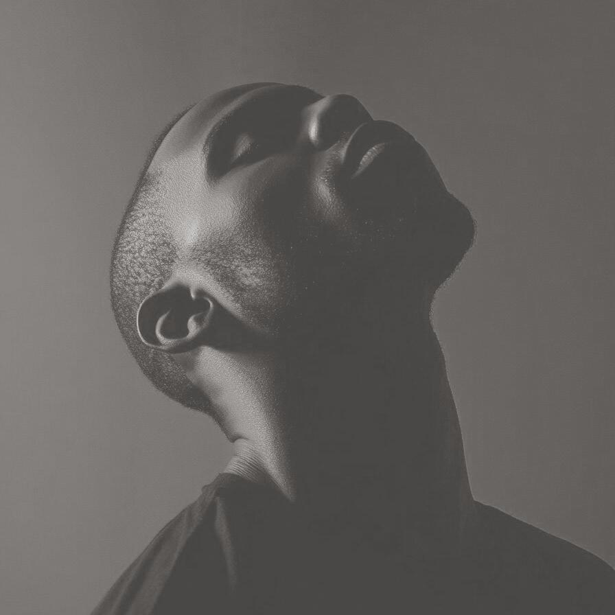 |
|  | 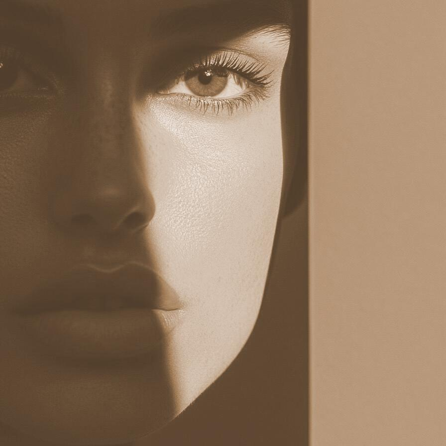 |

### Configuration

```ini
[imageFilter1]
id=ibp.imagefilter.huesaturation
bypass=false
relhue=45
relsaturation=25
rellightness=25
abshue=30
abssaturation=3
colorize=true

[info]
description=Change the color information of the image in the HSL space
fileType=ibp.imagefilterlist
nFilters=1
name=Hue/Saturation/Lightness

```

## Identity

Just doesn't make any modifications to the image

| Input | Output |
|--------|--------|
|  |  |
|  |  |

### Configuration

```ini
[imageFilter1]
id=ibp.imagefilter.identity
bypass=false

[info]
description=Just doesn't make any modifications to the image
fileType=ibp.imagefilterlist
nFilters=1
name=Identity

```

## Inpainting IIH Correction

This is a single filter configuration for imagefilter_inpaintingiihc.

| Input | Output |
|--------|--------|
|  | 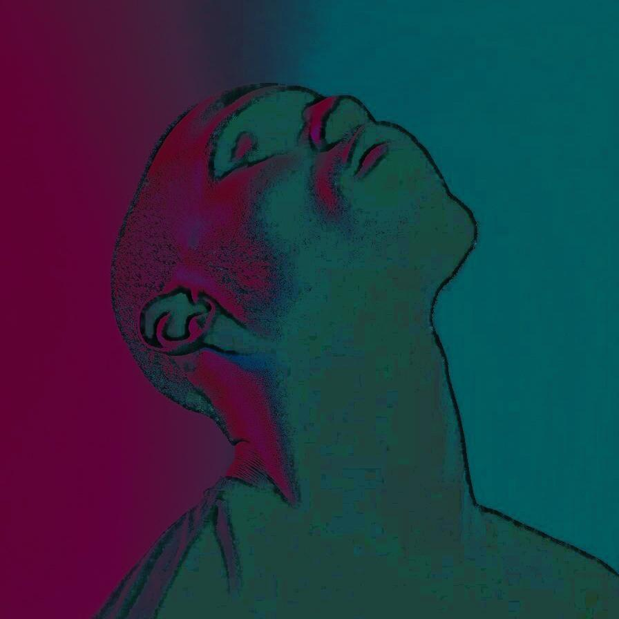 |
|  | 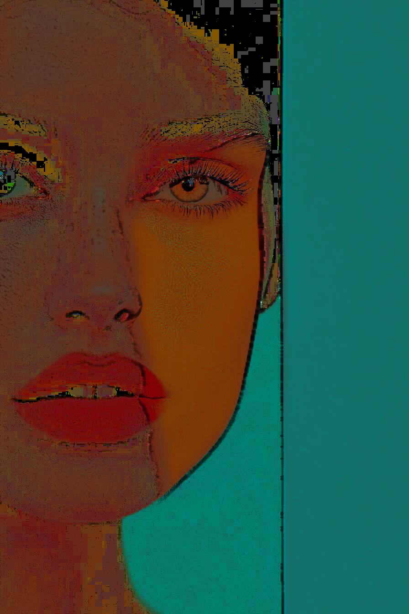 |

### Configuration

```ini
[imageFilter1]
id=ibp.imagefilter.inpaintingiihc
bypass=false
maskexpansion=3
outputmode=3
noisereduction=0.3

[info]
description=This is a single filter configuration for imagefilter_inpaintingiihc.
fileType=ibp.imagefilterlist
nFilters=1
name=Inpainting IIH Correction

```

## Invert

Invert one or more channels of the image

| Input | Output |
|--------|--------|
|  | 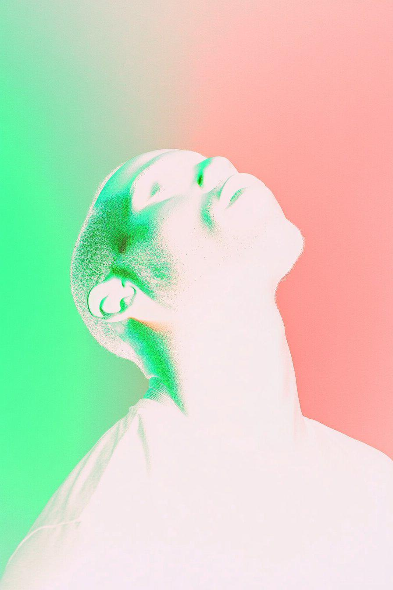 |
|  | 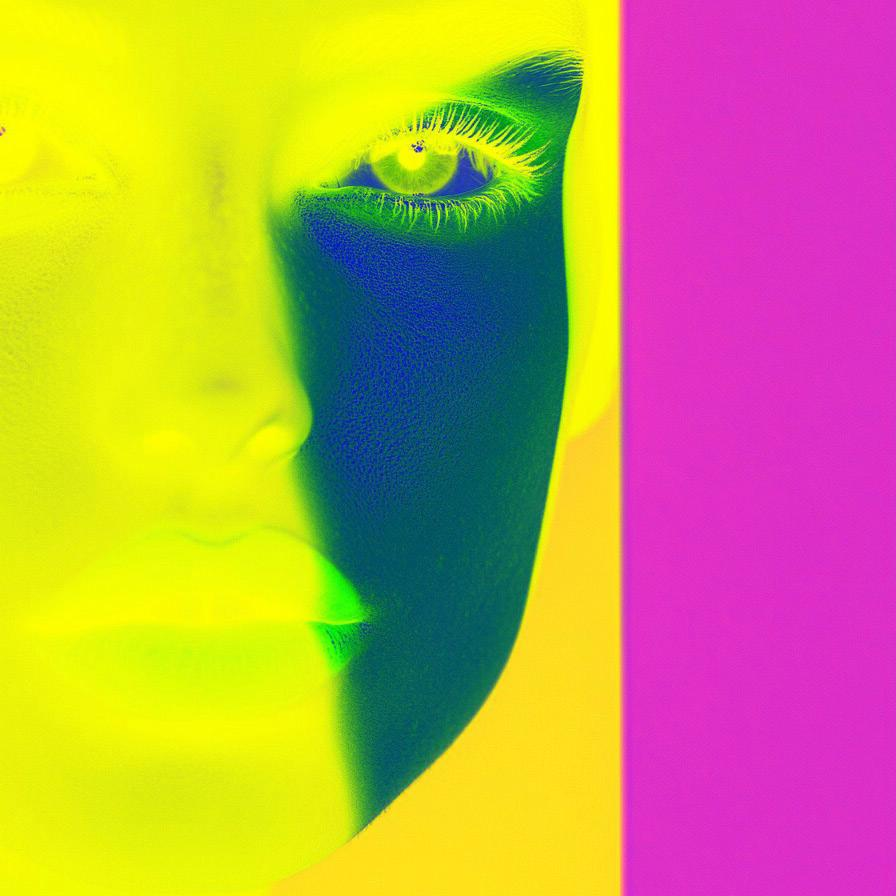 |

### Configuration

```ini
[imageFilter1]
id=ibp.imagefilter.invert
bypass=false
greenchannel=true
bluechannel=true
alphachannel=true
redchannel=true

[info]
description=Invert one or more channels of the image
fileType=ibp.imagefilterlist
nFilters=1
name=Invert

```

## ITK N4 IIH Correction

This is a single filter configuration for imagefilter_itkn4iihc.

| Input | Output |
|--------|--------|
|  |  |
|  |  |

### Configuration

```ini
[imageFilter1]
id=ibp.imagefilter.itkn4iihc
bypass=false
outputmode=3
gridsize=3

[info]
description=This is a single filter configuration for imagefilter_itkn4iihc.
fileType=ibp.imagefilterlist
nFilters=1
name=ITK N4 IIH Correction

```

## Levels

Adjust the black, mid and white tones of the image

| Input | Output |
|--------|--------|
|  |  |
|  |  |

### Configuration

```ini
[imageFilter1]
id=ibp.imagefilter.levels
bypass=false
inputblackpoint=0.3
inputgamma=0.3
inputwhitepoint=0.3
outputblackpoint=0.3
outputwhitepoint=0.3
workingchannel=3

[info]
description=Adjust the black, mid and white tones of the image
fileType=ibp.imagefilterlist
nFilters=1
name=Levels

```

## Low Pass IIH Correction

Removes the artifacts due to a bad illumination using a low pass filtering approach

| Input | Output |
|--------|--------|
|  |  |
|  | 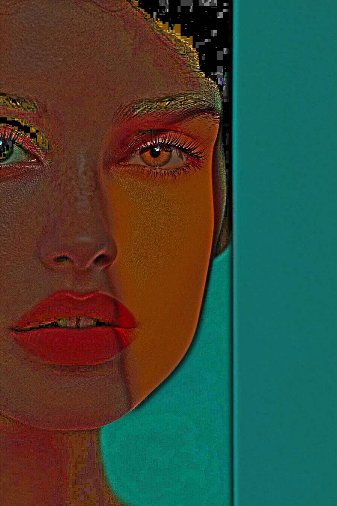 |

### Configuration

```ini
[imageFilter1]
id=ibp.imagefilter.lowpassiihc
bypass=false
outputmode=3
featuresize=10

[info]
description=Removes the artifacts due to a bad illumination using a low pass filtering approach
fileType=ibp.imagefilterlist
nFilters=1
name=Low Pass IIH Correction

```

## Luma Keyer

Apply a matte to the image based on its luminance

| Input | Output |
|--------|--------|
|  |  |
|  |  |

### Configuration

```ini
[imageFilter1]
id=ibp.imagefilter.lumakeyer
bypass=false
interpolationmode=3
inverted=true
outputmode=normal
preblurradius=0.3
knots=0

[info]
description=Apply a matte to the image based on its luminance
fileType=ibp.imagefilterlist
nFilters=1
name=Luma Keyer

```

## Median

Smooths the image using a median filter

| Input | Output |
|--------|--------|
|  | 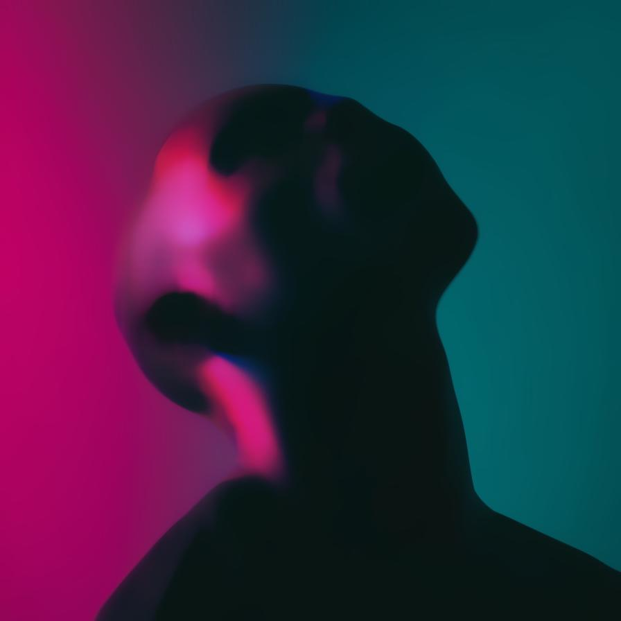 |
|  |  |

### Configuration

```ini
[imageFilter1]
id=ibp.imagefilter.median
bypass=false
radius=3

[info]
description=Smooths the image using a median filter
fileType=ibp.imagefilterlist
nFilters=1
name=Median

```

## Morphological IIH Correction

Removes the artifacts due to a bad illumination using a morphological approach

| Input | Output |
|--------|--------|
|  |  |
|  | 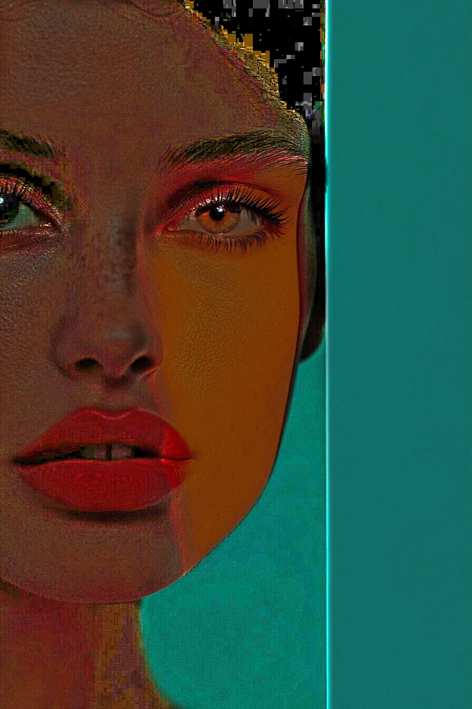 |

### Configuration

```ini
[imageFilter1]
id=ibp.imagefilter.morphologicaliihc
bypass=false
outputmode=3
featuresize=10

[info]
description=Removes the artifacts due to a bad illumination using a morphological approach
fileType=ibp.imagefilterlist
nFilters=1
name=Morphological IIH Correction

```

## Basic Morphology

Apply a basic mathematical morphology operation to the image

| Input | Output |
|--------|--------|
|  |  |
|  | 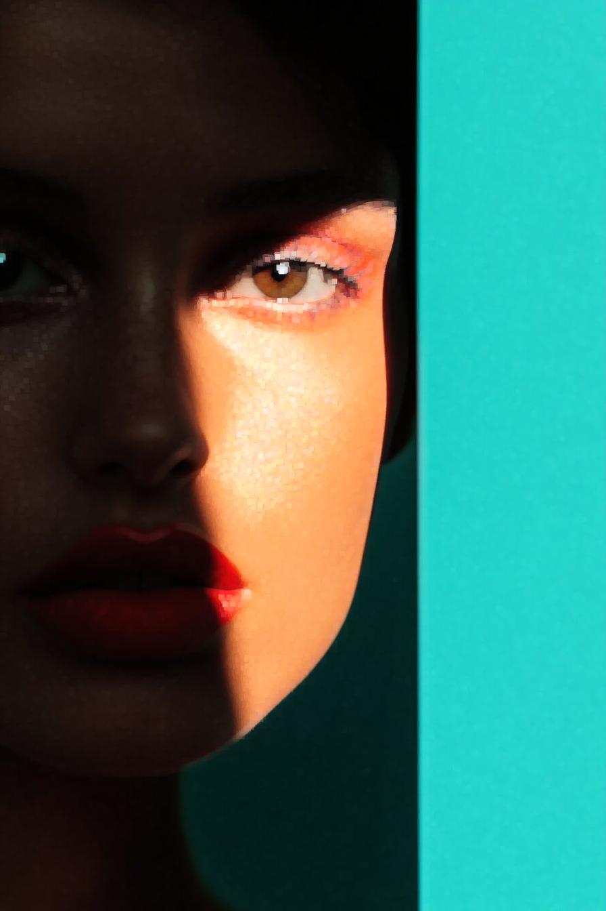 |

### Configuration

```ini
[imageFilter1]
id=ibp.imagefilter.morphology
bypass=false
modifyalpha=true
morphologyop=3
kernelshape=rectangle
vradius=3
hradius=3
lockradius=true
modifyrgb=true

[info]
description=Apply a basic mathematical morphology operation to the image
fileType=ibp.imagefilterlist
nFilters=1
name=Basic Morphology

```

## Non-Local Means Denoising

Removes the noise from the image using semi-local information

| Input | Output |
|--------|--------|
|  |  |
|  |  |

### Configuration

```ini
[imageFilter1]
id=ibp.imagefilter.nlmdenoising
bypass=false
strength=0.3

[info]
description=Removes the noise from the image using semi-local information
fileType=ibp.imagefilterlist
nFilters=1
name=Non-Local Means Denoising

```

## Prospective IIH Correction

Removes the artifacts due to a bad illumination using a prospective approach

| Input | Output |
|--------|--------|
|  |  |
|  |  |

### Configuration

```ini
[imageFilter1]
id=ibp.imagefilter.prospectiveiihc
bypass=false
outputmode=3
image=0

[info]
description=Removes the artifacts due to a bad illumination using a prospective approach
fileType=ibp.imagefilterlist
nFilters=1
name=Prospective IIH Correction

```

## Resample

Resample the image to a new size using the selected resampling interpolation mode

| Input | Output |
|--------|--------|
|  |  |
|  |  |

### Configuration

```ini
[imageFilter1]
id=ibp.imagefilter.resample
bypass=false
height=100
widthmode=3
heightmode=3
resamplingmode=bicubic
width=100

[info]
description=Resample the image to a new size using the selected resampling interpolation mode
fileType=ibp.imagefilterlist
nFilters=1
name=Resample

```

## Resize

Resize the image without resampling its data

| Input | Output |
|--------|--------|
|  |  |
|  |  |

### Configuration

```ini
[imageFilter1]
id=ibp.imagefilter.resize
bypass=false
height=100
widthmode=3
heightmode=3
resizemode=absolute
anchorposition=3
backgroundcolor=0
width=100

[info]
description=Resize the image without resampling its data
fileType=ibp.imagefilterlist
nFilters=1
name=Resize

```

## Surface Fitting IIH Correction

Removes the artifacts due to a bad illumination using a surface fitting approach

| Input | Output |
|--------|--------|
|  |  |
|  | 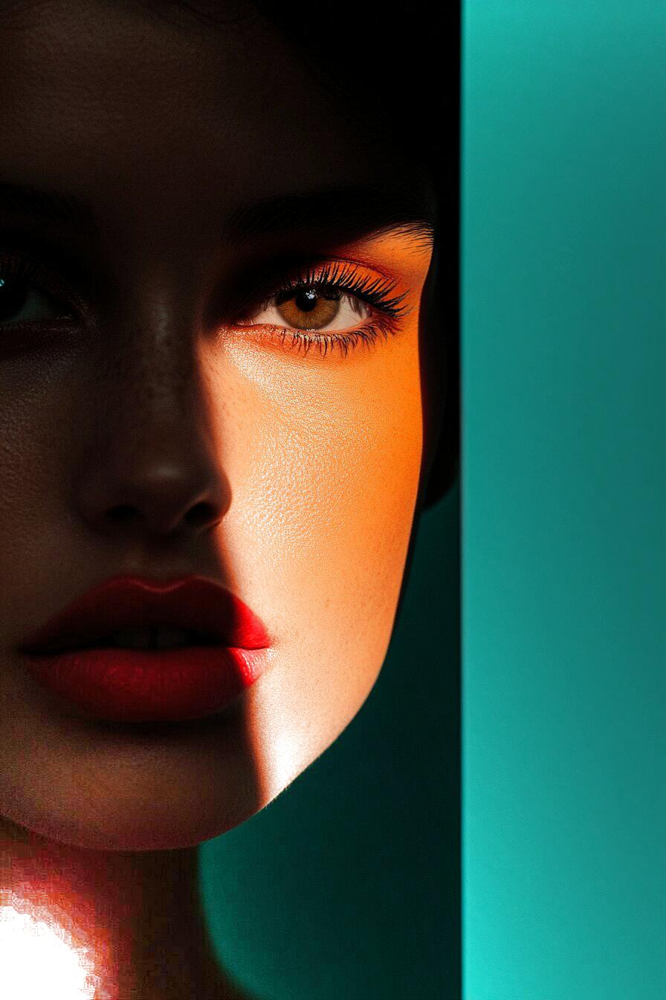 |

### Configuration

```ini
[imageFilter1]
id=ibp.imagefilter.surfacefittingiihc
bypass=false
outputmode=3

[info]
description=Removes the artifacts due to a bad illumination using a surface fitting approach
fileType=ibp.imagefilterlist
nFilters=1
name=Surface Fitting IIH Correction

```

## Texture Layer

Adds a texture layer to the image

| Input | Output |
|--------|--------|
|  |  |
|  | 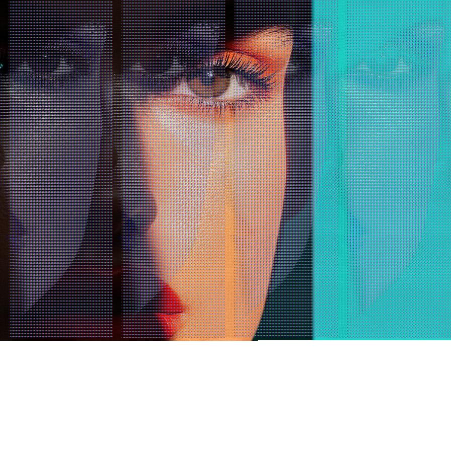 |

### Configuration

```ini
[imageFilter1]
id=ibp.imagefilter.texturelayer
bypass=false
position=3
colorcompositionmode=3
opacity=100
transformations=0
image=0

[info]
description=Adds a texture layer to the image
fileType=ibp.imagefilterlist
nFilters=1
name=Texture Layer

```

## Threshold

Transforms the channels of the image into binary using a threshold value

| Input | Output |
|--------|--------|
|  |  |
|  | 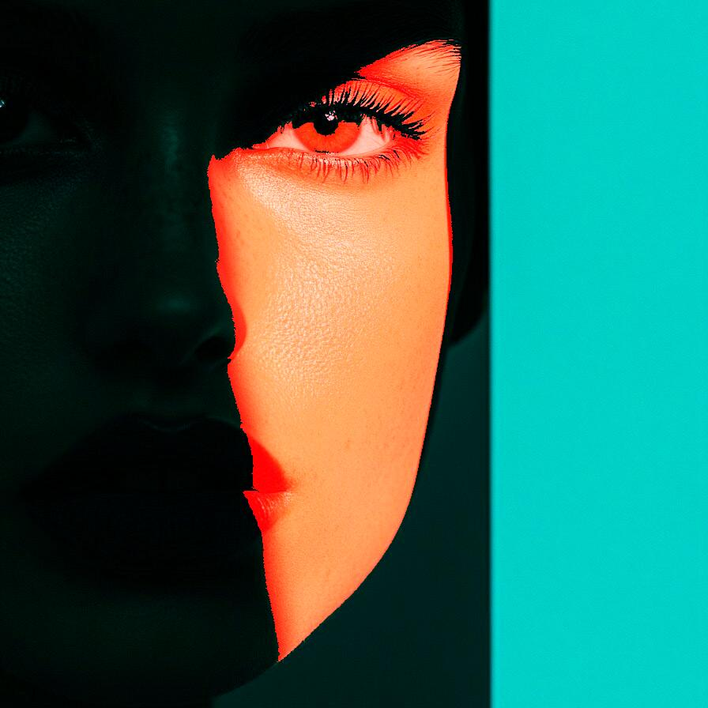 |

### Configuration

```ini
[imageFilter1]
affectedchannels=luma red alpha
alphathreshold=204
bluethreshold=128
bypass=false
colormode=rgb
greenthreshold=128
id=ibp.imagefilter.threshold
lumathreshold=51
redthreshold=78

[info]
description=Transforms the channels of the image into binary using a threshold value
fileType=ibp.imagefilterlist
nFilters=1
name=Threshold
```

## Total Variation Denoising

Removes the noise from the image using a variational method

| Input | Output |
|--------|--------|
|  |  |
|  | 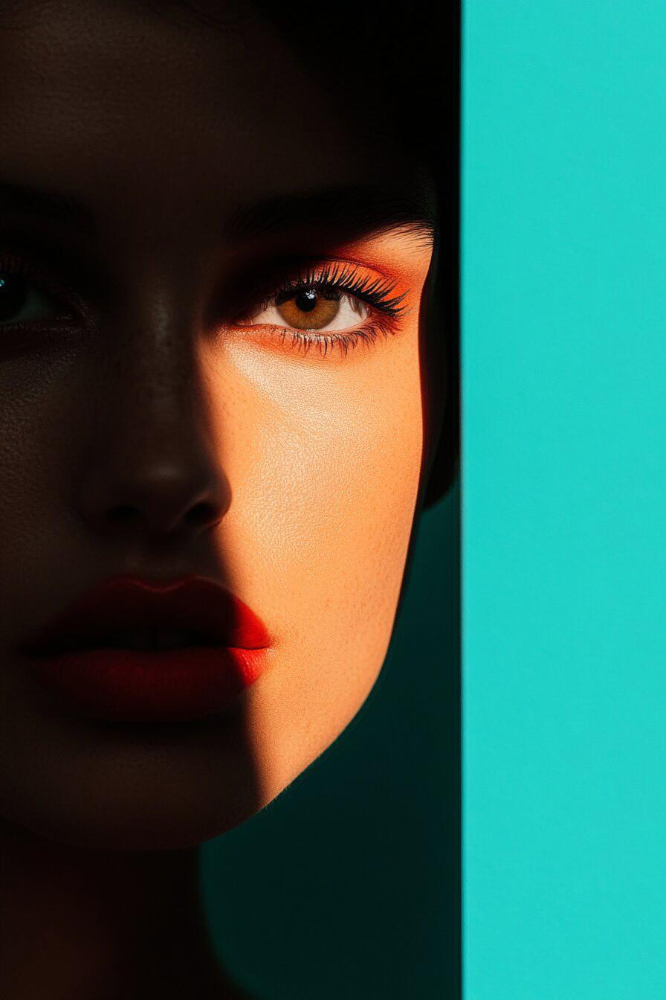 |

### Configuration

```ini
[imageFilter1]
id=ibp.imagefilter.tvdenoising
bypass=false
iterations=30
strength=0.3

[info]
description=Removes the noise from the image using a variational method
fileType=ibp.imagefilterlist
nFilters=1
name=Total Variation Denoising

```

## Tina Vision IIH Correction

This is a single filter configuration for imagefilter_tviihc.

| Input | Output |
|--------|--------|
|  |  |
|  |  |

### Configuration

```ini
[imageFilter1]
id=ibp.imagefilter.tviihc
bypass=false
smoothness=10
outputmode=3
refinement=10

[info]
description=This is a single filter configuration for imagefilter_tviihc.
fileType=ibp.imagefilterlist
nFilters=1
name=Tina Vision IIH Correction

```

## Unsharp Mask

Enhances the image by contrasting fine details

| Input | Output |
|--------|--------|
|  |  |
|  | 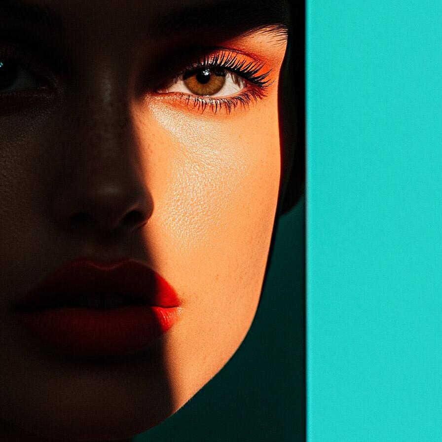 |

### Configuration

```ini
[imageFilter1]
id=ibp.imagefilter.unsharpmask
bypass=false
amount=3
threshold=3
radius=0.3

[info]
description=Enhances the image by contrasting fine details
fileType=ibp.imagefilterlist
nFilters=1
name=Unsharp Mask

```
