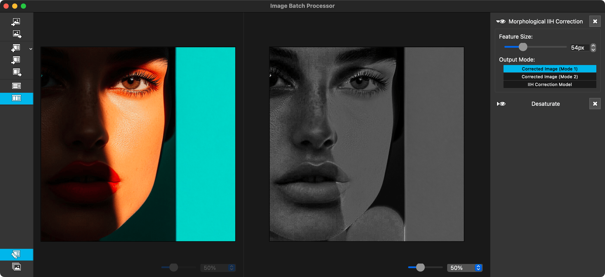

# Image Batch Processor


The Image Batch Processor (IBP) is a cross-platform, open source tool written in C++/Qt that transforms one or more images automatically using a customizable list of effects.



## Features

- Process multiple images in batch mode
- Apply multiple filters and effects sequentially
- Real-time preview of effects
- Plugin-based architecture for extensibility
- Cross-platform support (macOS, Windows, Linux)
- Optimized for traditional animation workflow

## Quick Links

- [Download Latest Release](https://github.com/twardoch/ibp/raw/refs/heads/master/dist/ImageBatchProcessor.dmg)
- [View Source on GitHub](https://github.com/twardoch/ibp)
- [Report Issues](https://github.com/twardoch/ibp/issues)

## Available Filters

IBP comes with a variety of built-in filters for image processing:

- Adaptive Manifold Filter
- Add Noise
- Auto Levels
- Auto Threshold
- Auto Trim
- Bilateral Filter
- Box Blur
- Brightness/Contrast
- Color Balance
- And many more...

## Building from Source

For macOS:

```bash
./macos_prep.sh    # Install prerequisites
./macos_install.sh # Build the app
./macos_package.sh # Create DMG package
```

## History

- 2014-2020: Created by [Deif Lou](https://github.com/deiflou/ibp)
- 2025: Updated by [Adam Twardoch](https://github.com/twardoch)

## License

This project is released under the MIT License. See the [LICENSE](https://github.com/twardoch/ibp/blob/master/LICENSE) file for details. 