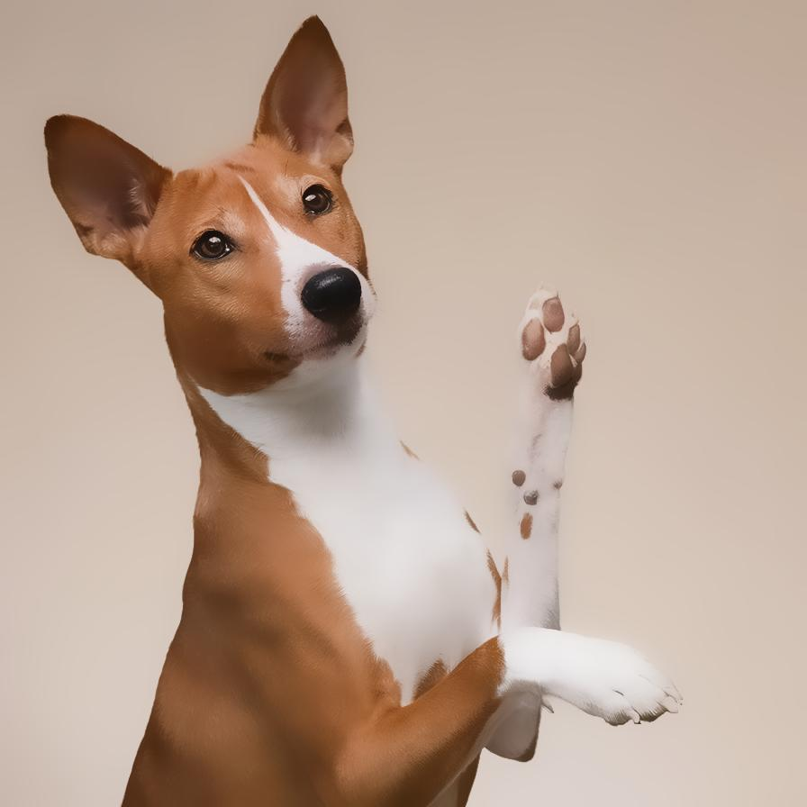

# adaptivemanifoldfilter

Smooth the image preserving hard edges

| Input | Output |
|--------|--------|
|  |  |
|  |  |
|  |  |
|  |  |

### Configuration

```ini
[imageFilter1]
id=ibp.imagefilter.adaptivemanifoldfilter
bypass=false
edgepreservation=75
radius=7500.0

[info]
description=Smooth the image preserving hard edges
fileType=ibp.imagefilterlist
nFilters=1
name=Adaptive Manifold Filter


```
