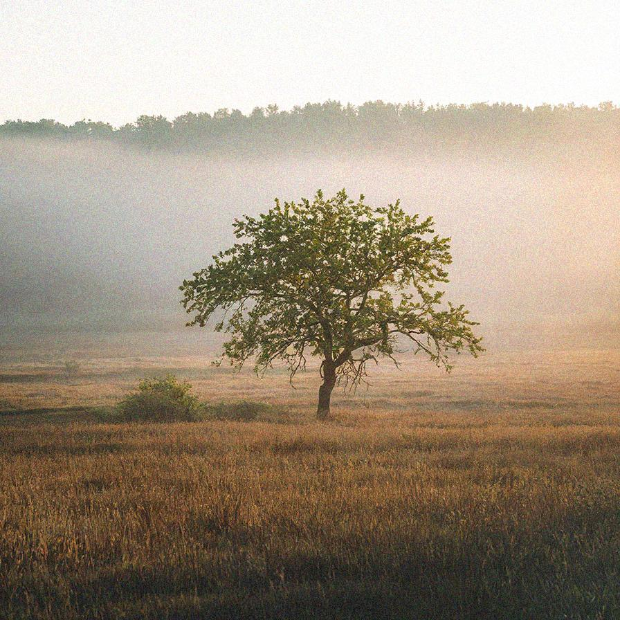

# addnoise

Add uniform or gaussian distributed noise to the image

| Input | Output |
|--------|--------|
|  |  |
|  |  |
|  |  |
|  |  |

### Configuration

```ini
[imageFilter1]
id=ibp.imagefilter.addnoise
bypass=false
amount=30000.0
colormode=#FF0000
distribution=75
seed=75

[info]
description=Add uniform or gaussian distributed noise to the image
fileType=ibp.imagefilterlist
nFilters=1
name=Add Noise


```
