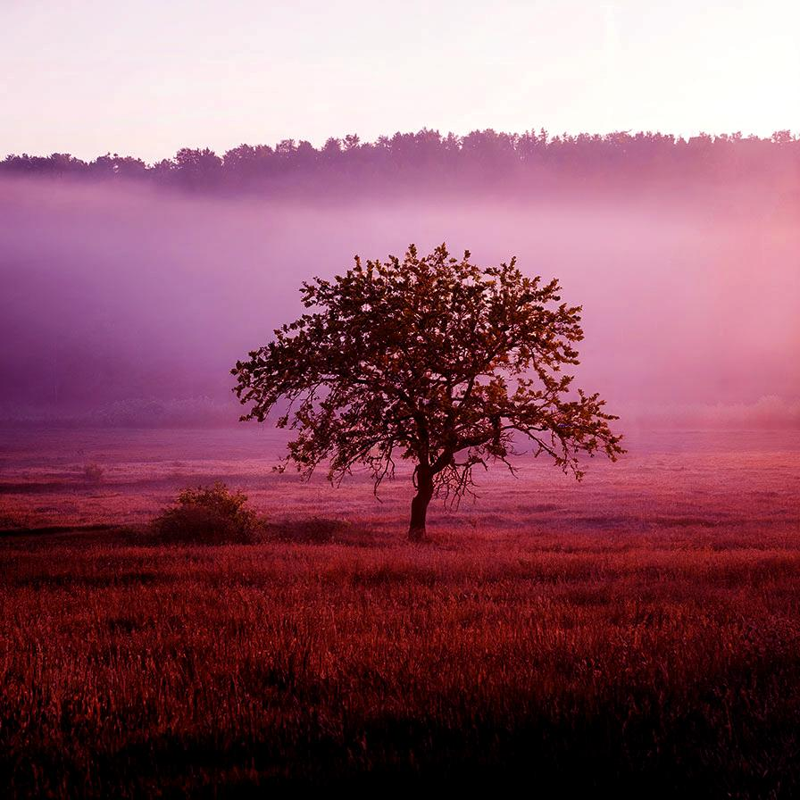

# autolevels

Adjust the levels automatically

| Input | Output |
|--------|--------|
|  |  |
|  |  |
|  |  |
|  |  |

### Configuration

```ini
[imageFilter1]
id=ibp.imagefilter.autolevels
bypass=false
adjustmidtones=1
clippinghighlights=50
clippingshadows=60
enhancechannelsseparately=1
targetcolorhighlights=20
targetcolormidtones=30
targetcolorshadows=40

[info]
description=Adjust the levels automatically
fileType=ibp.imagefilterlist
nFilters=1
name=Auto Levels


```
