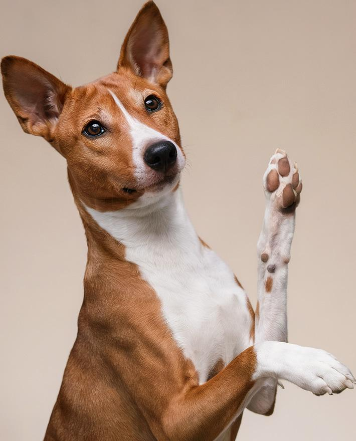

# autotrim

Trims the image based on some luma or alpha threshold value

| Input | Output |
|--------|--------|
|  |  |
|  |  |
|  |  |
|  |  |

### Configuration

```ini
[imageFilter1]
id=ibp.imagefilter.autotrim
bypass=false
margins=75
reference=75
threshold=190

[info]
description=Trims the image based on some luma or alpha threshold value
fileType=ibp.imagefilterlist
nFilters=1
name=Auto Trim


```
