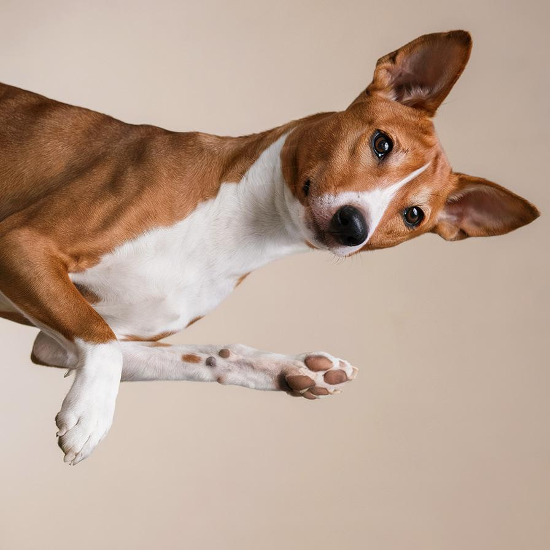
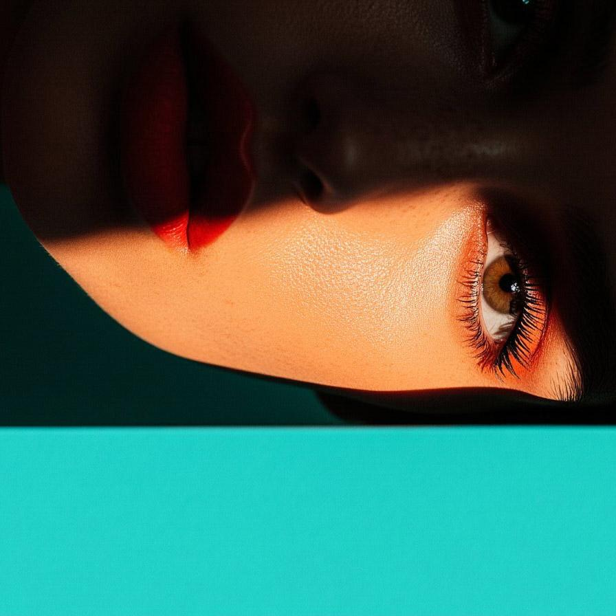
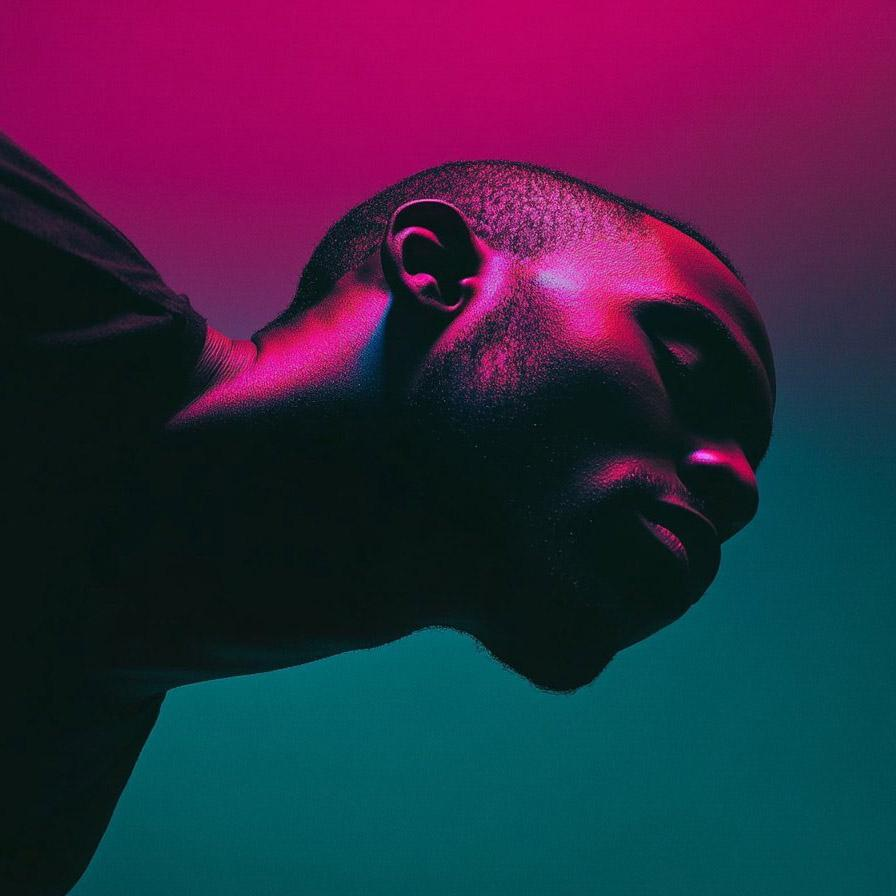
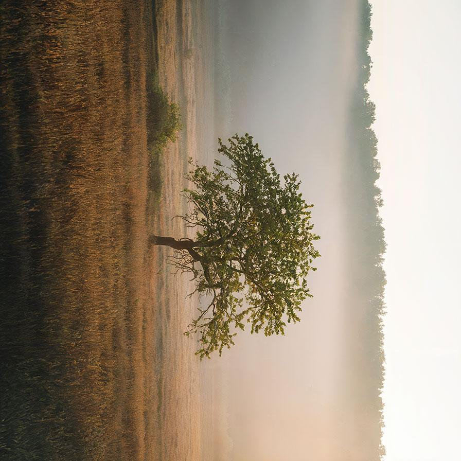

# basicrotation

Rotate the image by 90° increments

| Input | Output |
|--------|--------|
|  |  |
|  |  |
|  |  |
|  |  |

### Configuration

```ini
[imageFilter1]
id=ibp.imagefilter.basicrotation
bypass=false
angle=75

[info]
description=Rotate the image by 90° increments
fileType=ibp.imagefilterlist
nFilters=1
name=Basic Rotation


```
