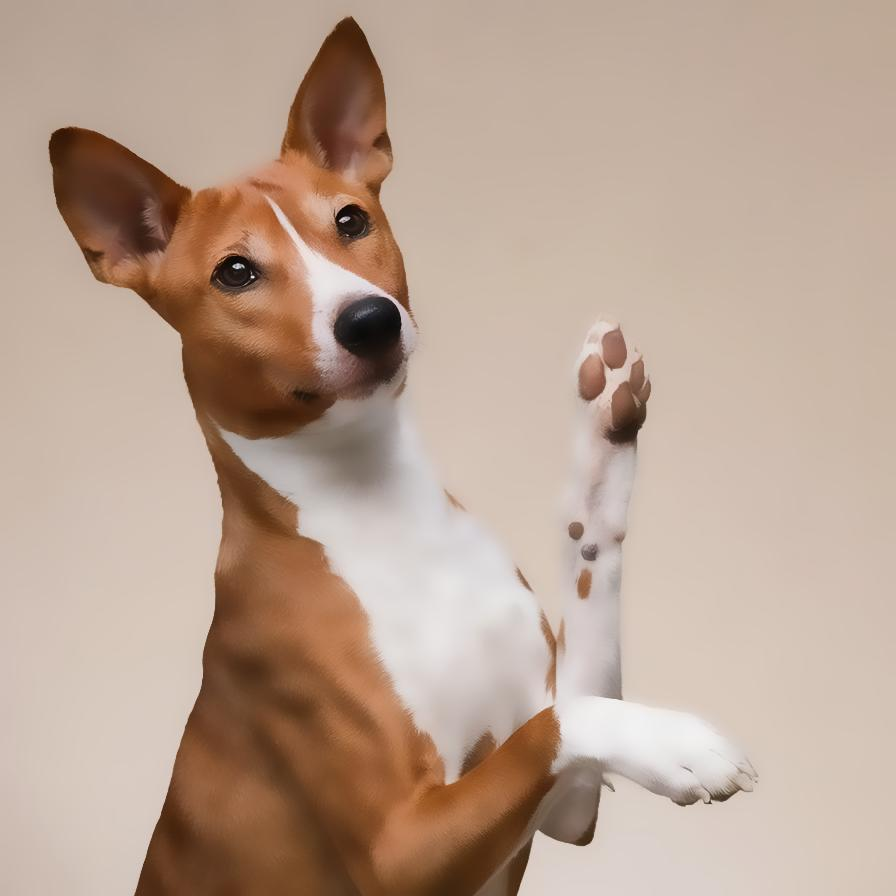
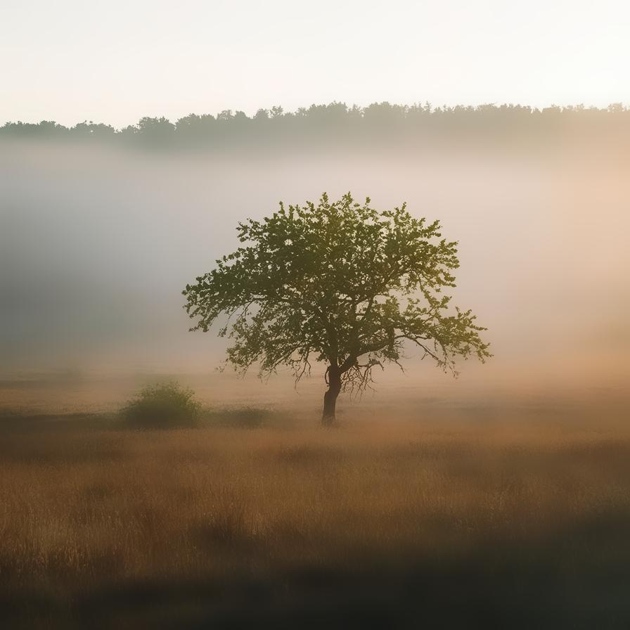

# bilateralfilter

Image filter plugin for bilateralfilter

| Input | Output |
|--------|--------|
|  |  |
|  |  |
|  |  |
|  |  |

### Configuration

```ini
[imageFilter1]
id=ibp.imagefilter.bilateralfilter
bypass=false
edgepreservation=75
radius=7500.0

[info]
description=Image filter plugin for bilateralfilter
fileType=ibp.imagefilterlist
nFilters=1
name=Bilateral Filter


```
