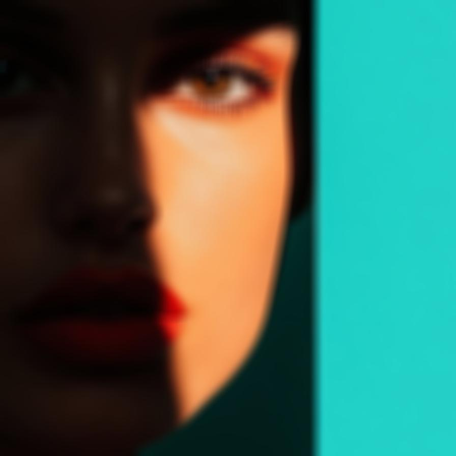
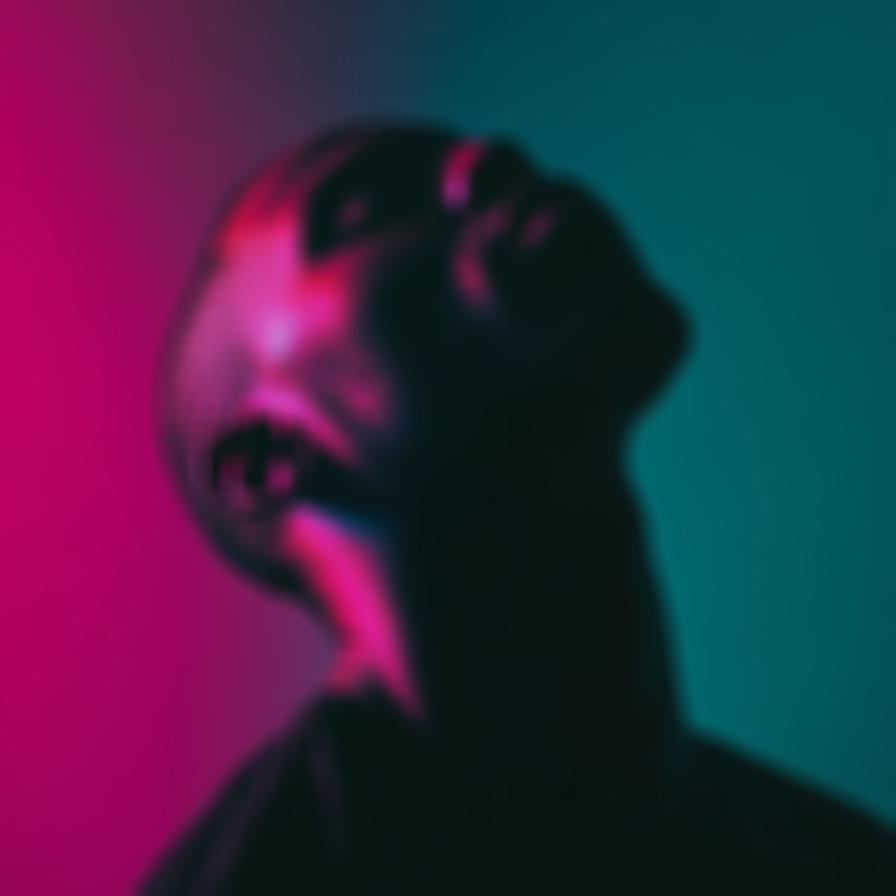

# boxblur

Smooths the image using a normalized box filter

| Input | Output |
|--------|--------|
|  |  |
|  |  |
|  |  |
|  |  |

### Configuration

```ini
[imageFilter1]
id=ibp.imagefilter.boxblur
bypass=false
radius=50

[info]
description=Smooths the image using a normalized box filter
fileType=ibp.imagefilterlist
nFilters=1
name=Box Blur (Mean Filter)


```
