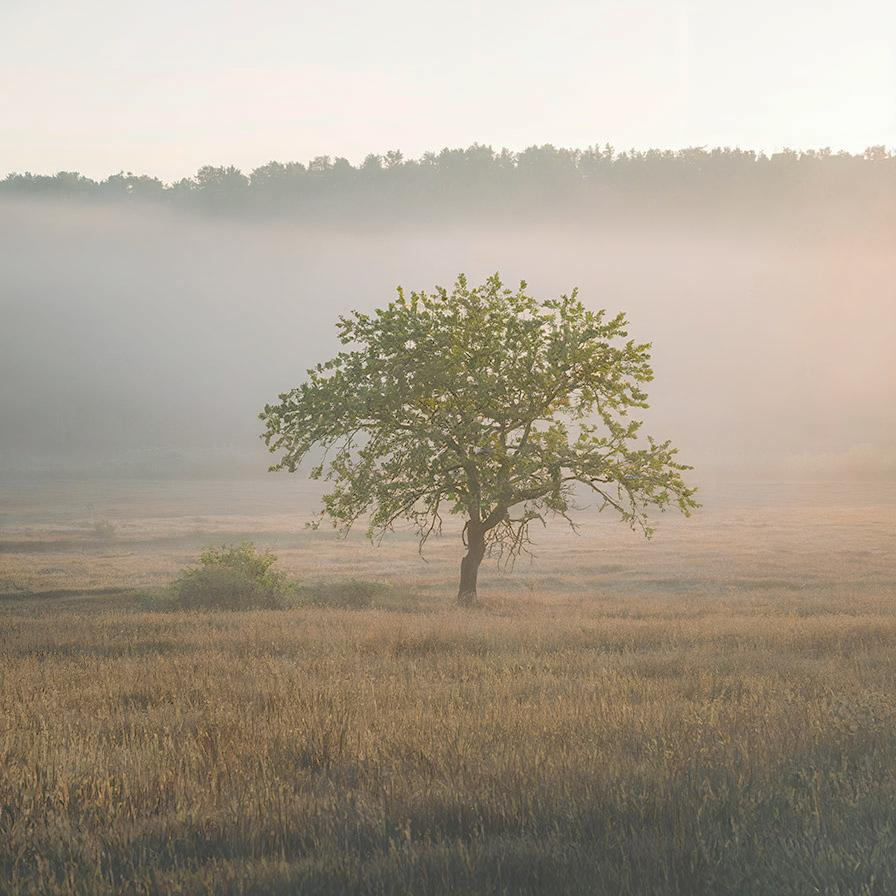

# brightnesscontrast

Adjust levels of the image in an easy way

| Input | Output |
|--------|--------|
|  |  |
|  |  |
|  |  |
|  |  |

### Configuration

```ini
[imageFilter1]
id=ibp.imagefilter.brightnesscontrast
bypass=false
brightness=30
contrast=20
usesoftmode=1
workingchannel=2

[info]
description=Adjust levels of the image in an easy way
fileType=ibp.imagefilterlist
nFilters=1
name=Brightness and Contrast


```
