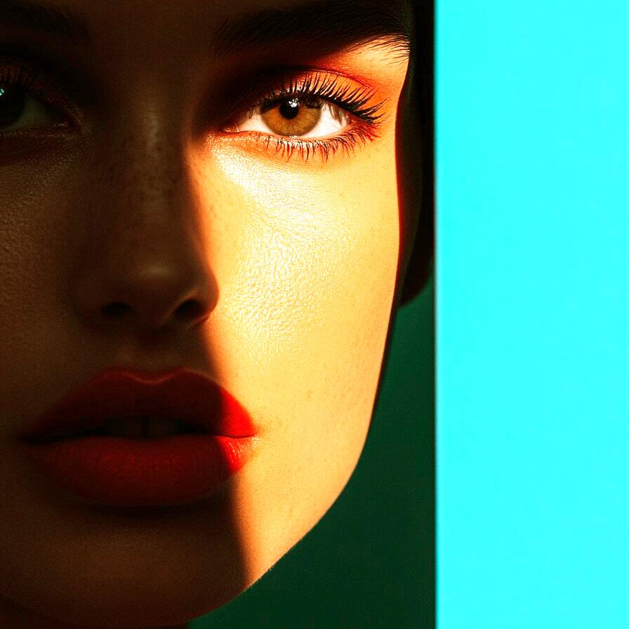
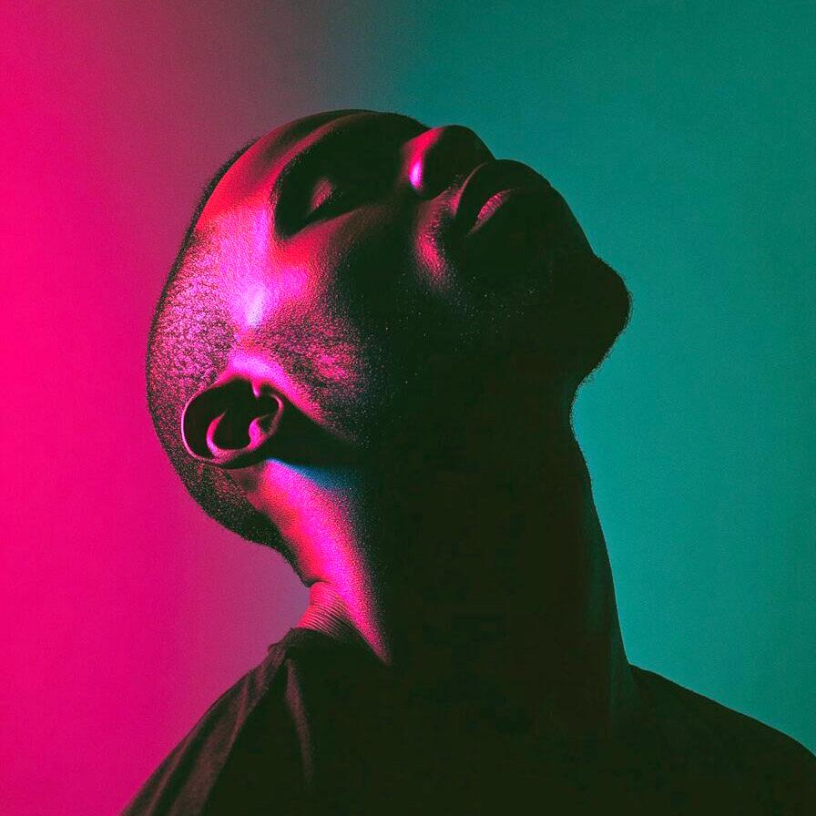
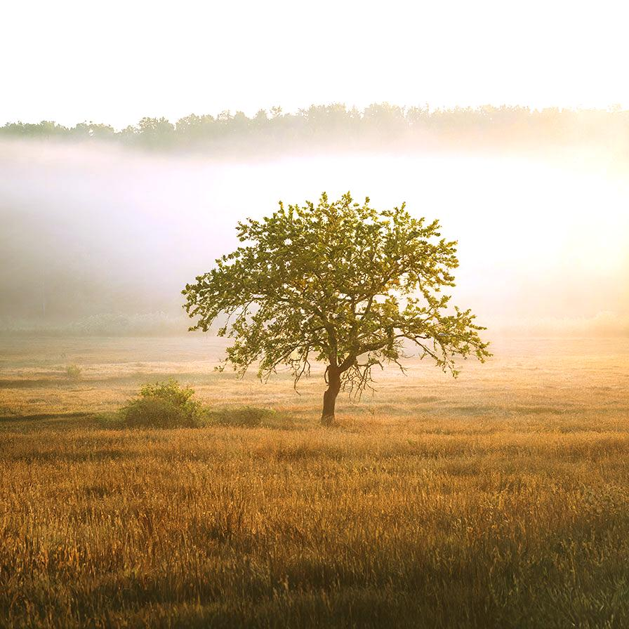

# colorbalance

Image filter plugin for colorbalance

| Input | Output |
|--------|--------|
|  |  |
|  |  |
|  |  |
|  |  |

### Configuration

```ini
[imageFilter1]
id=ibp.imagefilter.colorbalance
bypass=false
highlightsblue=50
highlightsgreen=50
highlightsred=50
midtonesblue=50
midtonesgreen=50
midtonesred=50
preserveluminosity=1
shadowsblue=50
shadowsgreen=50
shadowsred=50

[info]
description=Image filter plugin for colorbalance
fileType=ibp.imagefilterlist
nFilters=1
name=Color Balance


```
