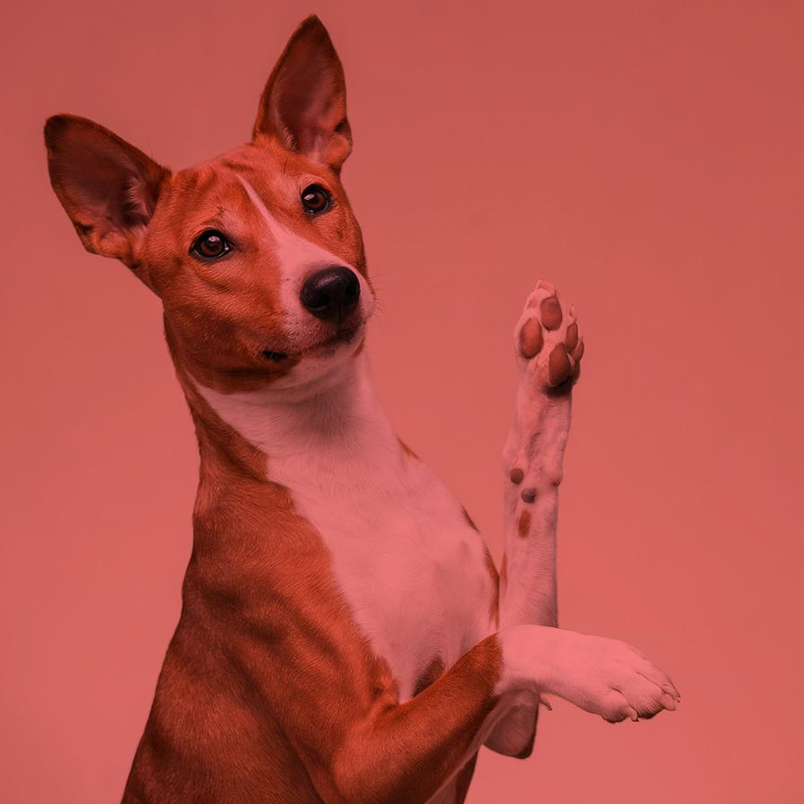
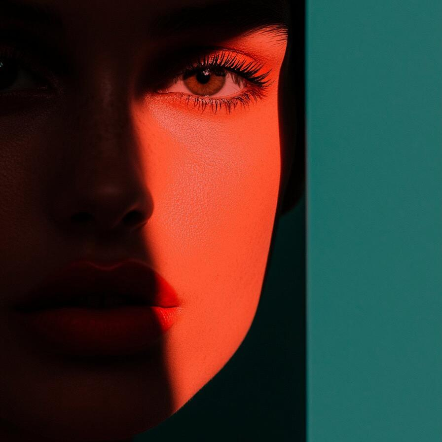
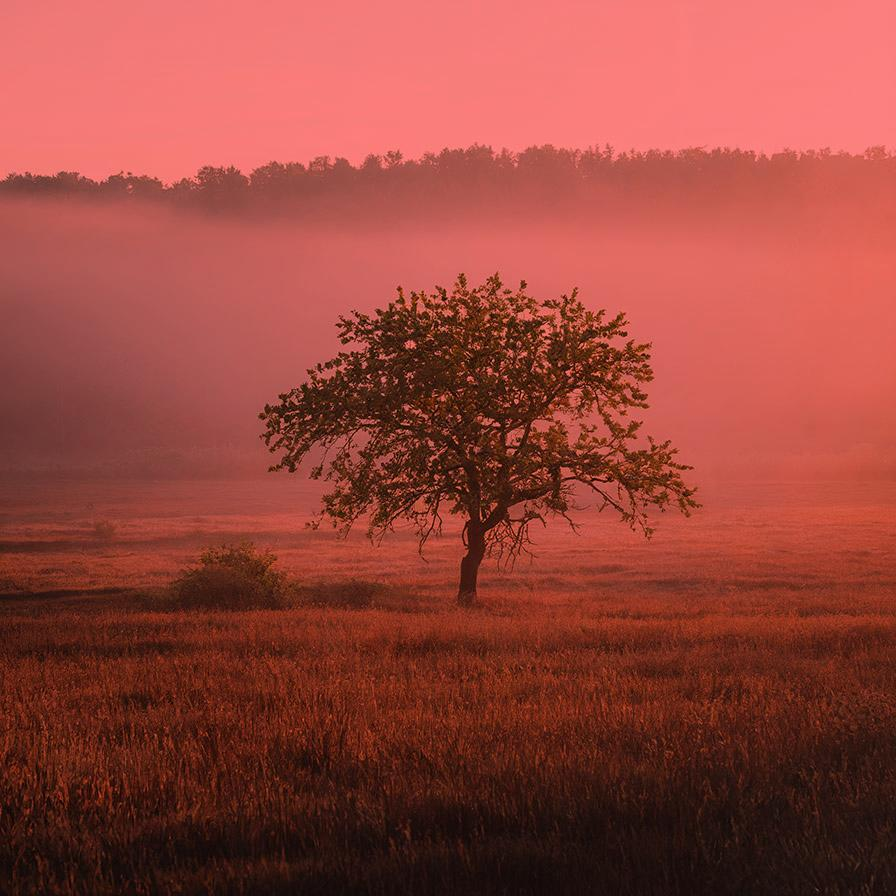

# colorlayer

Adds a color layer to the image

| Input | Output |
|--------|--------|
|  |  |
|  |  |
|  |  |
|  |  |

### Configuration

```ini
[imageFilter1]
id=ibp.imagefilter.colorlayer
bypass=false
color=20
colorcompositionmode=1
opacity=2
position=33

[info]
description=Adds a color layer to the image
fileType=ibp.imagefilterlist
nFilters=1
name=Color Layer


```
