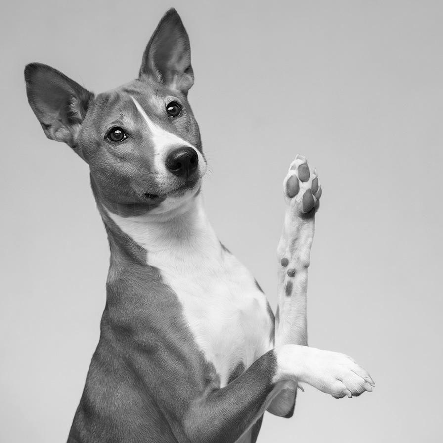
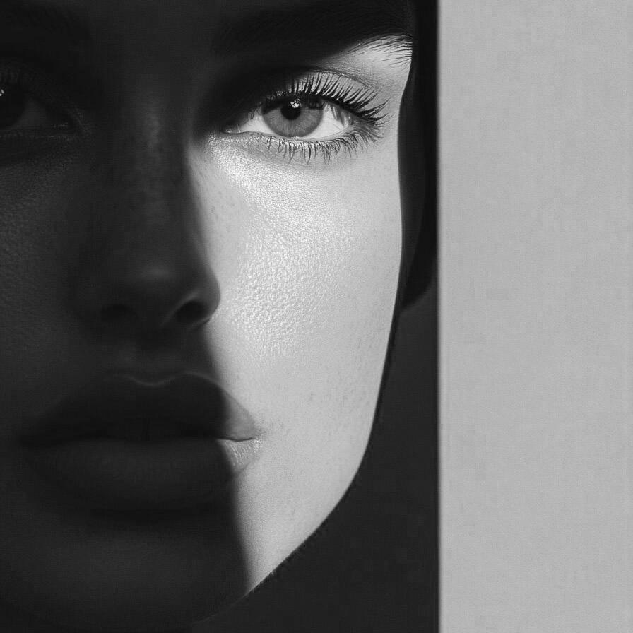
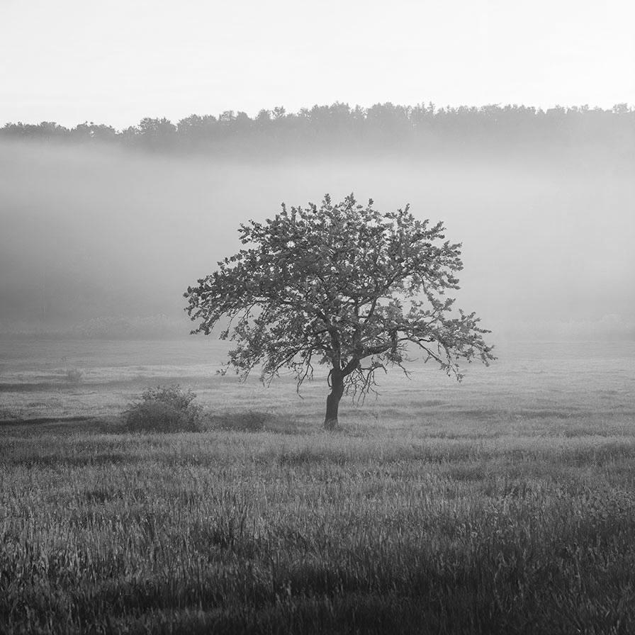

# contrastpreservinggrayscale

Convert the image to grayscale preserving the contrast

| Input | Output |
|--------|--------|
|  |  |
|  |  |
|  |  |
|  |  |

### Configuration

```ini
[imageFilter1]
id=ibp.imagefilter.contrastpreservinggrayscale
bypass=false

[info]
description=Convert the image to grayscale preserving the contrast
fileType=ibp.imagefilterlist
nFilters=1
name=Contrast Preserving Grayscale


```
