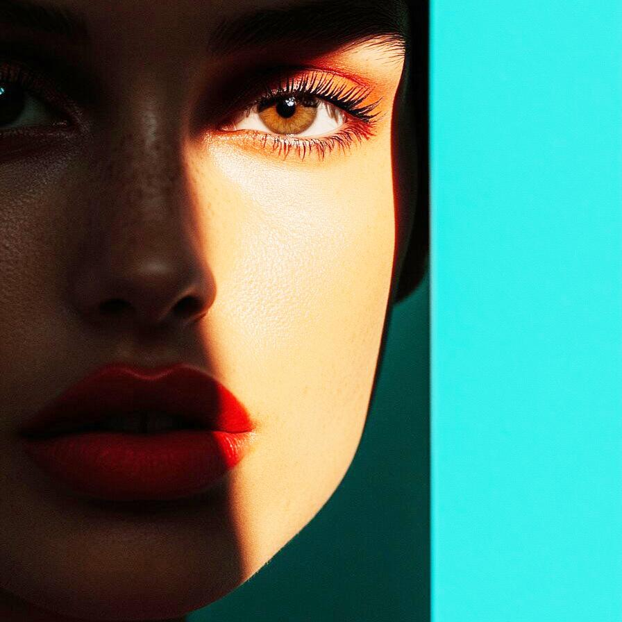

# curves

Adjust the tonal curves of the image

| Input | Output |
|--------|--------|
|  |  |
|  |  |
|  |  |
|  |  |

### Configuration

```ini
[imageFilter1]
id=ibp.imagefilter.curves
bypass=false
interpolationmode=normal
knots=3
workingchannel=1

[info]
description=Adjust the tonal curves of the image
fileType=ibp.imagefilterlist
nFilters=1
name=Curves


```
