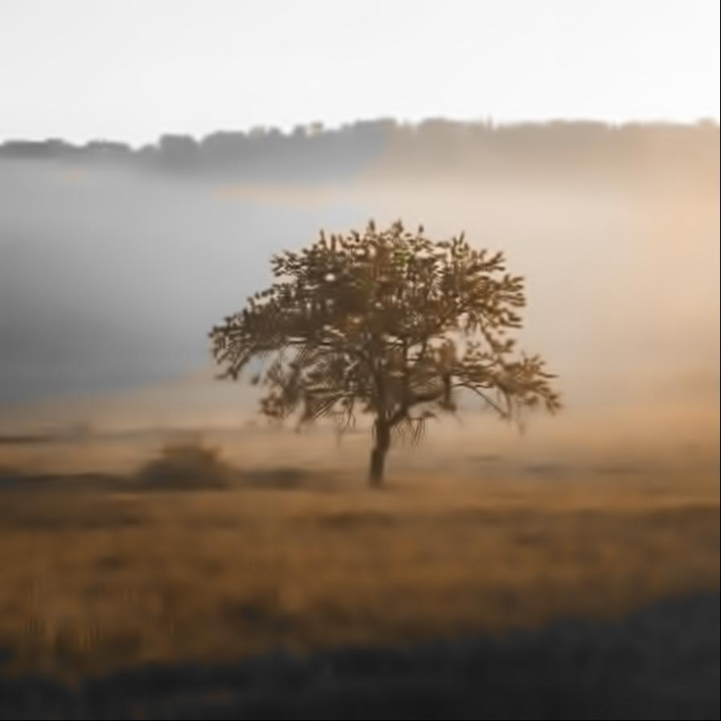

# dctdenoising

Image filter plugin for dctdenoising

| Input | Output |
|--------|--------|
|  |  |
|  |  |
|  |  |
|  |  |

### Configuration

```ini
[imageFilter1]
id=ibp.imagefilter.dctdenoising
bypass=false
strength=75

[info]
description=Image filter plugin for dctdenoising
fileType=ibp.imagefilterlist
nFilters=1
name=DCT Denoising


```
