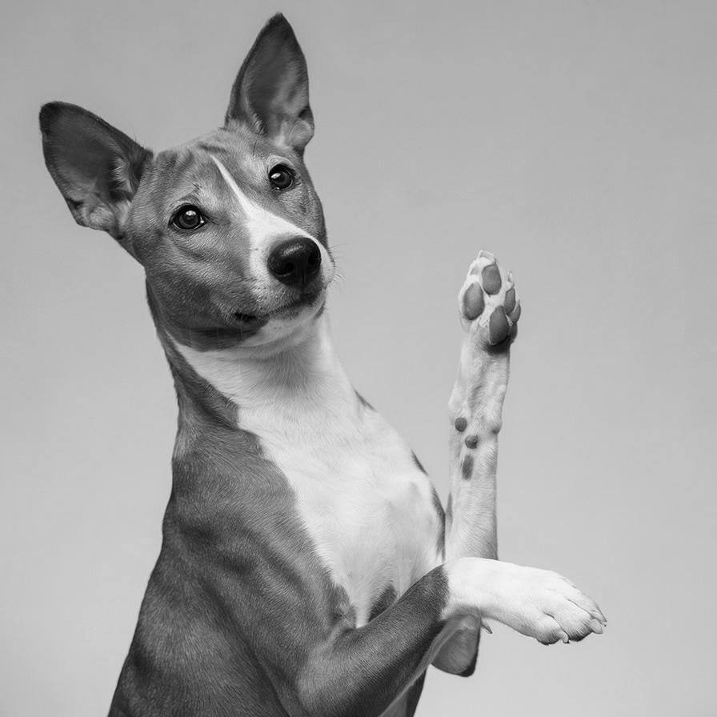
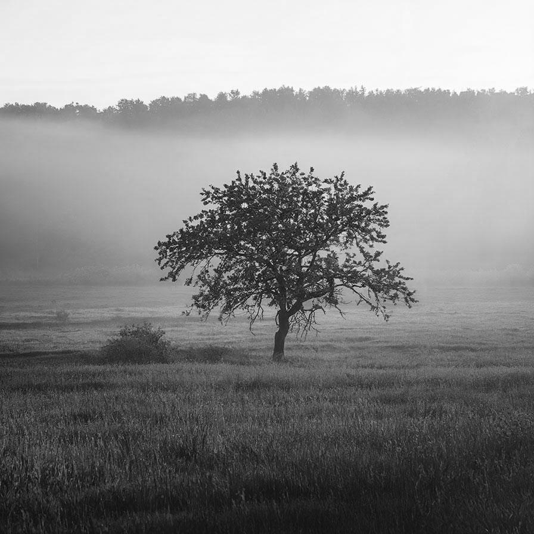

# desaturate

Removes the chroma information of the image

| Input | Output |
|--------|--------|
|  |  |
|  |  |
|  |  |
|  |  |

### Configuration

```ini
[imageFilter1]
id=ibp.imagefilter.desaturate
bypass=false

[info]
description=Removes the chroma information of the image
fileType=ibp.imagefilterlist
nFilters=1
name=Desaturate


```
