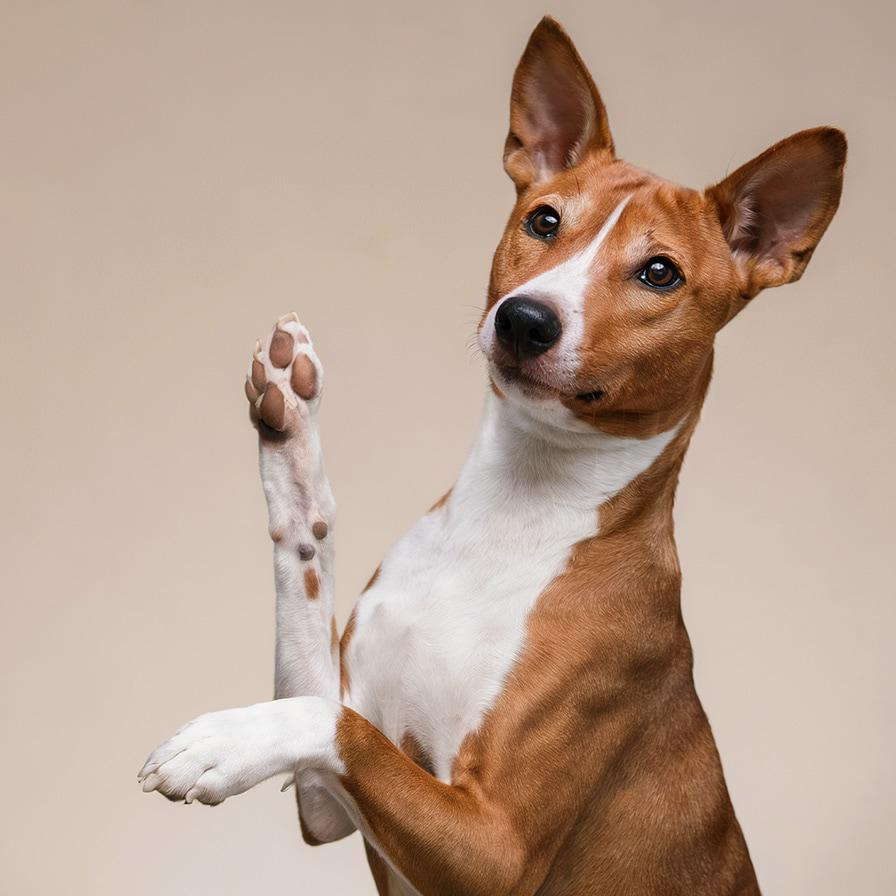
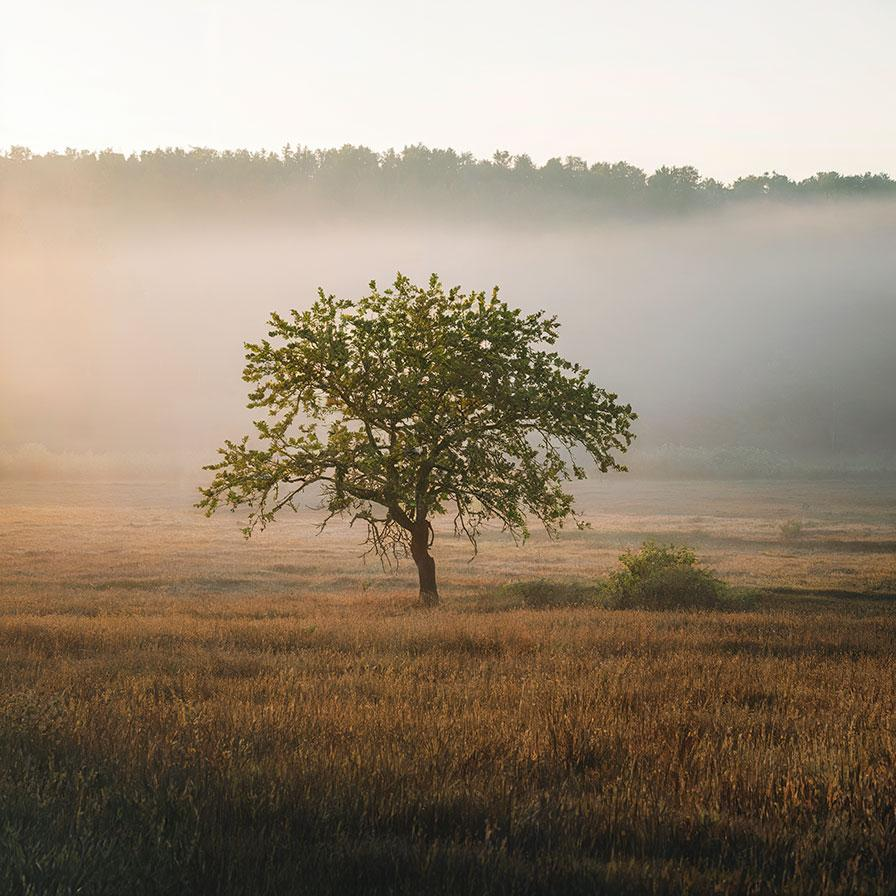

# flip

Flip the image around the vertical and/or horizontal axis

| Input | Output |
|--------|--------|
|  |  |
|  |  |
|  |  |
|  |  |

### Configuration

```ini
[imageFilter1]
id=ibp.imagefilter.flip
bypass=false
direction=1

[info]
description=Flip the image around the vertical and/or horizontal axis
fileType=ibp.imagefilterlist
nFilters=1
name=Flip


```
