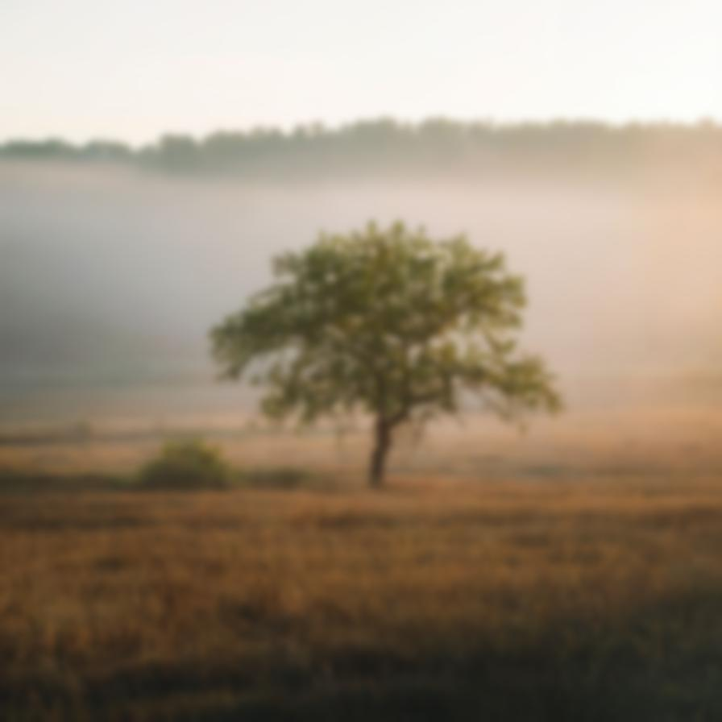

# gaussianblur

Blurs the image using a smooth gaussian distribution

| Input | Output |
|--------|--------|
|  |  |
|  |  |
|  |  |
|  |  |

### Configuration

```ini
[imageFilter1]
id=ibp.imagefilter.gaussianblur
bypass=false
bluralpha=1
blurrgb=1
radius=35

[info]
description=Blurs the image using a smooth gaussian distribution
fileType=ibp.imagefilterlist
nFilters=1
name=Gaussian Blur


```
