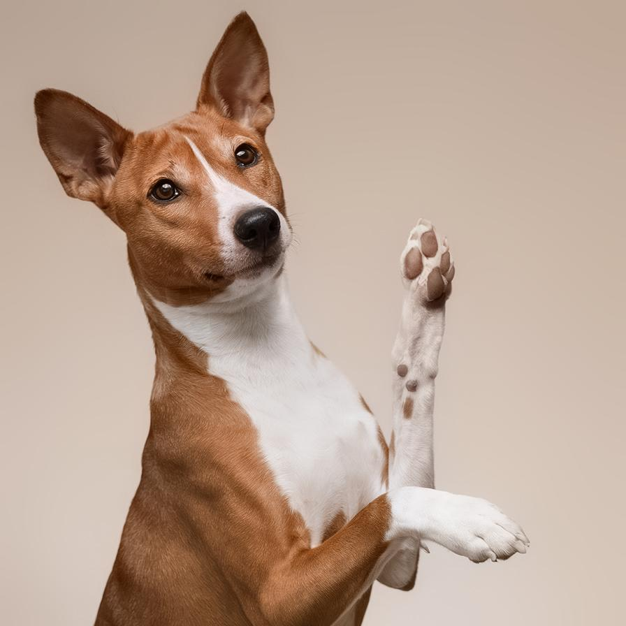
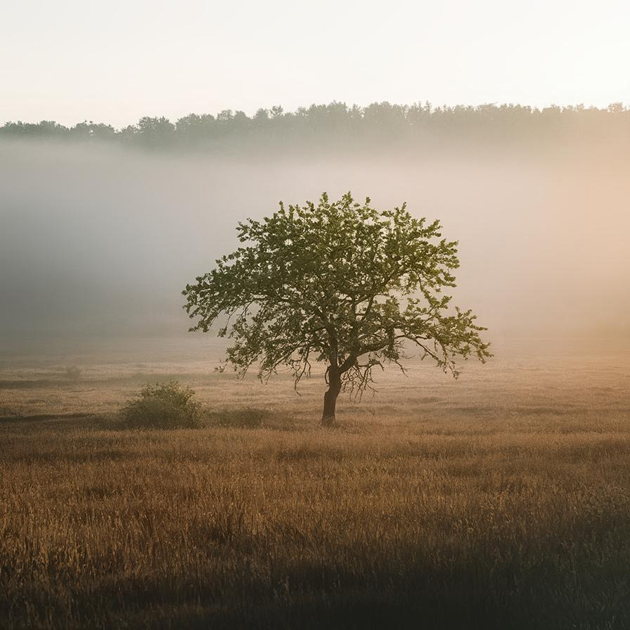

# guidedfilter

Smooth the image preserving hard edges

| Input | Output |
|--------|--------|
|  |  |
|  |  |
|  |  |
|  |  |

### Configuration

```ini
[imageFilter1]
id=ibp.imagefilter.guidedfilter
bypass=false
edgepreservation=80
radius=40

[info]
description=Smooth the image preserving hard edges
fileType=ibp.imagefilterlist
nFilters=1
name=Guided Filter


```
