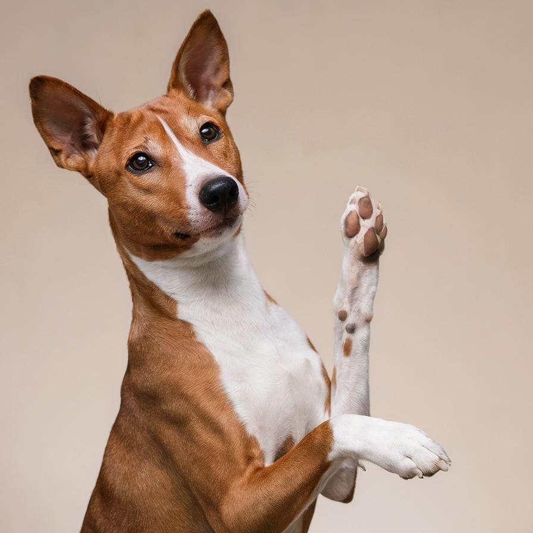
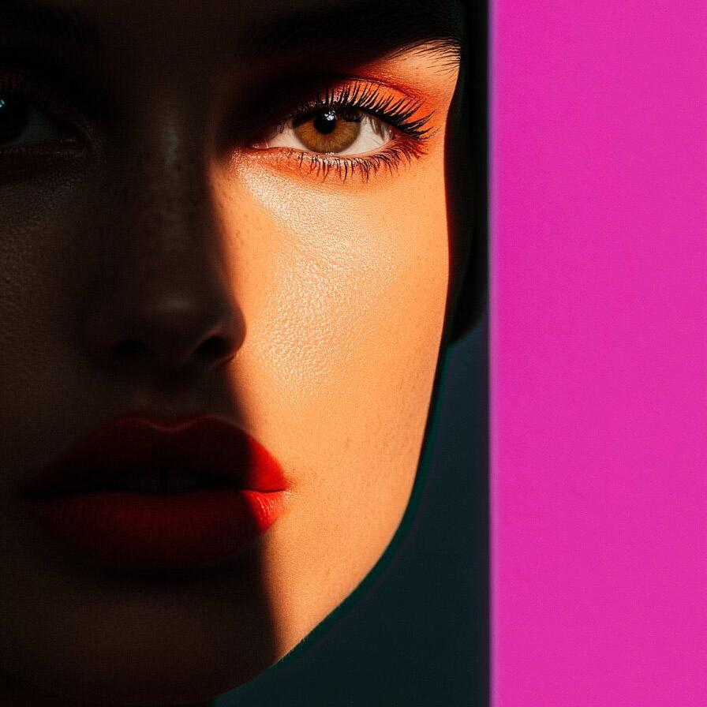
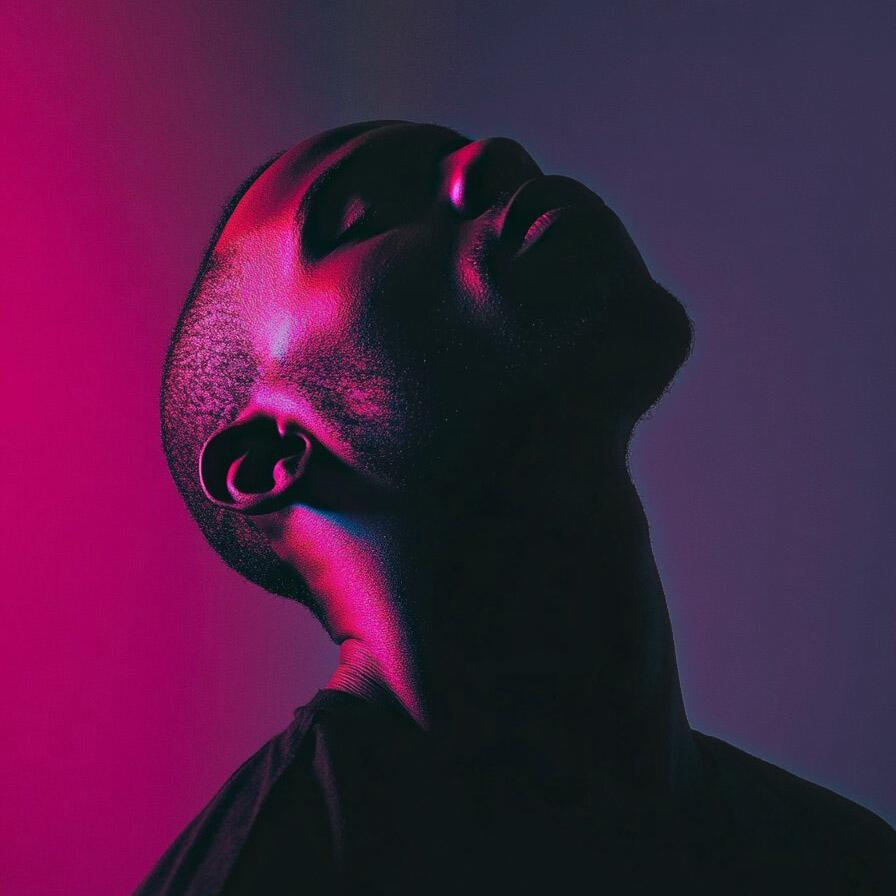
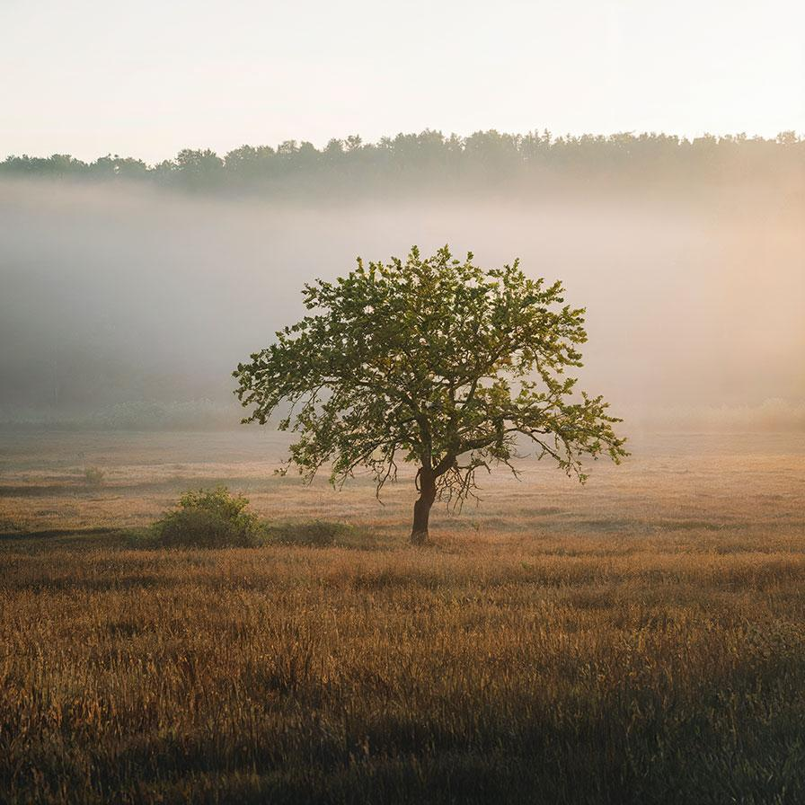

# hslcolorreplacement

Replace colors of the image based on its HSL components

| Input | Output |
|--------|--------|
|  |  |
|  |  |
|  |  |
|  |  |

### Configuration

```ini
[imageFilter1]
id=ibp.imagefilter.hslcolorreplacement
bypass=false
abshue=270
abssaturation=50
colorize=1
hueinterpolationmode=75
hueinverted=1
hueknots=75
lightnessinterpolationmode=75
lightnessinverted=1
lightnessknots=75
outputmode=normal
preblurradius=40
relhue=90
rellightness=50
relsaturation=50
saturationinterpolationmode=75
saturationinverted=1
saturationknots=75

[info]
description=Replace colors of the image based on its HSL components
fileType=ibp.imagefilterlist
nFilters=1
name=HSL Color Replacement


```
