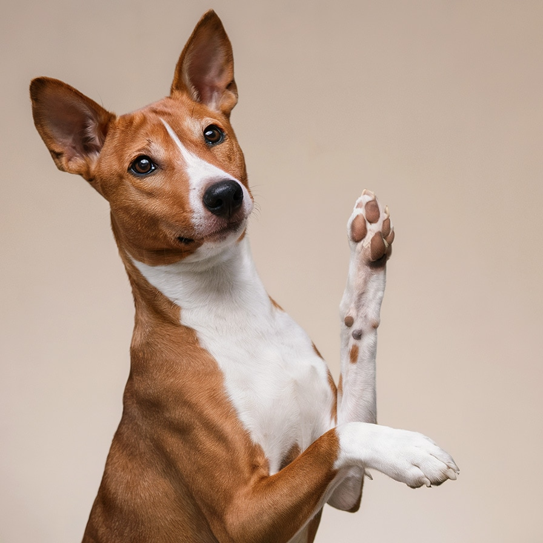

# hslkeyer

Apply a matte to the image based on its HSL components

| Input | Output |
|--------|--------|
|  |  |
|  |  |
|  |  |
|  |  |

### Configuration

```ini
[imageFilter1]
id=ibp.imagefilter.hslkeyer
bypass=false
hueinterpolationmode=75
hueinverted=1
hueknots=75
lightnessinterpolationmode=75
lightnessinverted=1
lightnessknots=75
outputmode=normal
preblurradius=7500.0
saturationinterpolationmode=75
saturationinverted=1
saturationknots=75

[info]
description=Apply a matte to the image based on its HSL components
fileType=ibp.imagefilterlist
nFilters=1
name=HSL Keyer


```
