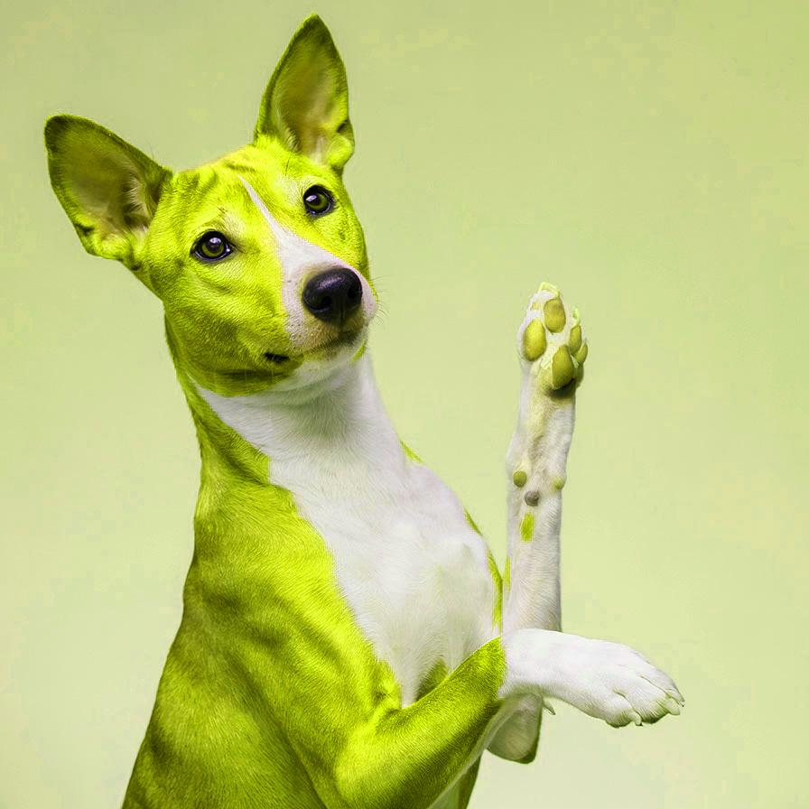
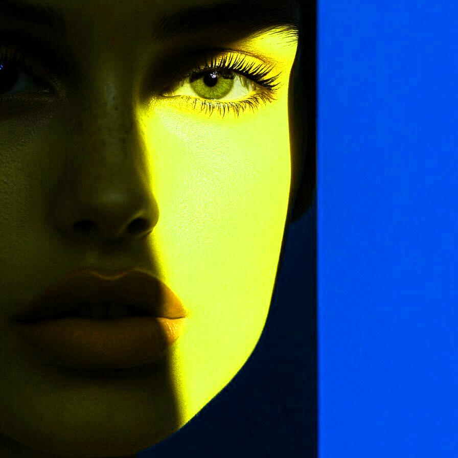
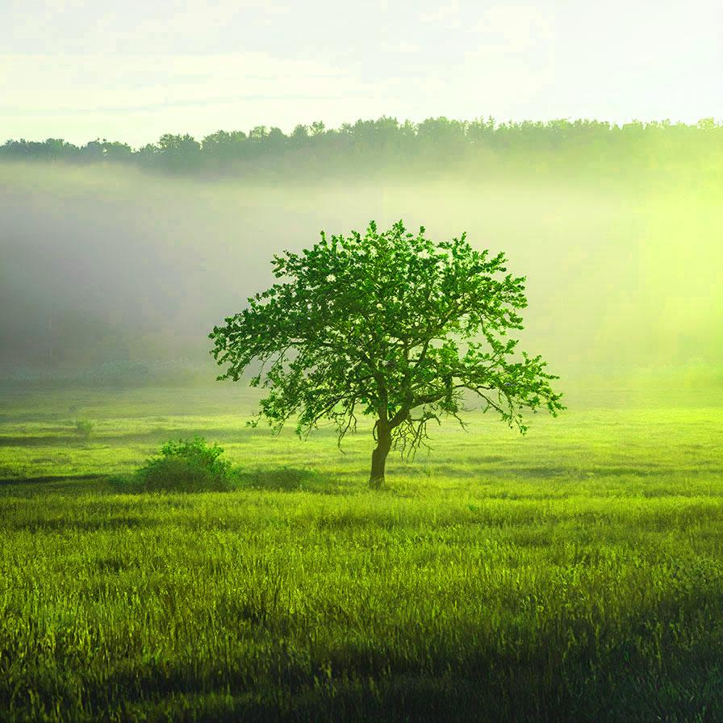

# huesaturation

Change the color information of the image in the HSL space

| Input | Output |
|--------|--------|
|  |  |
|  |  |
|  |  |
|  |  |

### Configuration

```ini
[imageFilter1]
id=ibp.imagefilter.huesaturation
bypass=false
abshue=270
abssaturation=75
colorize=1
relhue=90
rellightness=50
relsaturation=50

[info]
description=Change the color information of the image in the HSL space
fileType=ibp.imagefilterlist
nFilters=1
name=Hue/Saturation/Lightness


```
