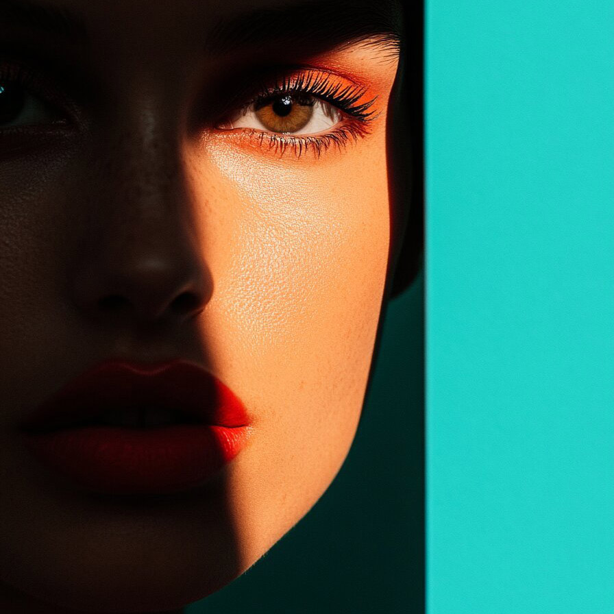

# inpaintingiihc

Image filter plugin for inpaintingiihc

| Input | Output |
|--------|--------|
|  |  |
|  |  |
|  |  |
|  |  |

### Configuration

```ini
[imageFilter1]
id=ibp.imagefilter.inpaintingiihc
bypass=false
maskexpansion=75
noisereduction=7500.0
outputmode=75

[info]
description=Image filter plugin for inpaintingiihc
fileType=ibp.imagefilterlist
nFilters=1
name=Inpainting IIH Correction


```
