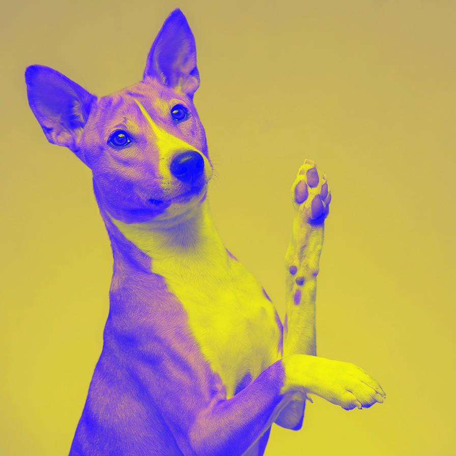

# invert

Invert one or more channels of the image

| Input | Output |
|--------|--------|
|  |  |
|  |  |
|  |  |
|  |  |

### Configuration

```ini
[imageFilter1]
id=ibp.imagefilter.invert
bypass=false
alphachannel=1
bluechannel=0
greenchannel=1
redchannel=0

[info]
description=Invert one or more channels of the image
fileType=ibp.imagefilterlist
nFilters=1
name=Invert


```
