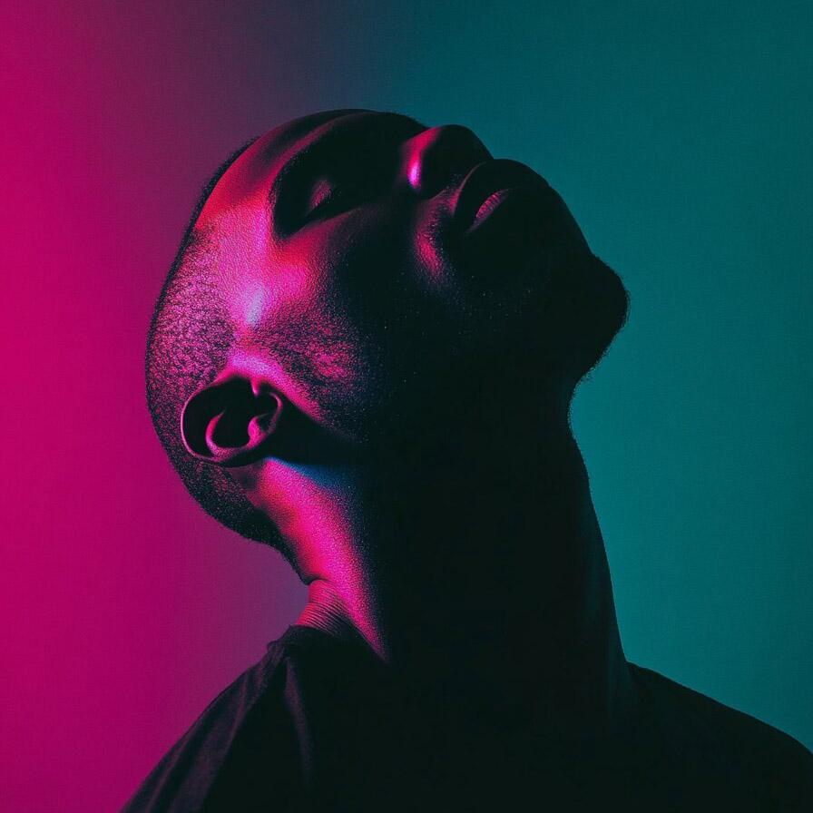

# levels

Adjust the black, mid and white tones of the image

| Input | Output |
|--------|--------|
|  |  |
|  |  |
|  |  |
|  |  |

### Configuration

```ini
[imageFilter1]
id=ibp.imagefilter.levels
bypass=false
inputblackpoint=75.0
inputgamma=75.0
inputwhitepoint=75.0
outputblackpoint=75.0
outputwhitepoint=75.0
workingchannel=75

[info]
description=Adjust the black, mid and white tones of the image
fileType=ibp.imagefilterlist
nFilters=1
name=Levels


```
