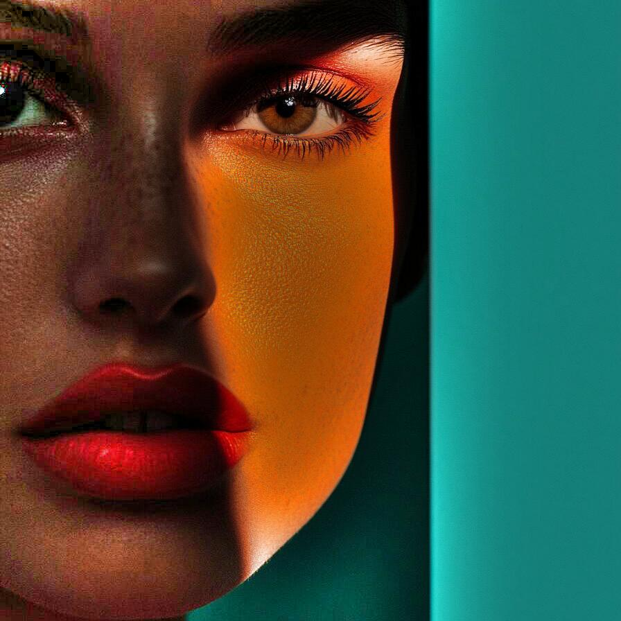
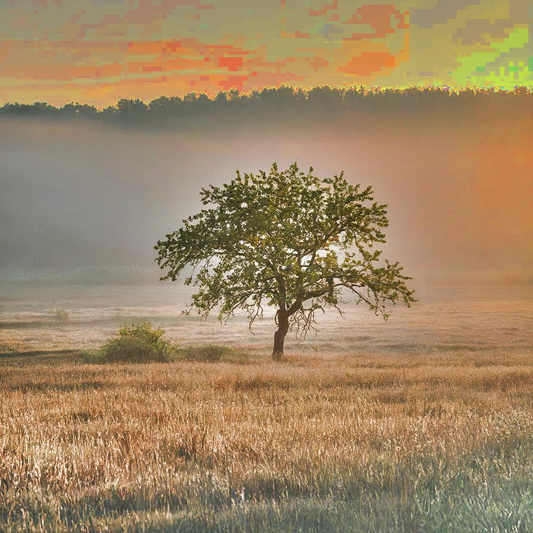

# lowpassiihc

Removes the artifacts due to a bad illumination using a low pass filtering approach

| Input | Output |
|--------|--------|
|  |  |
|  |  |
|  |  |
|  |  |

### Configuration

```ini
[imageFilter1]
id=ibp.imagefilter.lowpassiihc
bypass=false
featuresize=150
outputmode=75

[info]
description=Removes the artifacts due to a bad illumination using a low pass filtering approach
fileType=ibp.imagefilterlist
nFilters=1
name=Low Pass IIH Correction


```
