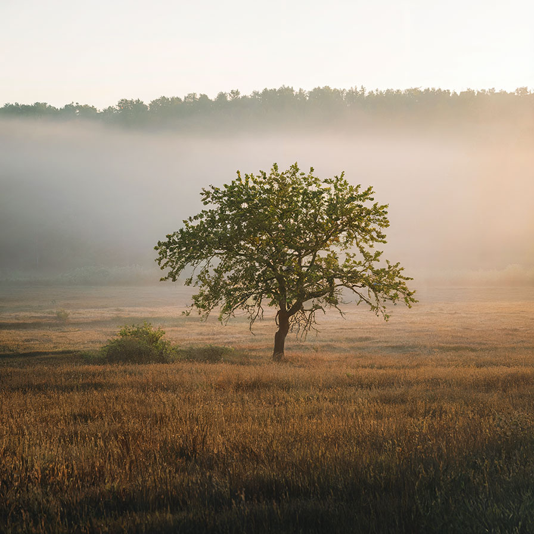

# lumakeyer

Apply a matte to the image based on its luminance

| Input | Output |
|--------|--------|
|  |  |
|  |  |
|  |  |
|  |  |

### Configuration

```ini
[imageFilter1]
id=ibp.imagefilter.lumakeyer
bypass=false
interpolationmode=75
inverted=1
isinverted=1
knots=75
outputmode=normal
preblurradius=7500.0

[info]
description=Apply a matte to the image based on its luminance
fileType=ibp.imagefilterlist
nFilters=1
name=Luma Keyer


```
