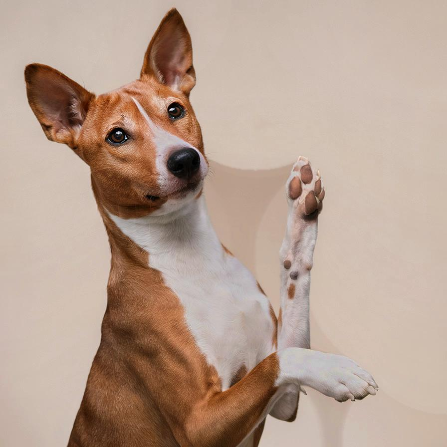
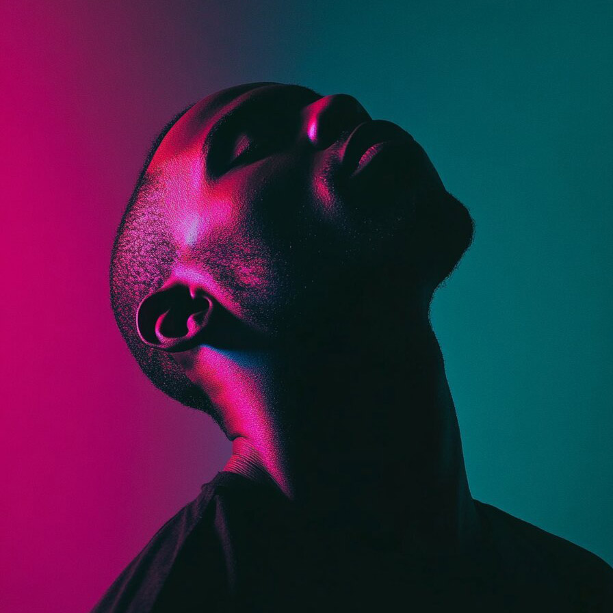

# morphologicaliihc

Removes the artifacts due to a bad illumination using a morphological approach

| Input | Output |
|--------|--------|
|  |  |
|  |  |
|  |  |
|  |  |

### Configuration

```ini
[imageFilter1]
id=ibp.imagefilter.morphologicaliihc
bypass=false
featuresize=150
outputmode=1

[info]
description=Removes the artifacts due to a bad illumination using a morphological approach
fileType=ibp.imagefilterlist
nFilters=1
name=Morphological IIH Correction


```
