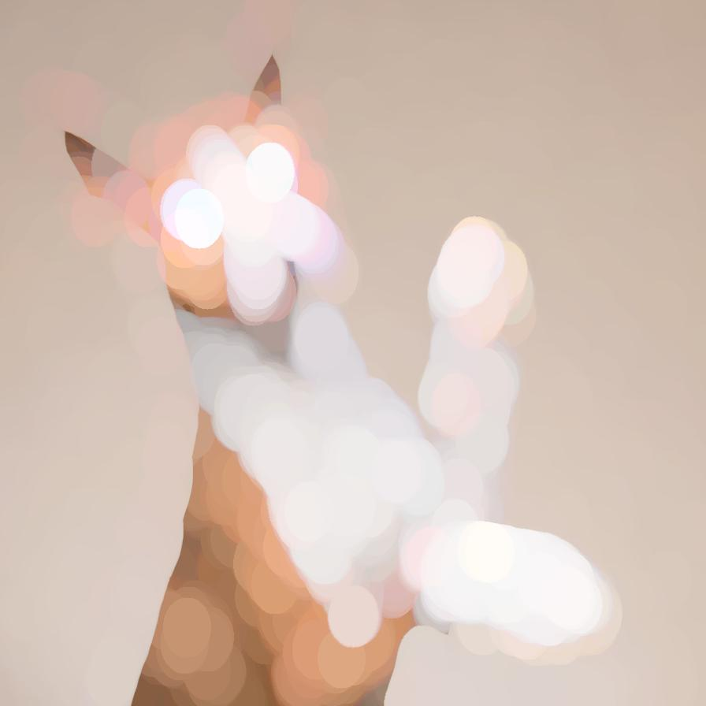
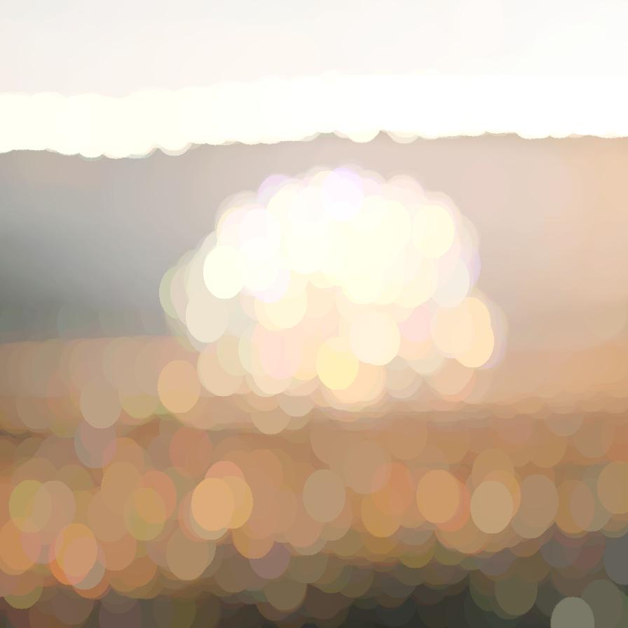

# morphology

Apply a basic mathematical morphology operation to the image

| Input | Output |
|--------|--------|
|  |  |
|  |  |
|  |  |
|  |  |

### Configuration

```ini
[imageFilter1]
id=ibp.imagefilter.morphology
bypass=false
hradius=30
kernelshape=normal
lockradius=1
modifyalpha=0
modifyrgb=1
morphologyop=20
vradius=40

[info]
description=Apply a basic mathematical morphology operation to the image
fileType=ibp.imagefilterlist
nFilters=1
name=Basic Morphology


```
