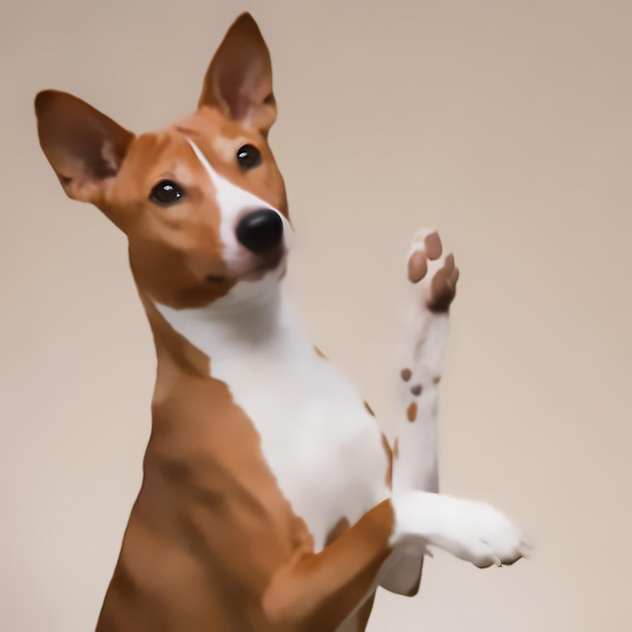

# nlmdenoising

Removes the noise from the image using semi-local information

| Input | Output |
|--------|--------|
|  |  |
|  |  |
|  |  |
|  |  |

### Configuration

```ini
[imageFilter1]
id=ibp.imagefilter.nlmdenoising
bypass=false
strength=75

[info]
description=Removes the noise from the image using semi-local information
fileType=ibp.imagefilterlist
nFilters=1
name=Non-Local Means Denoising


```
