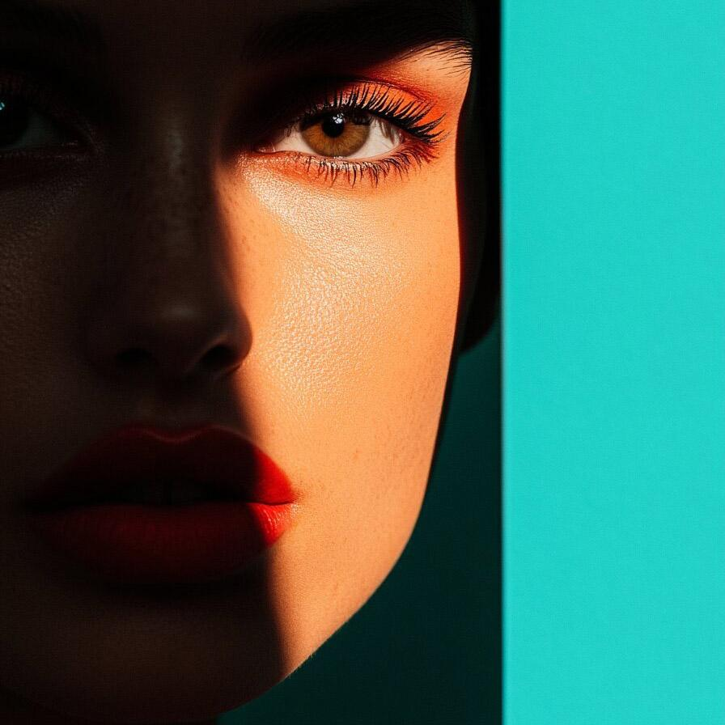

# prospectiveiihc

Removes the artifacts due to a bad illumination using a prospective approach

| Input | Output |
|--------|--------|
|  |  |
|  |  |
|  |  |
|  |  |

### Configuration

```ini
[imageFilter1]
id=ibp.imagefilter.prospectiveiihc
bypass=false
image=3
outputmode=22

[info]
description=Removes the artifacts due to a bad illumination using a prospective approach
fileType=ibp.imagefilterlist
nFilters=1
name=Prospective IIH Correction


```
