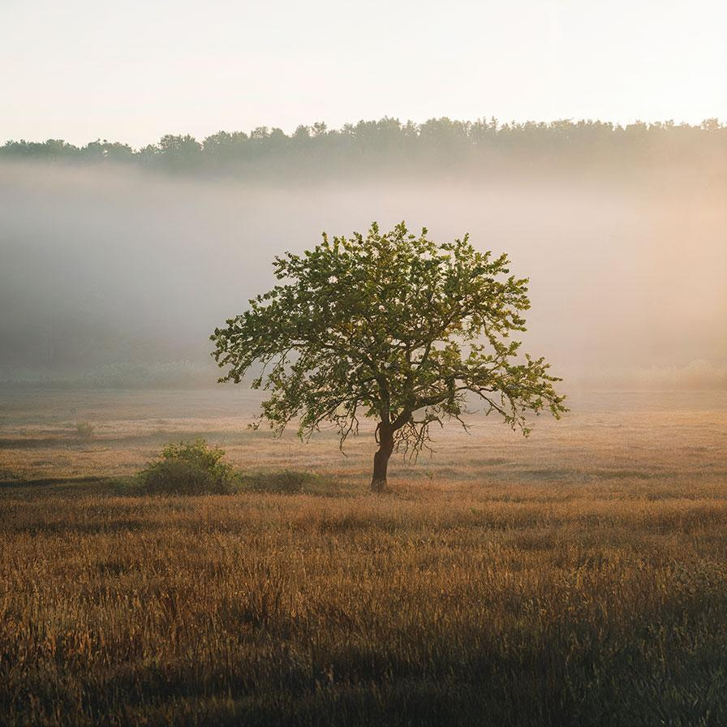

# resize

Resize the image without resampling its data

| Input | Output |
|--------|--------|
|  |  |
|  |  |
|  |  |
|  |  |

### Configuration

```ini
[imageFilter1]
id=ibp.imagefilter.resize
bypass=false
anchorposition=2
backgroundcolor=0
height=90
heightmode=1
resizemode=normal
width=80
widthmode=1

[info]
description=Resize the image without resampling its data
fileType=ibp.imagefilterlist
nFilters=1
name=Resize


```
