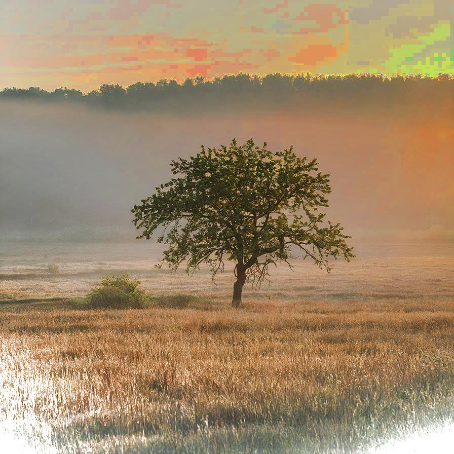

# surfacefittingiihc

Removes the artifacts due to a bad illumination using a surface fitting approach

| Input | Output |
|--------|--------|
|  |  |
|  |  |
|  |  |
|  |  |

### Configuration

```ini
[imageFilter1]
id=ibp.imagefilter.surfacefittingiihc
bypass=false
outputmode=25

[info]
description=Removes the artifacts due to a bad illumination using a surface fitting approach
fileType=ibp.imagefilterlist
nFilters=1
name=Surface Fitting IIH Correction


```
