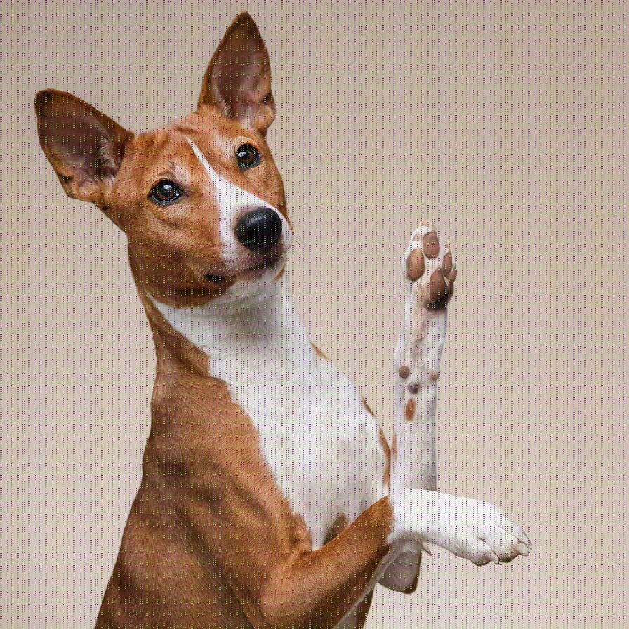
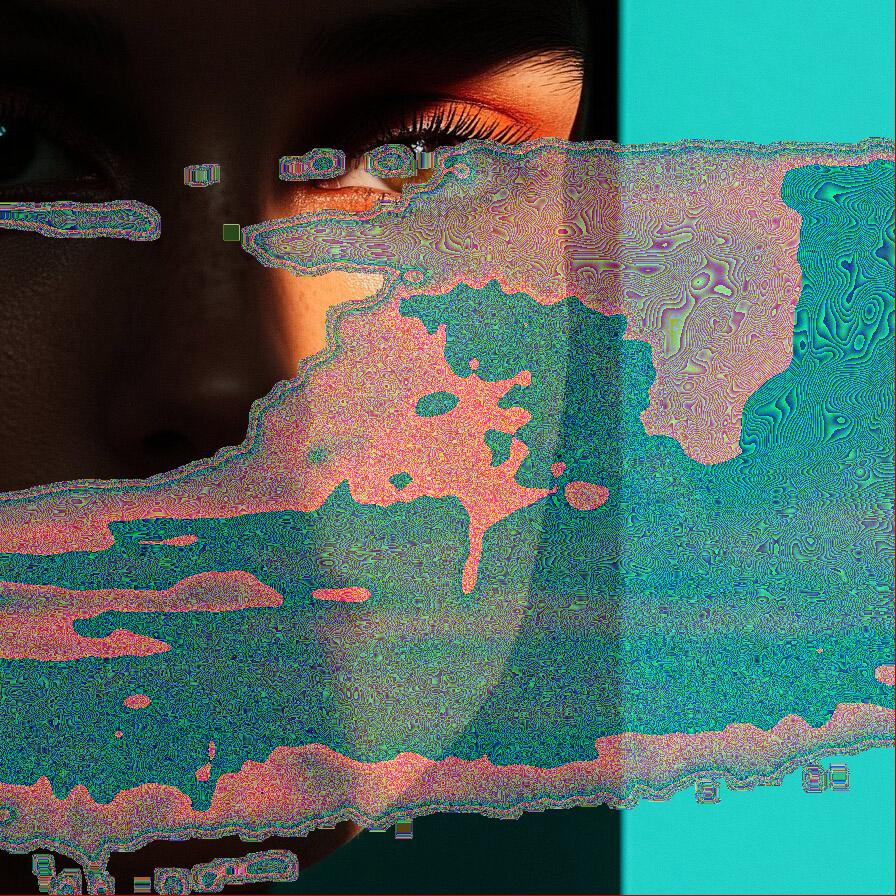

# texturelayer

Adds a texture layer to the image

| Input | Output |
|--------|--------|
|  |  |
|  |  |
|  |  |
|  |  |

### Configuration

```ini
[imageFilter1]
id=ibp.imagefilter.texturelayer
bypass=false
colorcompositionmode=1
image=22
opacity=33
position=44
transformations=2

[info]
description=Adds a texture layer to the image
fileType=ibp.imagefilterlist
nFilters=1
name=Texture Layer


```
