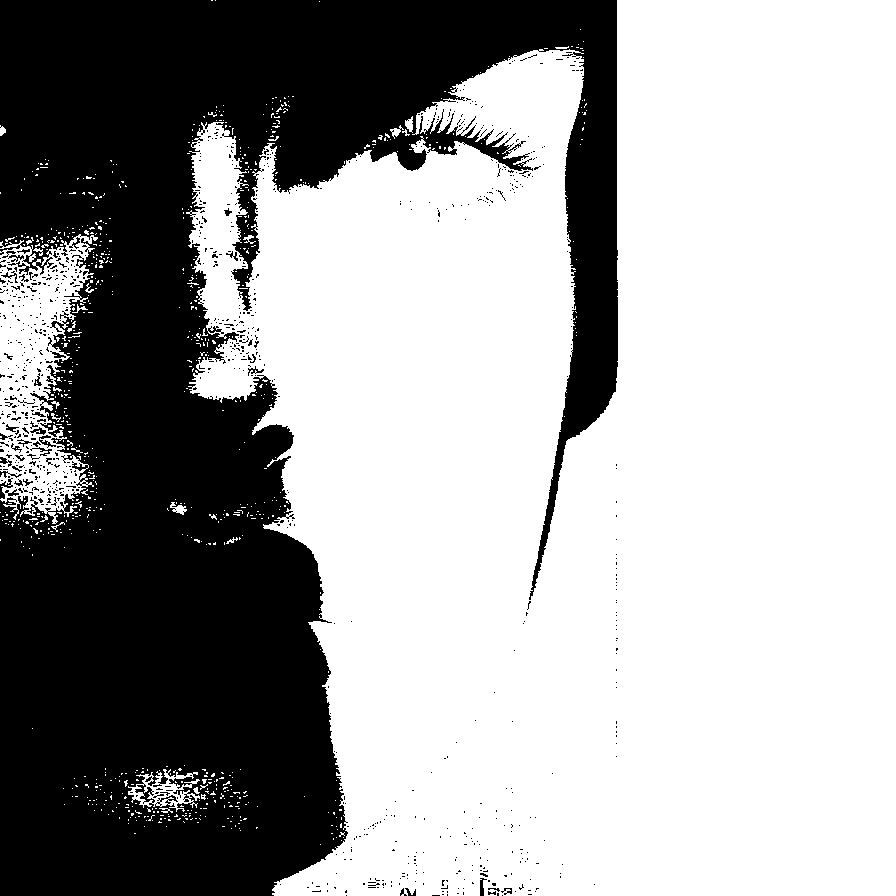
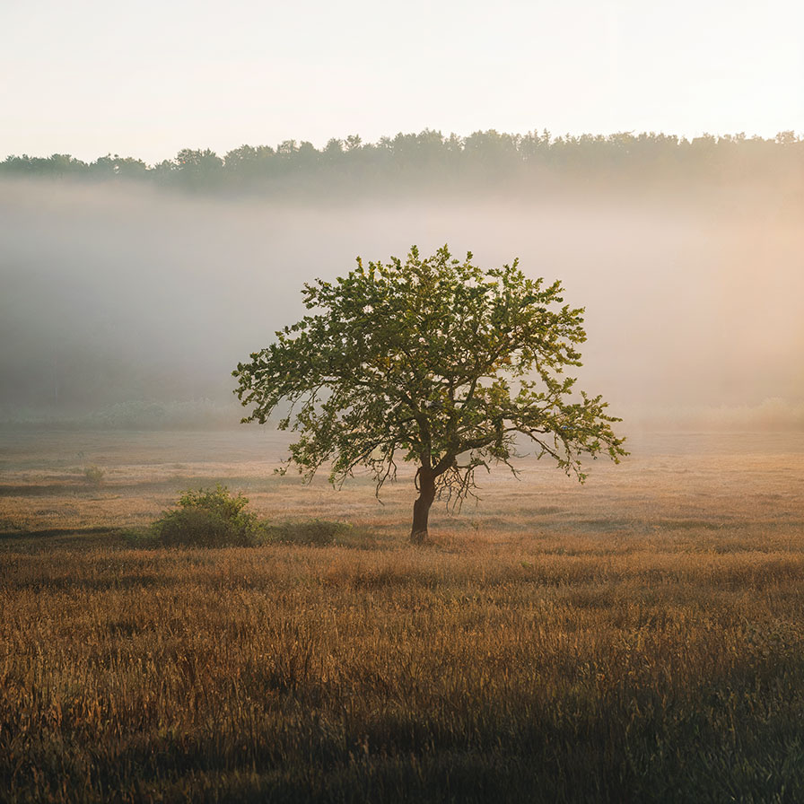

# threshold

Transforms the channels of the image into binary using a threshold value

| Input | Output |
|--------|--------|
|  |  |
|  |  |
|  |  |
|  |  |

### Configuration

```ini
[imageFilter1]
id=ibp.imagefilter.threshold
bypass=false
affectedchannel=1
colormode=2
threshold=75

[info]
description=Transforms the channels of the image into binary using a threshold value
fileType=ibp.imagefilterlist
nFilters=1
name=Threshold


```
