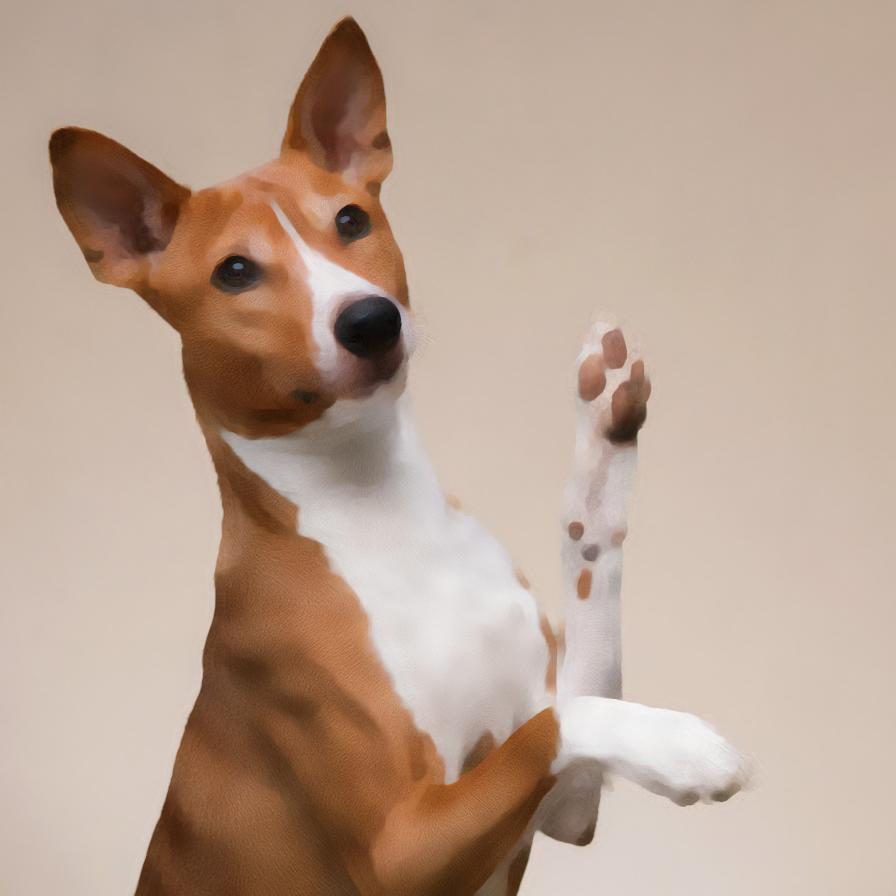

# tvdenoising

Removes the noise from the image using a variational method

| Input | Output |
|--------|--------|
|  |  |
|  |  |
|  |  |
|  |  |

### Configuration

```ini
[imageFilter1]
id=ibp.imagefilter.tvdenoising
bypass=false
iterations=75
strength=7500.0

[info]
description=Removes the noise from the image using a variational method
fileType=ibp.imagefilterlist
nFilters=1
name=Total Variation Denoising


```
