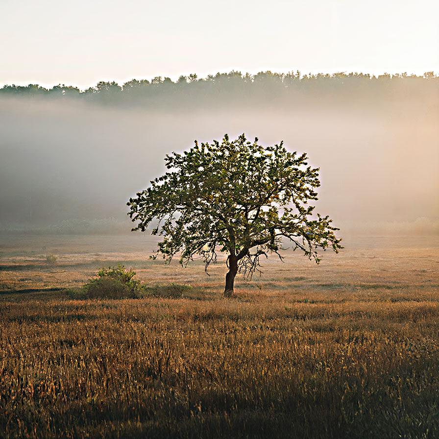

# unsharpmask

Enhances the image by contrasting fine details

| Input | Output |
|--------|--------|
|  |  |
|  |  |
|  |  |
|  |  |

### Configuration

```ini
[imageFilter1]
id=ibp.imagefilter.unsharpmask
bypass=false
amount=375
radius=7500.0
threshold=191

[info]
description=Enhances the image by contrasting fine details
fileType=ibp.imagefilterlist
nFilters=1
name=Unsharp Mask


```
